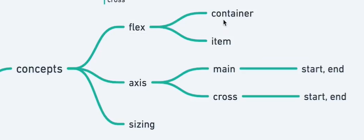
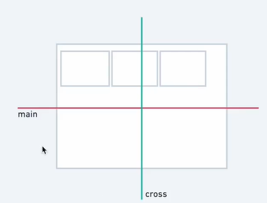
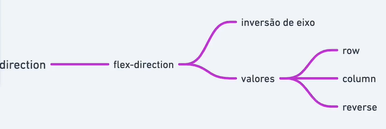

# Container, Itens e Eixo





```html
  <div class="container">
    <div class="item" style="--hue: 0">1</div>
    <div class="item" style="--hue: 100">2</div>
    <div class="item" style="--hue: 200">3</div>
    <div class="item" style="--hue: 300">4</div>
  </div>
```

```css
  .container {
    border: dashed;
    display: flex;
    flex-direction: column;
    /* flex-direction: row-reverse; */
    /* flex-direction: column-reverse; */
  }

  .item {
    --hue: 0;
    text-align: center;
    background-color: hsl(var(--hue), 100%, 70%);
  }
```
