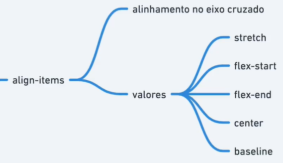

# Align-Items



```html
  <div class="container">
    <div class="item" style="--hue: 0; font-size: 30px;">1</div>
    <div class="item" style="--hue: 100;">2</div>
    <div class="item" style="--hue: 200; font-size: 45px;">3</div>
    <div class="item" style="--hue: 300;">4</div>
  </div>
```

```css
  .container {
    border: dashed;
    height: 50vh;
    display: flex;
    /* flex-direction: column; */
    align-items: stretch; /* Padrão */
    /* align-items: flex-start; */
    /* align-items: center; */
    /* align-items: flex-end; */
    align-items: baseline;
  }

  .item {
    --hue: 0;
    text-align: center;
    background-color: hsl(var(--hue), 100%, 70%);
    width: 20px;
  }
```
