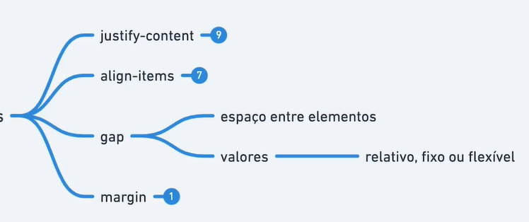
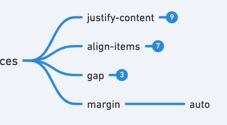

# Gap e Margin




```html
  <div class="container">
    <div class="item" style="--hue: 0; margin-top: auto;">1</div>
    <!-- <div class="item" style="--hue: 0; margin-left: auto;">1</div> -->
    <!-- <div class="item" style="--hue: 0; margin-right: auto;">1</div> -->
    <div class="item" style="--hue: 100;">2</div>
    <div class="item" style="--hue: 200;">3</div>
    <div class="item" style="--hue: 300;">4</div>
  </div>
```

```css
  .container {
    border: dashed;
    display: flex;
    /* gap: 20px; */
    /* gap: 10%; */
    gap: 2rem;
    align-items: center;
  }

  .item {
    --hue: 0;
    text-align: center;
    background-color: hsl(var(--hue), 100%, 70%);
    width: 20px;
  }
```
