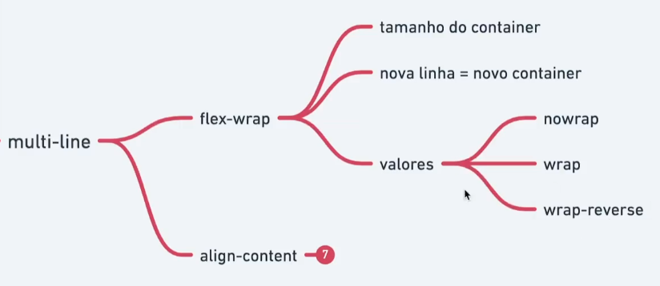
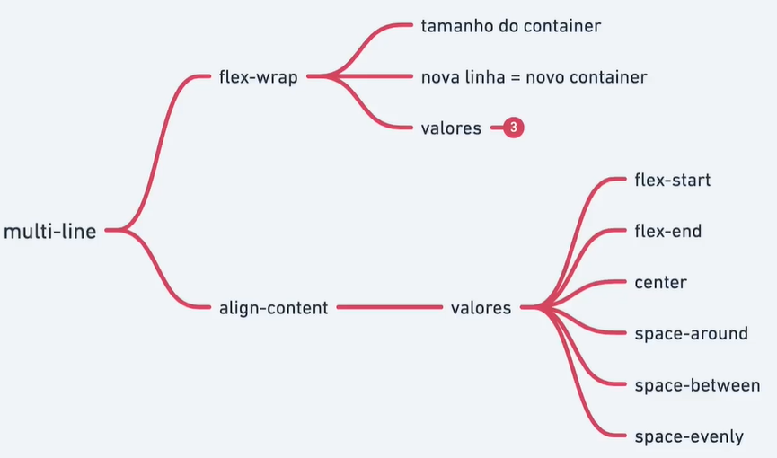

# Multi Line




```html
  <div class="container">
    <div class="item" style="--hue: 0;">1</div>
    <div class="item" style="--hue: 100;">2</div>
    <div class="item" style="--hue: 200;">3</div>
    <div class="item" style="--hue: 300;">4</div>

    <div class="item" style="--hue: 0;">5</div>
    <div class="item" style="--hue: 100;">6</div>
    <div class="item" style="--hue: 200;">7</div>
    <div class="item" style="--hue: 300;">8</div>
  </div>
```

```css
  .container {
    border: dashed;
    height: 50vh;
    align-items: center; /* Não funciona */
    display: flex;
    flex-wrap: nowrap; /* Padrão */
    /* flex-wrap: wrap; */
    flex-wrap: wrap-reverse;
    /* align-content: flex-start; */
    /* align-content: flex-end; */
    /* align-content: center; */
    /* align-content: space-around; */
    /* align-content: space-between; */
    align-content: space-evenly;
  }

  .item {
    --hue: 0;
    text-align: center;
    background-color: hsl(var(--hue), 100%, 70%);
    width: 120px;
  }
```
