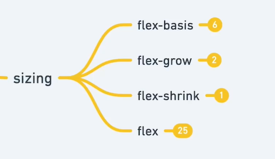
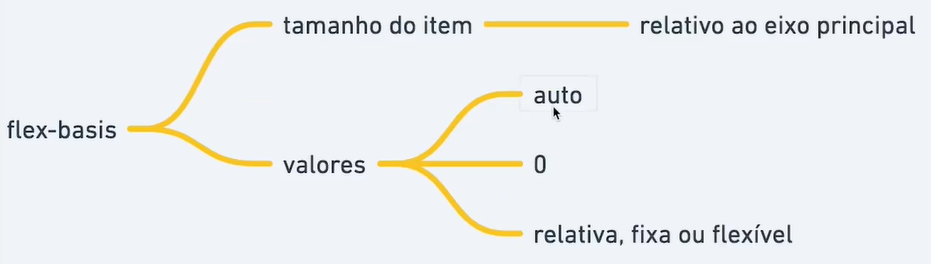

# Flex Basis




```html
  <div class="container">
    <div class="item" style="--hue: 0;">1</div>
    <div class="item" style="--hue: 100;">2</div>
    <div class="item" style="--hue: 200;">3</div>
    <div class="item" style="--hue: 300;">4</div>

    <div class="item" style="--hue: 0;">5</div>
    <div class="item" style="--hue: 100;">6</div>
    <div class="item" style="--hue: 200;">7</div>
    <div class="item" style="--hue: 300;">8</div>
  </div>
```

```css
  .container {
    border: dashed;
    height: 50vh; /* Limita a altura */
    display: flex;
    flex-direction: column; /* define que o item será definido pela altura */
    /* justify-content: center; */
    /* align-items: center; */
  }

  .item {
    --hue: 0;
    text-align: center;
    background-color: hsl(var(--hue), 100%, 70%);
    flex-basis: 220px;
    flex-basis: 10%;
  }
```
