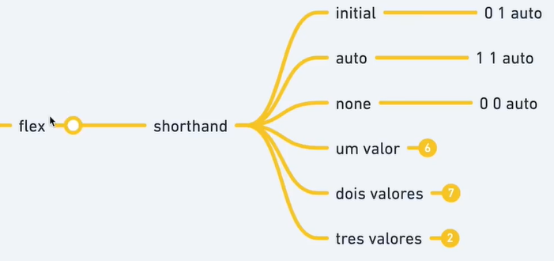
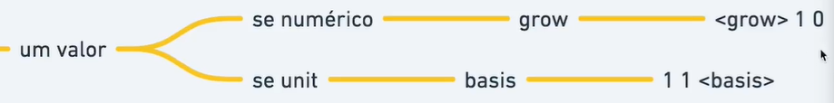
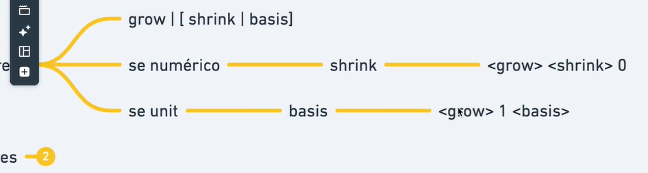
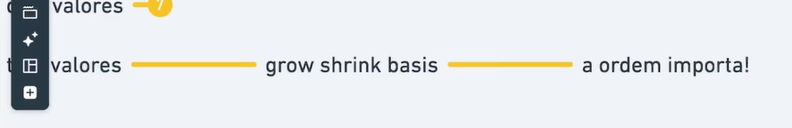

# Shorthand Flex






```html
  <div class="container">
    <div class="item" style="--hue: 0;">1</div>
    <div class="item" style="--hue: 100;">2</div>
    <div class="item" style="--hue: 200;">3</div>
    <div class="item" style="--hue: 300;">4</div>

    <div class="item" style="--hue: 0;">5</div>
    <div class="item" style="--hue: 100;">6</div>
    <div class="item" style="--hue: 200;">7</div>
    <div class="item" style="--hue: 300;">8</div>
  </div>
```

```css
  .container {
    border: dashed;
    display: flex;
  }

  .item {
    --hue: 0;
    text-align: center;
    background-color: hsl(var(--hue), 100%, 70%);
    flex-basis: 120px;
    flex: initial; /* 0 1 auto / grow shrink basis */
    flex: auto; /* 1 1 auto / grow shrink basis */
    flex: none; /* 0 0 auto / grow shrink basis */
  }
```
