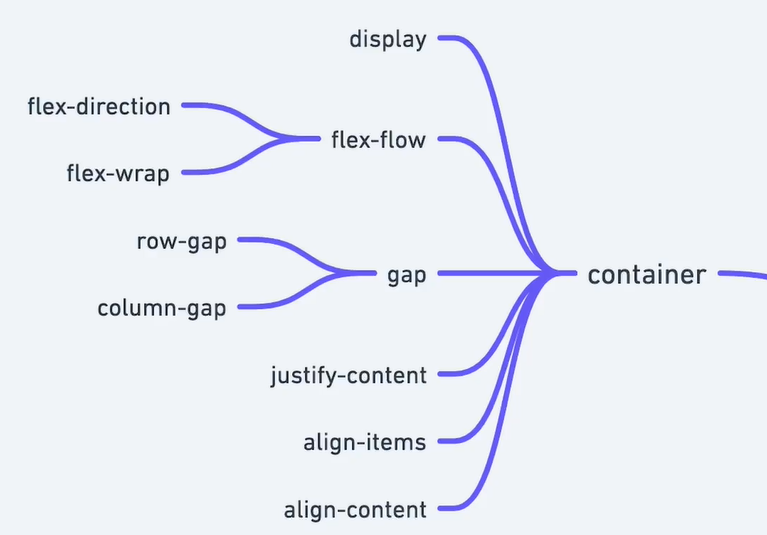
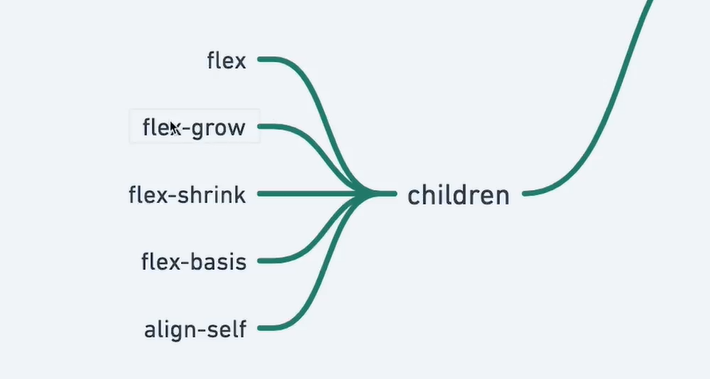

# Revisão e Propriedades Extras Flex-Flow, Align-Items, Row e Column-Gap




```html
  <div class="container">
    <div class="item" style="--hue: 0;">1</div>
    <div class="item" style="--hue: 100;">2</div>
    <div class="item" style="--hue: 200;">3</div>
    <div class="item" style="--hue: 300;">4</div>

    <div class="item" style="--hue: 0;">5</div>
    <div class="item" style="--hue: 100;">6</div>
    <div class="item" style="--hue: 200;">7</div>
    <div class="item" style="--hue: 300;">8</div>
  </div>
```

```css
  .container {
    height: 50vh;
    border: dashed;
    display: flex;
    flex-flow: wrap;
    /* flex-flow: wrap column; */
    row-gap: 2rem; /* formas completas do shorthand "gap", melhor com flex-flow */
    column-gap: 2rem;
  }

  .item {
    --hue: 0;
    text-align: center;
    background-color: hsl(var(--hue), 100%, 70%);
    flex-basis: 10%;
  }

  .item:nth-child(2) {
    align-self: flex-start;
    align-self: center;
    align-self: flex-end;
  }
```
