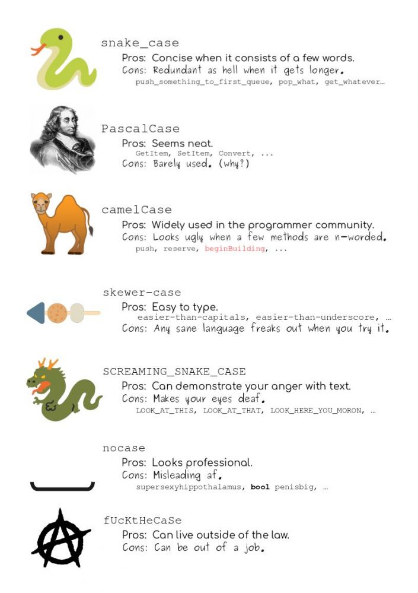

# Nomes Para Variáveis

---

```js
// case-sensitive
let username = "Rodrigo";
let userName = "João";

console.log(username);
console.log(userName);

// PODEMOS
let $email = "rodrigo@gmail.com";
let _email = "joao@gmail.com";
let user_email = "user@gmail.com";

let Ação = "Cadastrar";

console.log($email);
console.log(_email);
console.log(user_email);

console.log(Ação);

// NÃO PODEMOS
// let 1user = "Ana";
// let product name = "Teclado"

// RECOMENDAÇÃO camelCase (corcunda do camelo)
let productName = "Teclado";
let firstName = "Rodrigo";
let lastName = "Gonçalves";

// RECOMENDAÇÃO snake_case (rastejar)
let product_name = "Teclado";
let first_name = "Rodrigo";
let last_name = "Gonçalves";
```


