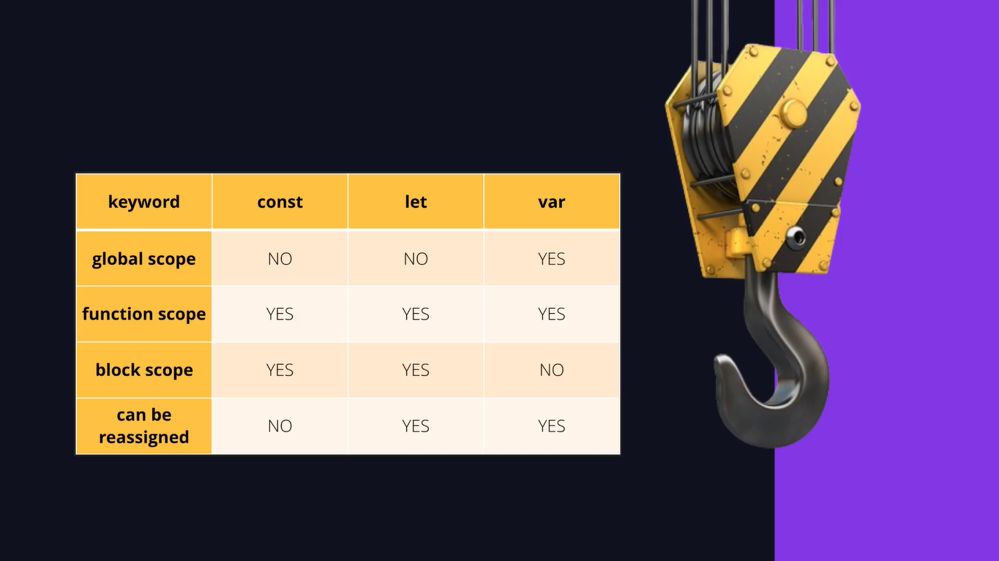

# Variáveis e Constantes

---

## O que são variáveis?


## Var

```js
// Declara uma variável sem valor.
var user;
console.log(user);

// Declara uma variável com valor.
var email = "rodrigo@email.com";
console.log(email);

// Substitui o valor da variável.
email = "joao@email.com";
console.log(email);
```

## Case Sensitive

Quando uma linguagem de programação é case-sensitive significa que ela é sensível a letras maiúsculas e minúsculas.

Por exemplo: “Rodrigo” é considerado diferente de “rodrigo”.

```js
var product = "Teclado Mecânico";
var Product = "Mouse Gamer";

var product = "Fone sem fio";

console.log(product);
console.log(Product);
```

## Let

```js
// Declara uma variável sem valor.
let user;
console.log("Rodrigo Gonçalves");

// Declara uma variável com valor.
let email = "rodrigo@email.com";
console.log(email);

email = "joao@email.com";
console.log(email);
```

## Const

```js
// Uma constante cria uma variável cuja valor é fixo (não pode ser alterado
const number = 42;
console.log(number);

// Irá gerar um erro porque o valor não pode ser alterado.
number = 55;
console.log(number);
```

## Compreendendo Escopos


## Hoisting





## Scope

```js
// console.log(user);
// var user = "Rodrigo";

// Hoisting
var user;
console.log(user);

// Escopo global
var email = "joao@email.com";

{
	// Escopo de bloco
	console.log(email);
}

{
  // var age = 18;
  let age = 18;
}

console.log(age);

let address = "Rua X";

{
	address = "Rua Y";
	console.log(address);
}
```

## Nomes Para Variáveis

```js
// case-sensitive
let username = "Rodrigo";
let userName = "João";

console.log(username);
console.log(userName);

// PODEMOS
let $email = "rodrigo@gmail.com";
let _email = "joao@gmail.com";
let user_email = "user@gmail.com";

let Ação = "Cadastrar";

console.log($email);
console.log(_email);
console.log(user_email);

console.log(Ação);

// NÃO PODEMOS
// let 1user = "Ana";
// let product name = "Teclado"

// RECOMENDAÇÃO camelCase (corcunda do camelo)
let productName = "Teclado";
let firstName = "Rodrigo";
let lastName = "Gonçalves";

// RECOMENDAÇÃO snake_case (rastejar)
let product_name = "Teclado";
let first_name = "Rodrigo";
let last_name = "Gonçalves";
```


## Tipos de Dados


## String

```js
// String
let username = "Rodrigo";
console.log(username);
console.log(typeof username);

console.log("Uma string com aspas");
console.log('Uma string com apóstrofo (aspas simples)');

// Quando utilizar uma ou outra?
console.log('Uma string com "aspas duplas" dentro de simples.');

console.log("Uma string com 'aspas simples' dentro de dupla.");

console.log(`
	Uma string com assento grave permite
	escrever múltiplas linhas.
`);
```

## Template Literals

```js
// Template literals (template strings, interpolação de strings)
let username = "Rodrigo";
let email = "rodrigo@email.com";

// Passar mais de um parâmetro.
console.log(username, email, "teste");

// Concatenar texto.
let message = "Olá," + username + ". Você conectou com o e-mail " + email;

console.log(message);

// Template literals
console.log(`Olá, ${username}. Você conectou com o e-mail ${email}.`);
```

## Number

```js
// Number
console.log(typeof 5);

// Inteiro positivo.
console.log(5);

// Inteiro negativo.
console.log(-5);

// Números reais ou float.
console.log(125.70);

// NaN - Not a Number.
console.log(12.5 / "rodrigo");
```

## Boolean

```js
// Boolean

console.log(true);
console.log(false);

let isLoading = true;
console.log(typeof isLoading);
```

## Undefined e Null

```js
// undefined (indefinido) e null

let emptiness;
console.log("O valor é: ", emptiness);

let empty = null;
console.log("O valor é: ", empty);
```

## Conversão e Coerção de Tipos

- **Conversão de tipos (type casting ou type conversion):** ocorre quando você explicitamente transforma um valor de um tipo para outro. Isso é feito de forma consciente, usando funções ou métodos específicos para realizar a conversão.

```js
let value = "9";
console.log(typeof value);
console.log(typeof Number(value));

let age = 18;
console.log(typeof age.toString());
console.log(typeof String(age));

let option = 0;
console.log(Boolean(option));
console.log(typeof Boolean(option));
```

- **Coerção de tipos:** acontece de forma automática (implicitamente). O JavaScript tenta automaticamente converter um dos valores para um tipo compatível antes de realizar a operação.

```js
// Exemplo de coerção
console.log(typeof ("10" + 5));
```
