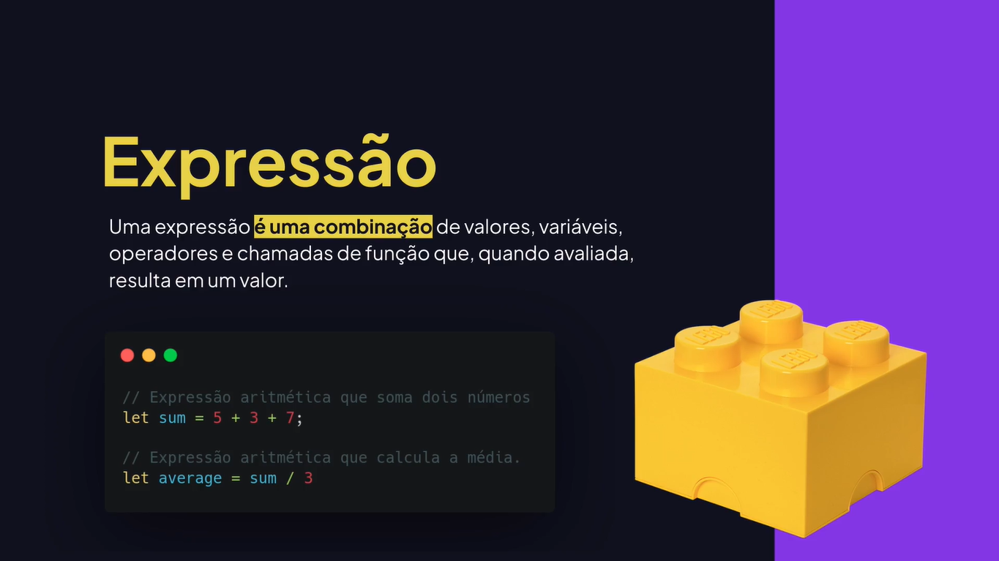
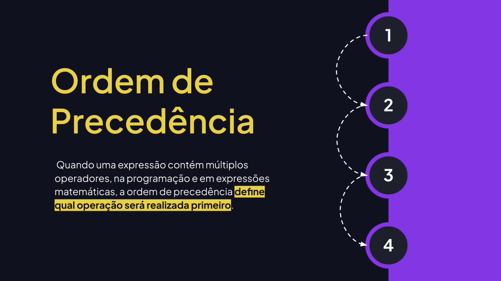
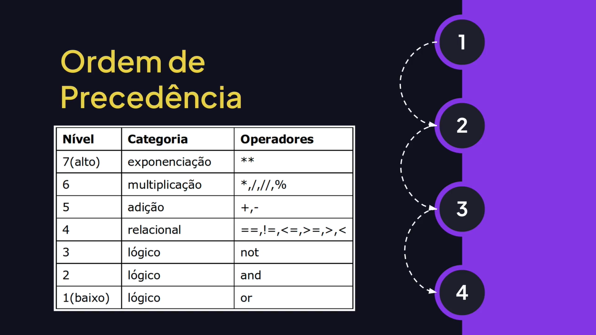
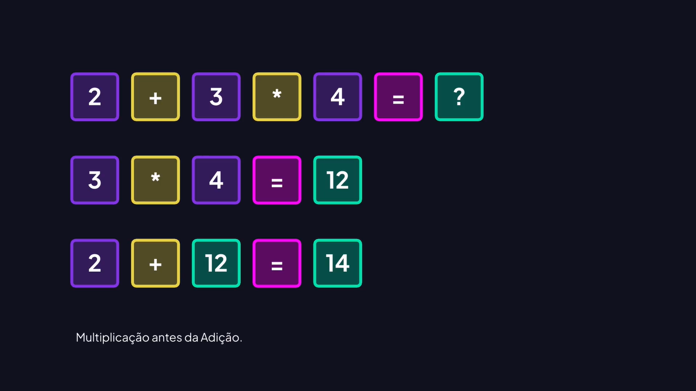
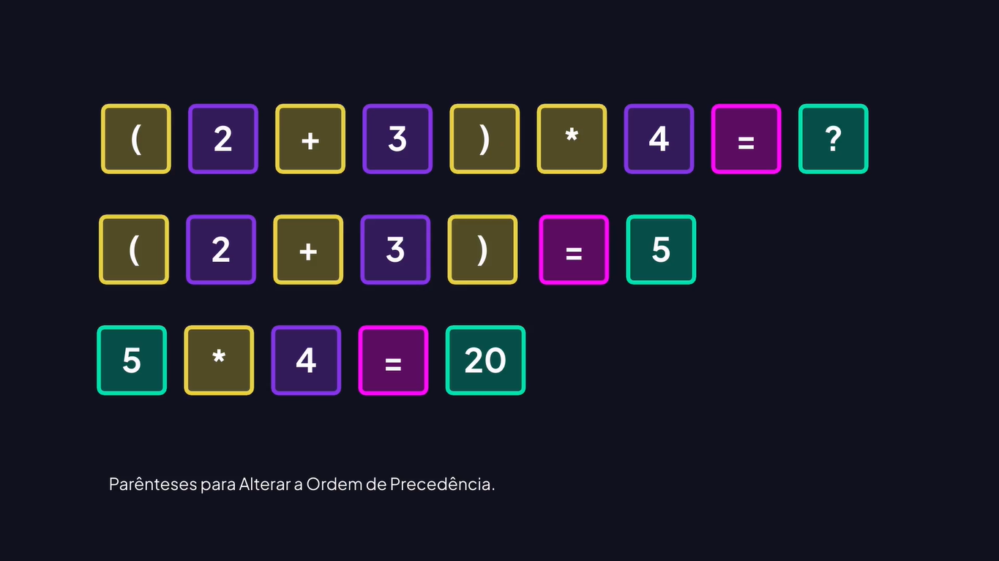

# Expressões e Operadores

---




## Operadores Aritméticos

```js
// Operadores atirméticos
console.log("SOMA: ", 12 + 8);
console.log("CONCATENAÇÃO: ", "12" + "8"); // 128

console.log("SUBTRAÇÃO: ", 12 - 10);

console.log("MULTIPLICAÇÃO: ", 3 * 5.5);

console.log("DIVISÃO: ", 12 / 2);

console.log("RESTO DA DIVISÃO: ", 13 % 2);

console.log("EXPONENCIAL: ", 3 ** 3);
```

## Incremento e Decremento

```js
let number = 10;

// Incremento
// number = number + 1;
number++;

// Incrementa após (por isso não mostra no console)
console.log(number++);
console.log(number);

// Incrementa antes
console.log(++number);

// Decremento
console.log("Decremento após: ", number--);
console.log(number--);
console.log("Decremento antes: ", --number);

// Incrementar mais de um (colocar).
number += 10;
console.log(number);

// Decrementar mais de um (removendo).
number -= 2;
console.log(number);

number = number + 20;
console.log(number);
number = number - 20;
console.log(number);
```

## Ordem de Precedência









## Grouping Operator

```js
// Grouping Operator (ordem de precedência)
let total1 = 2 + 3 * 4;
console.log(total);

let total2 = (2 + 3) * 4;
console.log(total2);

let average = (9.5 + 7 + 5) / 3;
console.log(average);
```

## Igual a e Diferente de

```js
let one = 1;
let two = 2;

// == igual a
console.log("### IGUAL A ###");
console.log(one == two);
console.log(one == 1);
console.log(one == "1");

// != diferente de
console.log("### DIFERENTE DE ###");
console.log(one != two);
console.log(one != 1);
console.log(one != "1");
```

## Estritamente Igual e Diferente

```js
let one = 1;
let two = 2;

// === estritamente igual a (tipo e valor)
console.log(one === 1);
console.log(one === "1");

// !== estritamente diferente de
console.log(one !== two);
console.log(one !== 1);
console.log(two !== 2);
console.log(two !== "2");
```

## Maior, Menor e Igual

```js
let balance = 500;
let payment = 120;

// > Maior que
console.log(balance > payment);

// < Menor que
console.log(balance < payment);

// >= Maior ou igual a
balance = 120;
console.log(balance >= payment);

// <= Menor ou igual a
balance = 500;
console.log(balance <= payment);
```

## Operadores de Atribuição

```js
let value;

// Operador atribuição
value = 1;
console.log(value);

// Incremento
value += 2;
console.log(value);

// Decremento
value -= 2;
console.log(value);

// Multiplicação
value *= 3;
console.log(value);

// Divisão
value /= 2;
console.log(value);

// Resto da divisão
value %= 2;
console.log(value);

// Potência
value **= 2;
console.log(value);
```

## Operadores Lógicos

```js
let email = true;
let password = false;
let isAdmin = true

// AND (E) &&
console.log(email && password && isAdmin);

// OR (OU) ||
console.log(email || password);

// NOT (negação) !
console.log(!password);
```
