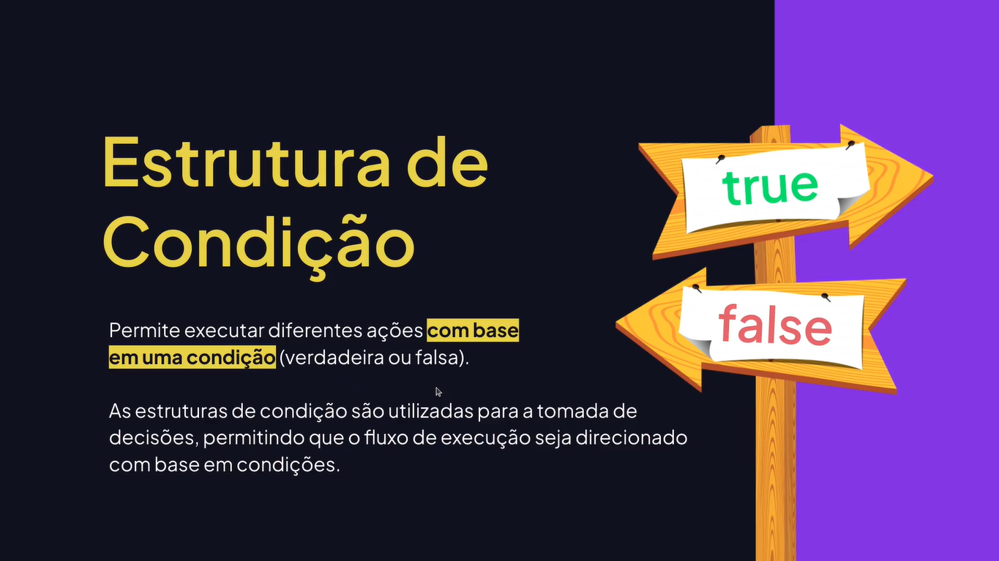
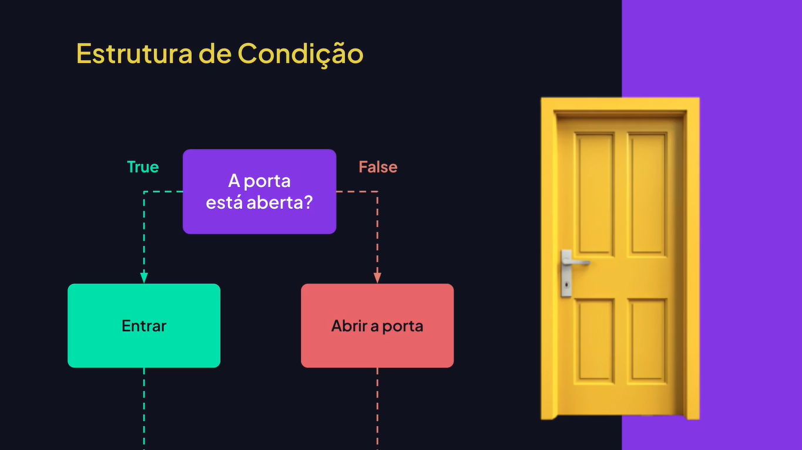
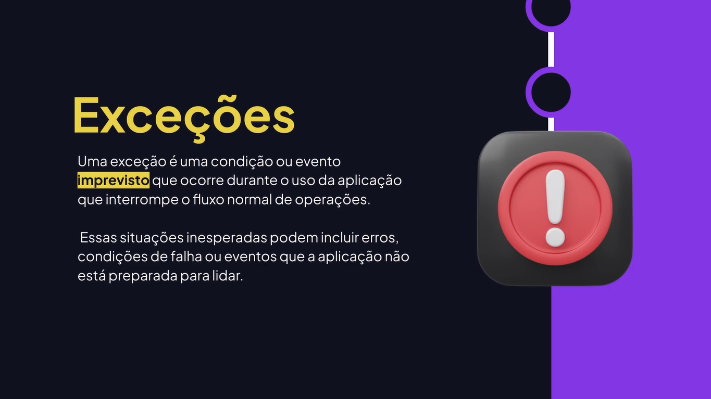
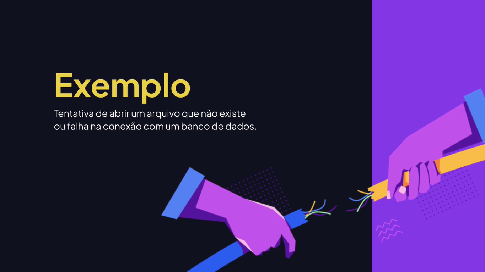
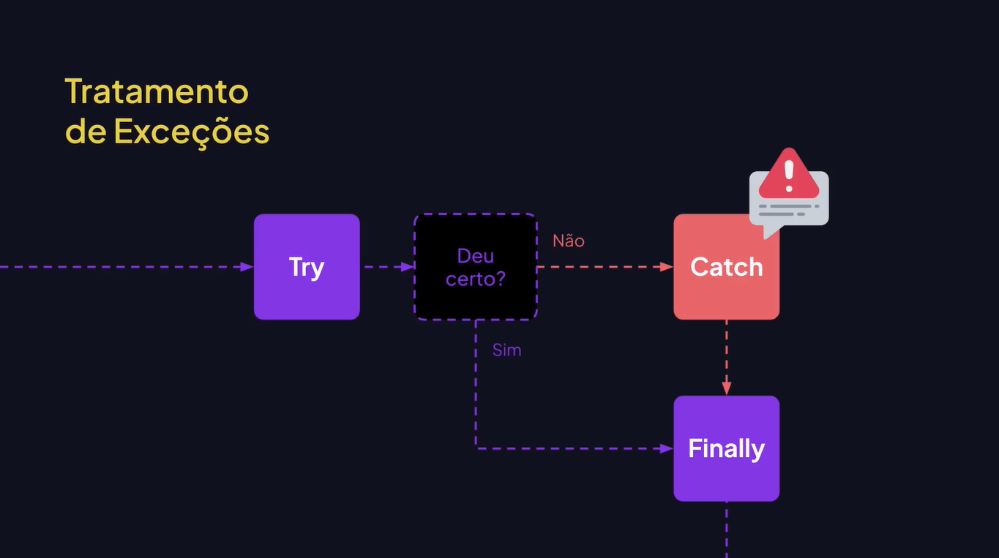

# Condicionais e Controle de Fluxos

---

## Condicionais





## Operador Condicional Ternário

```js
// Operador condicional ternário

let age = 21;
console.log(
	age >= 18 // condição
	? "Você pode dirigir." // se verdadeiro
	: "Você não pode dirigir." // se falso
);

console.log(
	age < 18 
	? "Você não pode dirigir."
	: "Você pode dirigir."
);	
```

## Falsy e Truthy

FALSY quando um valor é considerado false e TRUTHY quando é considerado verdadeiro em contextos onde um boolean é obrigatório (condicionais e loops).

```js
console.log("### EXEMPLOS DE FALSY ###");
console.log(false ? "VERDADEIRO" : "FALSO");
console.log(0 ? "VERDADEIRO" : "FALSO");
console.log(-0 ? "VERDADEIRO" : "FALSO");
console.log("" ? "VERDADEIRO" : "FALSO");
console.log(null ? "VERDADEIRO" : "FALSO");
console.log(undefined ? "VERDADEIRO" : "FALSO");
console.log(NaN ? "VERDADEIRO" : "FALSO");

console.log("### EXEMPLOS DE TRUTHY ###");
console.log(true ? "VERDADEIRO" : "FALSO");
console.log({} ? "VERDADEIRO" : "FALSO");
console.log([] ? "VERDADEIRO" : "FALSO");
console.log(1 ? "VERDADEIRO" : "FALSO");
console.log(3.23 ? "VERDADEIRO" : "FALSO");
console.log("0" ? "VERDADEIRO" : "FALSO");
console.log(" " ? "VERDADEIRO" : "FALSO");
console.log("Rodrigo" ? "VERDADEIRO" : "FALSO");
console.log("false" ? "VERDADEIRO" : "FALSO");
console.log(-1 ? "VERDADEIRO" : "FALSO");
console.log(Infinity ? "VERDADEIRO" : "FALSO");
console.log(-Infinity ? "VERDADEIRO" : "FALSO");
```

## If

```js
// IF (SE)
let hour = 13;

if (hour <= 12) {
	console.log("Bom dia!");
	console.log("Seja bem vindo!");
}

if (hour <= 12)
	console.log("Bom dia!");
	console.log("Seja bem vindo!");
```

## If Else

```js
// IF ELSE

let age = 17;

if (age < 18) {
	console.log("Você não pode dirigir");
} else {
	console.log("Você pode dirigir");
}
```

## Else If

```js
// IF ELSE IF

let hour = 13;

/* if (hour <= 12) {
	console.log("Bom dia");
} else if (hour > 18) {
	console.log("Boa noite");
} else if (hour > 12) {
	console.log("Boa tarde");
} */

if (hour <= 12) {
	console.log("Bom dia");
} else if (hour > 12 && hour <= 18) {
	console.log("Boa tarde");
} else {
	console.log("Boa noite");
}
```

## Switch

```js
let option = 1;

switch (option) {
	case 1:
		console.log("Consultar pedido");
		console.log("Aguarde...");
		break;
	case 2:
		console.log("Falar com atendente");
		break;
	case 3:
		console.log("Cancelar pedido");
		break;
	default:
		console.log("Opção inválida!");	
}
```

## Tratamento de Exceções







## Try / Catch / Finally

```js
/* try {
	// TENTA executar algo.	
	console.log(result);
} catch (error) {
	// CAPTURA o erro para tratar.
	// console.log("Não foi possível executar seu pedido. Tente novamente mais tarde!");
	console.log(error);
} finally {
	console.log("Fim");
} */

let result = 0;

try {
	if (result === 0) {
		throw new Error("O valor é igual a zero.");
	}
} catch (error) {
	console.log(error);
} finally {
	console.log("Fim");
}
```
