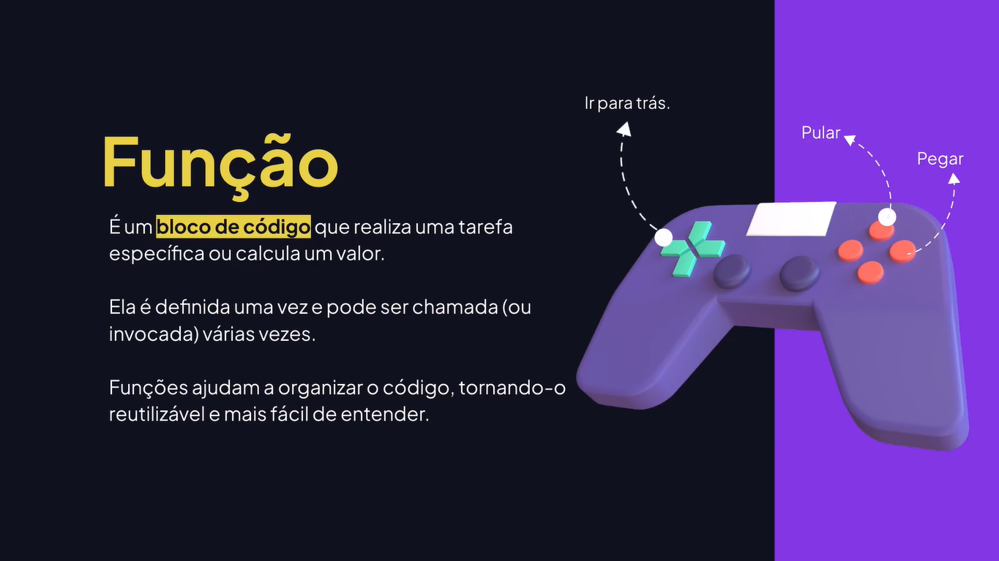

# Funções

---

## O que são funções



## Primeira Função

```js
function message() {
	console.log("Olá é bom ter você aqui!");
};

message();
message();
message();
```

## Argumentos e Parâmetros

```js
/*
	- Parâmetros: é a variável (escopo da função) que irá receber um valor em uma função.
	- Argumentos: é o valor que é passado para a função.
*/

// Passando o parâmetro username.
function message(username) {
  console.log("Olá", username);
}

// Passando argumentos.
message("Rodrigo");
message("Ana");

function sum(a, b) {
	console.log(a + b);
}

sum(10, 20);
sum(7, 3);

// Definindo um valor (argumento) padrão.
function joinText(text1, text2 = "", text3 = "") {
	console.log(text1, text2, text3);
}

joinText("Rodrigo", "Gonçalves", "Santana");
joinText("Gonçalves", "Rodrigo", "Santana");

joinText("Rodrigo", "Gonçalves");
```

## Retornando Valores

```js
function sum(a, b) {
	let result = a + b;
	
	return result
}

let response = sum(7, 7);
console.log(response);

console.log(sum(5, 6));
```

## Escopo de Função

```js
showMessage("Olá, Rodrigo!");

function showMessage(message) {
	console.log(message);
	endLine();
	
	function endLine() {
		console.log("--------");
	}
}

showMessage("Tudo bem?");

// Não existe nesse escopo.
// endLine();
```

## Comentário de Documentação

```js
/*
	Comentário de documentação em JavaScript (sintaxe de JSDoc). 
	O JSDoc é um padrão para incorporar documentação no código-fonte a
	partir desses comentários.
*/

/**
 * Authenticates the user 
 *
 * @param {String} email user email
 * @param {String} password more than 6 characters
 * @returns {Number} user id.
 */
function signIn(email, password) {
	// Fluxo de autenticação do usuário.
	
	return 7;
}

signIn("rodrigo@email.com", "12345678");
```

## Função Anônima

```js
// Função anônima (função que não possui nome)
const showMessage1 = function() {
	return "Olá, Rodrigo";
}

console.log(showMessage1());

const showMessage2 = function(message, name) {
	return message + name;
}

console.log(showMessage2("Olá ", "João"));
```

## Arrow Function

```js
// Arrow Function (função de seta).
const showMessage1 = () => {
	console.log("Olá");
}

console.log(showMessage);
showMessage();

const showMessage2 = (username, email) => {
	// console.log("Olá, ", username, ". Seu e-mail é: ", email);
	
	console.log(`Olá, ${username}. Seu e-mail é: ${email}`);
}

showMessage2("Maria", "maria@email.com");
```

## Callback Function

```js
// CALLBACK FUNCTION: é uma função passada para outra função como um argumento.

function execute(taskName, callback) {
	console.log("Executando a tarefa: ", taskName);
	
	callback();
}

function callback() {
	console.log("Tarefa finalizada.");
}

// Passando para a função.
execute("Download do arquivo...", callback);

// Criando a função no próprio parâmetro (função anônima).
execute("Upload do arquivo...", function() {
	console.log("Função de callback com um função anônima.");
});

// Utilizando Arrow Function
execute("Excluindo arquivo...", () => {
	console.log("Arquivo excluído!");
});

execute("Salvando arquivo...", () => console.log("Arquivo Salvo!"));
```
