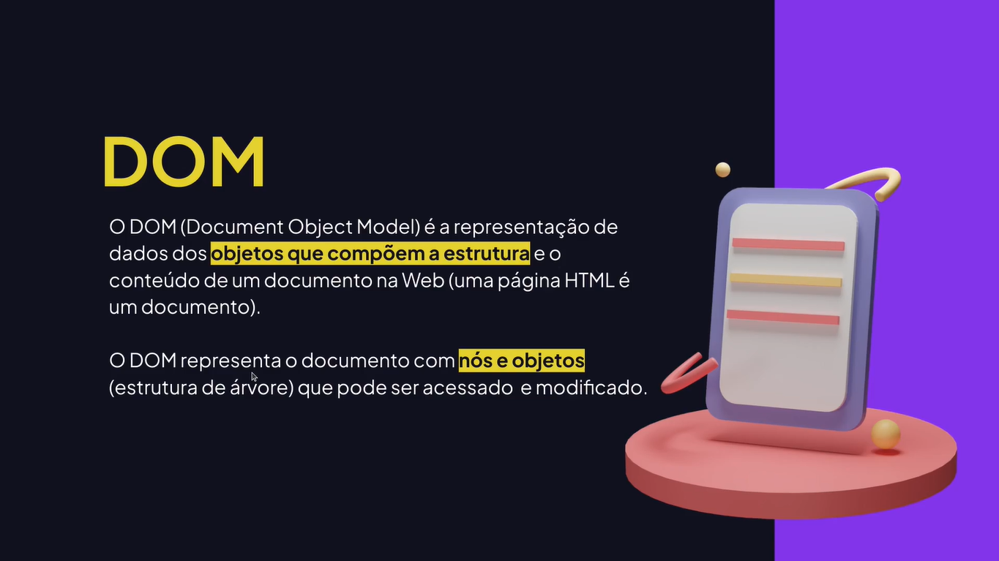
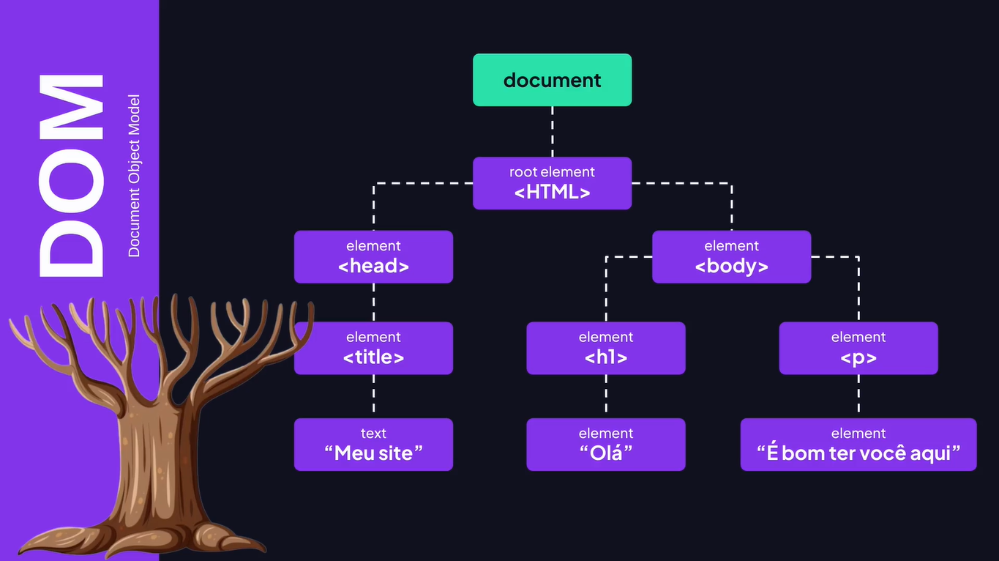

# Document Object Model

---

## DOM





## Acessando Elementos no DOM

```js
// Visualizar o conteúdo do document.
// console.log(document);

// Obter o title da página.
console.log(document.title);

// Acessar o elemento pelo ID (SELETOR ID).
const guest = document.getElementById("guest-2");
console.log(guest);

// Mostra as propriedades do objeto.
console.dir(guest);

// Acessar elemento com class (SELETOR class).
const guestsByClass = document.getElementsByClassName("guest");
console.log(guestsByClass);

// Exibir o primeiro elemento da lista.
console.log(guestsByClass.item(0));
console.log(guestsByClass[0]);

// Selecionar lista de elementos pela tag.
const guestsTag = document.getElementsByTagName("li");
console.log(guestsTag);
```

## Query Selector

```js
// Acessa o elemento pelo seletor ID
const guest = document.querySelector("#guest-2");
console.log(guest);

// Acessa o elemento pelo seletor class
// const guests = document.querySelector(".guest");

// Retorna todos os elementos encontrados pelo query
const guests = document.querySelectorAll(".guest");
console.log(guests);
```

## Manipulando Conteúdo

```js
const guest = document.querySelector("#guest-1");

// Retorna o conteúdo como texto.
// console.log(guest.textContent);
// guest.textContent = "Maria";

console.log(guest.textContent); // Retorna o conteúdo visível e oculto.
console.log(guest.innerText); // Retorna somente o conteúdo visível.
console.log(guest.innerHTML); // Retorna o HTML como texto.
```

## Alterando Estilos

```js
const input = document.querySelector("#name");

// Adiciona a classe.
// input.classList.add("input-error");

// Remove a classe.
// input.classList.remove("input-error");

// Se não tiver a classe adiciona. Se tem, remove.
// input.classList.toggle("input-error");

const button = document.querySelector("button");

// Modificar as propriedades css do elemento.
button.style.backgroundColor = "red";
```

## Criando Elementos

```js
const guests = document.querySelector("ul");

const newGuest = document.createElement("li");
newGuest.classList.add("guest");

const guestName = document.createElement("span");

guestName.textContent = "Diego";

const guestSurname = document.createElement("span");
guestSurname.textContent = "Fernandes";

// Adiciona após o último filho.
// newGuest.append(guestName, guestSurname);

// Adiciona antes do primeiro filho.
// newGuest.prepend(guestSurname);

// É mais simples que o append e aceita apenas um argumento.
newGuest.appendChild(guestName);

// guests.appendChild(newGuest);
guests.prepend(newGuest);
```

## Manipulando Atributos

```js
const input = document.querySelector("input");

// Adicionar ou atualizar um atributo.
// input.setAttribute("disabled", true);
// input.setAttribute("type", "file");

// Remover um atributo.
input.removeAttribute("id");
```

## Eventos

```js
window.addEventListener("load", () => {
  console.log("A página foi carregada!");
});

addEventListener("click", (event) => {
  event.preventDefault();

  // Retorna todas as informações do evento.
  // console.log(event);

  // Retorna o elemento clicado.
  console.log(event.target);

  // Retorna o textContent do elemento clicado.
  console.log(event.target.textContent);
});
```

## Eventos em um elemento específico

```js
const ul = document.querySelector("ul");

ul.addEventListener("scroll", () => {
  if (ul.scrollTop > 300) {
    // console.log("FIM DA LISTA");

    ul.scrollTo({
      top: 0,
      behavior: "smooth",
    });
  }
});

const button = document.querySelector("button");
button.addEventListener("click", (event) => {
  event.preventDefault();
  console.log("CLICOU!");
});
```

## Eventos de Formulário

```js
const form = document.querySelector("form");

form.onsubmit = (event) => {
  event.preventDefault();
  console.log("Você fez submit no formulário #1");
};

form.onsubmit = (event) => {
  event.preventDefault();
  console.log("Você fez submit no formulário #2");
};

form.addEventListener("submit", (event) => {
  event.preventDefault();
  console.log(" Vocé fez submit no formulário #3");
});

form.addEventListener("submit", (event) => {
  event.preventDefault();
  console.log(" Vocé fez submit no formulário #4");
});
```

## Eventos em Input

```js
const input = document.querySelector("input");

// keydown - quando uma tecla é pressionada (captura tudo, incluindo CTRL, SHIFT, etc.)
/* input.addEventListener("keydown", (event) => {
  console.log(event.key);
}); */

// keypress - quando uma tecla do tipo caractere é pressionada (letras, números, pontos, etc.)
input.addEventListener("keypress", (event) => {
  console.log(event.key);
});

// change - quando o valor do input mudar
input.onchange = () => {
  inputChange();
};

function inputChange() {
  console.log("O INPUT MUDOU!");
}
```

## Compreendendo Expressão Regular


## Manipulando Valor do Input

```js
const input = document.querySelector("input");
const form = document.querySelector("form");

/*  input.addEventListener("input", () => {
  const value = input.value;
  
  const regex = /\D+/g;
  
  // Retorna o padrão encontrado na string.
  // console.log(value.match(regex));

  // Testa se atende o padrão.
  // const isValid = regex.test(value);
  // console.log(isValid);
}); */

form.addEventListener("submit", (event) => {
  event.preventDefault();
  const value = input.value;

  const regex = /\D+/g;

  if (regex.test(value)) {
    console.log(value);
  } else {
    alert("Valor inválido. Digite corretamente!");
  }

  // const value = input.value.replace(regex, "");
  // console.log(value);
});
```
