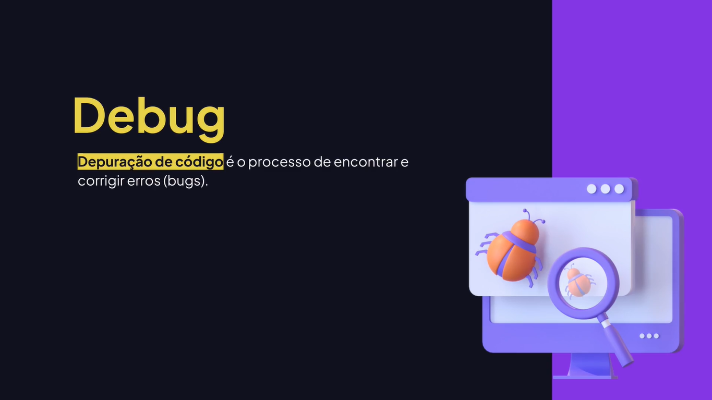

# Depuração de Código

---

## O Que É Depurar o Código




## Depurando o Código

```js
const input = document.querySelector("input");
const form = document.querySelector("form");

form.onsubmit = (event) => {
  event.preventDefault();

  const value = input.value;
  const hasNumberRegex = /\d+/g;

  if (hasNumberRegex.test(value)) {
    alert("O texto contém números. Por favor, digite corretamente.");
  } else {
    alert("Enviado!");
  }
};
```