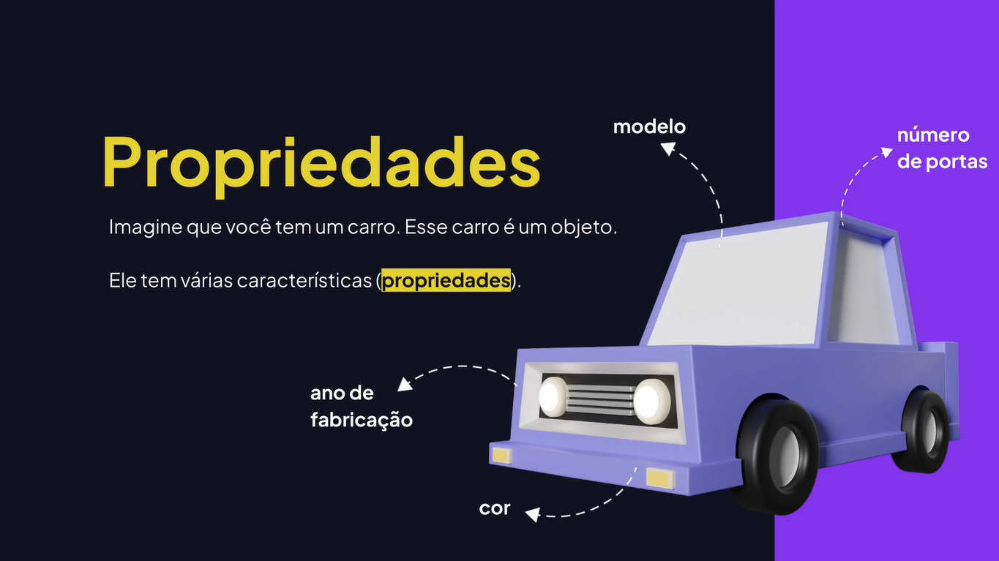

# Objetos

---

## Aprendendo Sobre Objetos





## Criando Um Objeto

```js
/*
	OBJETO
	  - Uma coleção de dados e/ou funcionalidades;
	  - Podem ter propriedades e métodos;
*/

// Cria um objeto vazio.
const obj = {};
console.log(obj);
console.log(typeof obj);

// Cria um objeto com propriedades e métodos.
const user = {
	email: "rodrigo@email.com",
	age: 18,
	name: {
		first_name: "Rodrigo",
		surname: "Gonçalves",
	},
	address: {
		street: "Rua x",
		number: 23,
		city: "São Paulo",
		postal_code: "12345-123",
	},
	message: function() {
		console.log("Oi Rodrigo");
	},
};
```

## Acessando Um Objeto

```js
const user = {
	email: "rodrigo@email.com",
	age: 18,
	name: {
		first_name: "Rodrigo",
		surname: "Gonçalves",
	},
	address: {
		street: "Rua x",
		number: 23,
		city: "São Paulo",
		postal_code: "12345-123",
	},
	message: function() {
		console.log("Oi Rodrigo");
	},
};

// Acessando propriedades e métodos usando a notação de ponto.
console.log(user.email);

// Acessando propriedade de objetos.
console.log(user.name.first_name);

// Executa o método do objeto.
user.message();

// Notação de colchetes.
console.log(user["email"]);
console.log(user["name"]["first_name"]);
user["message"]();
```

## Acessando Propriedades No Contexto Do Objeto

```js
const user = {
	name: "João",
	email: "rodrigo@email.com",
	message: function() {
		// console.log(`Olá ${user.name}`);
		console.log(`Olá ${this.name}`);
	},
};

user.message();
```

## Encadeamento Opcional (Optional Chaining)

```js
/*
	OPTIONAL CHAINING (?.) - encadeamento opcional
	Se a propriedade ou função chamada é nullish (null or undefined), a expressão retorna 
	undefined em vez de gerar um erro.
	
	Útil ao explorar o conteúdo de um objeto quando não existe garantia da existência de
	determinadas propriedades obrigatórias.
*/

const user = {
	id: 1,
	name: "Rodrigo",
	/* address: {
		street: "Avenida Brasil",
		city: "São Paulo",
		geo: {
			latitude: 47.808,
			longitude: 17.5674,
		},
	}, */
	message: function() {
		console.log(`Olá, ${this.name}`);
	},
};

console.log(user?.address);
console.log(user?.address?.street);

user.message?.();
```

## Operador de Coalescência Nula

```js
/*
	OPERADOR DE COALESCÊNCIA NULA (??)
	Operador lógico que retorna o seu operando do lado direito quando o seu operador do
	lado esquerdo é null ou undefined. Caso contrário, ele retorna o seu operando do
	lado esquerdo.
*/

let content = undefined;
console.log(content ?? "Conteúdo padrão");

const user = {
	name: "Rodrigo",
	avatar: undefined,
};

console.log(user.avatar ?? "default.png");
```

## O Que É Uma Função Construtora?

```js
function createProduct(name) {
	const product = {};
	
	product.name = name;
	product.details = function() {
		console.log(`O nome do produto é ${this.name}`);
	};
	
	return product;
};

// O new cria um novo objeto utilizando a estrutura da função construtora.
const product1 = new createProduct("Teclado");
console.log(product1.name);
product1.details();

const product2 = new createProduct("Mouse");
console.log(product2.name);
product2.details();

// console.log(product1 === product2);

// Exemplos de funções construtoras disponíveis no próprio JavaScript.
let myName = new String("Rodrigo");
console.log(myName);

let price = "40.6".replace(".", "");
console.log(price);

let date = new Date("2024-1-1");
console.log(date);

function Person(name) {
	this.name = name;
	this.message = function() {
		console.log(`Olá, ${this.name}`);
	};
};

const person1 = new Person("Rodrigo");
console.log(person1.name);
person1.message();

const person2 = new Person("João");
console.log(person2.name);
person2.message();
```
