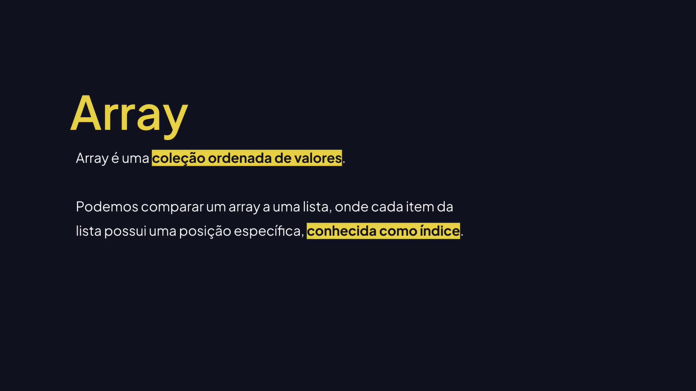
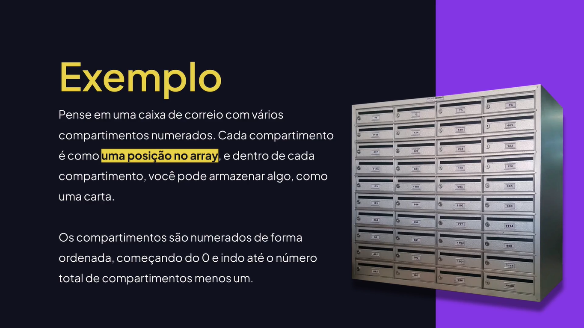
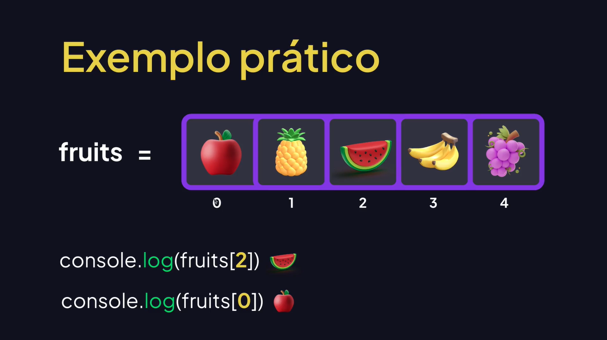

# Arrays

---

## Aprendendo Sobre Arrays







## Criando Um Array Com Um Construtor

```js
// Criando Array com construtor.
const newArray = new Array();
console.log(newArray);
console.log("Rodrigo".length);

// Retorna o tamanho do Array.
console.log(newArray.length);

// [] - Array
// {} - Object

// Cria o Array com 10 posições vazias.
const available = new Array(10);
console.log(available);
console.log(available.length);
```

## Criando e Acessando Um Array

```js
// Cria o Array.
let fruits = ["Apple", "Banana", "Orange", "Watermelon"];
console.log(fruits);

// Quantidade de itens do Array.
console.log(fruits.length);

// Acessa o item pelo índice.
console.log(fruits[1]);

// Tenta acessar um índice que não existe.
console.log(fruits[7]);

// Obtém dinamicamente o último item.
console.log(fruits[fruits.length - 1]);
```

## Convertendo Uma String Para Array

```js
let fullName = "Rodrigo Gonçalves Santana";
console.log(fullName);

// Cria um Array com os nomes separando pelo espaço.
console.log(fullName.split(" "));

// Cria um Array com as letras.
console.log(Array.from(fullName));
```

## Adicionando e Removendo Um Item do Array

```js
let users = [];
// console.log(users);

// Adiciona um item no final do Array.
users.push("Rodrigo");
users.push("João");
users.push("Marcos");

// Adiciona um item no início do Array.
users.unshift("Ana");

// Remove do início do Array.
users.shift();

// Remove do final do Array.
users.pop();

console.log(users);
```

## Usando o Índice

```js
let fruits = ["Apple", "Watermelon", "Lemon", "Strawberry"];
// console.log(fruits);

// Encontra e retorna o índice do elemento no Array.
let position = fruits.indexOf("Lemon");
console.log(position);

// Remove um item pela posição do índice (1 é o número de itens para remover)

// fruits.splice(1, 2);
fruits.splice(position, 1);
console.log(fruits);
```

## Quais Elementos o Array Aceita?

```js
let myArray = [
	"Um texto",
	10,
	true,
	function() {
		console.log("Função dentro do Array!");
	},
	{
		name: "Rodrigo",
		email: "rodrigo@email.com",
	},
];

// Texto.
console.log(myArray[0]);

// Número.
console.log(myArray[1]);

// Boolean.
console.log(myArray[2]);

// Função.
myArray[3]();

// Objeto.
console.log(myArray[4].name, myArray[4].email);
```

## Verificando Se Existe Um Conteúdo No Array

```js
let fruits = ["Apple", "Orange", "Banana", "Strawberry"];

// Verifica se um item existe no Array.
console.log(fruits.includes("Apple"));
console.log(fruits.includes("Strawberry"));
console.log(fruits.includes("Lemon"));
```
