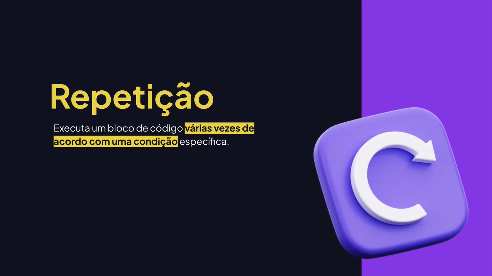
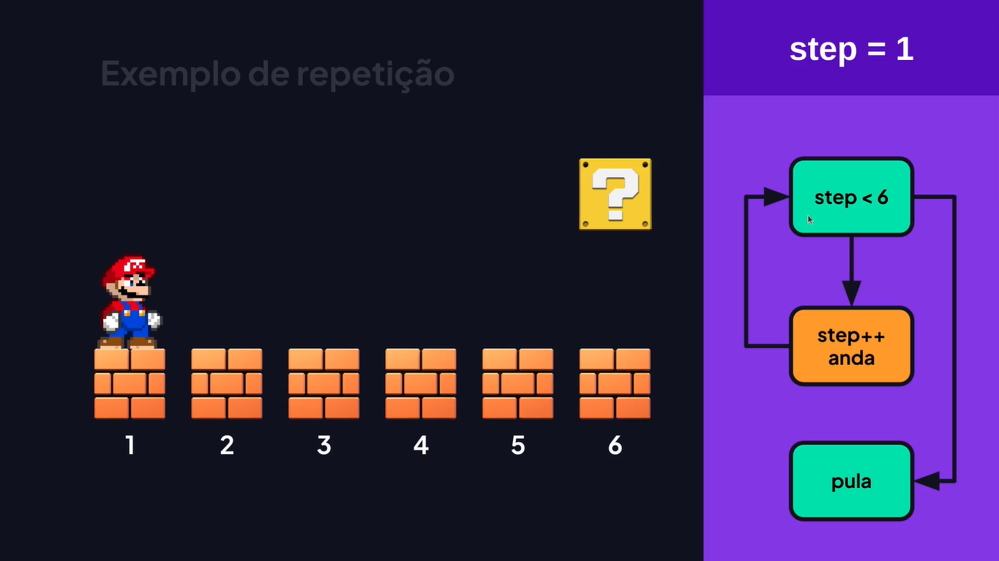
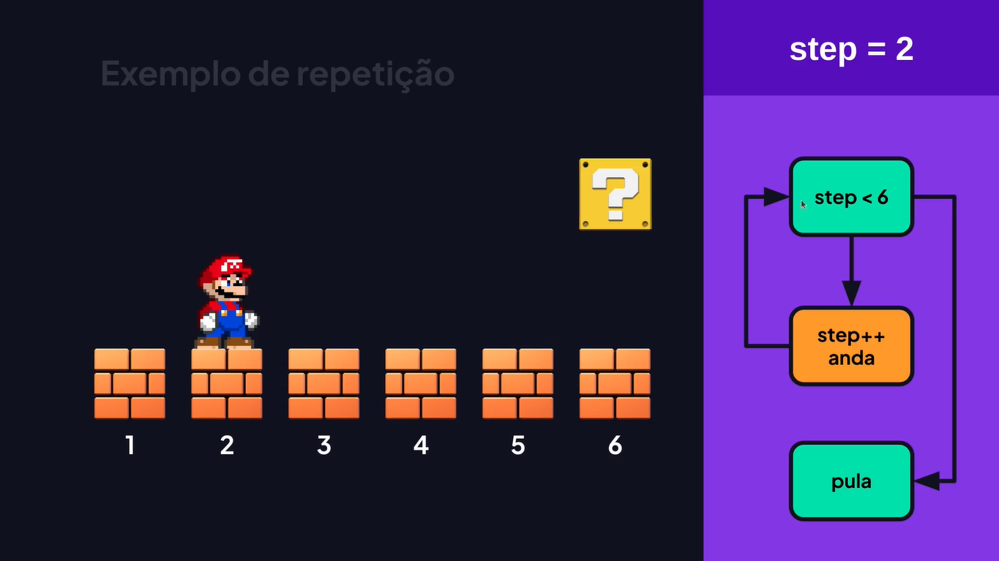
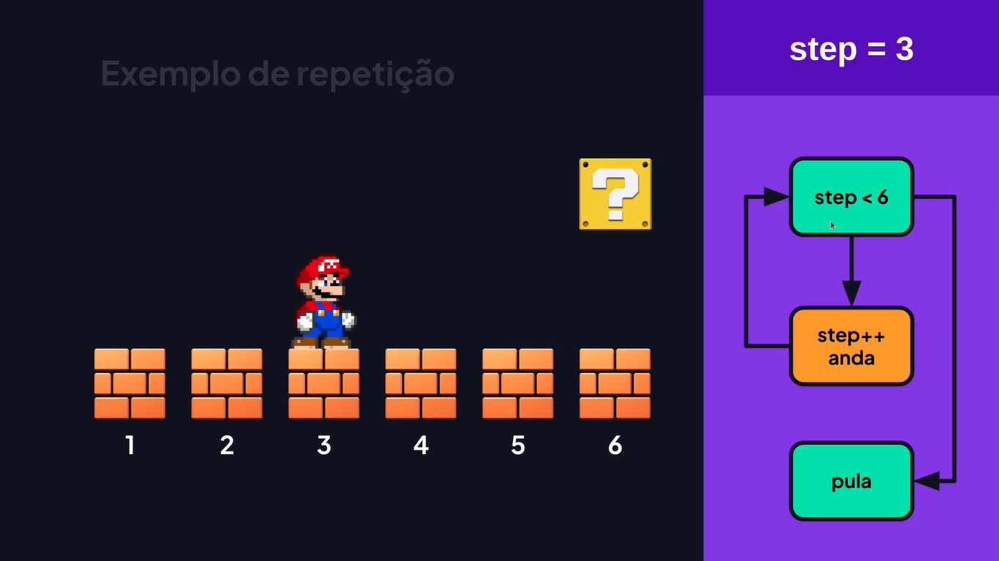
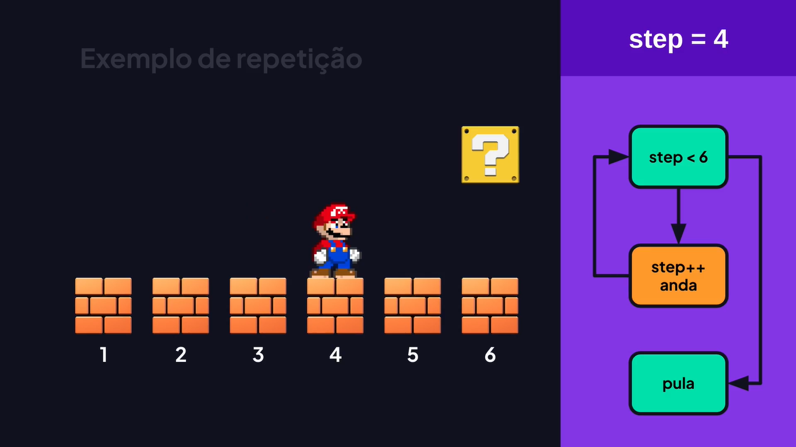
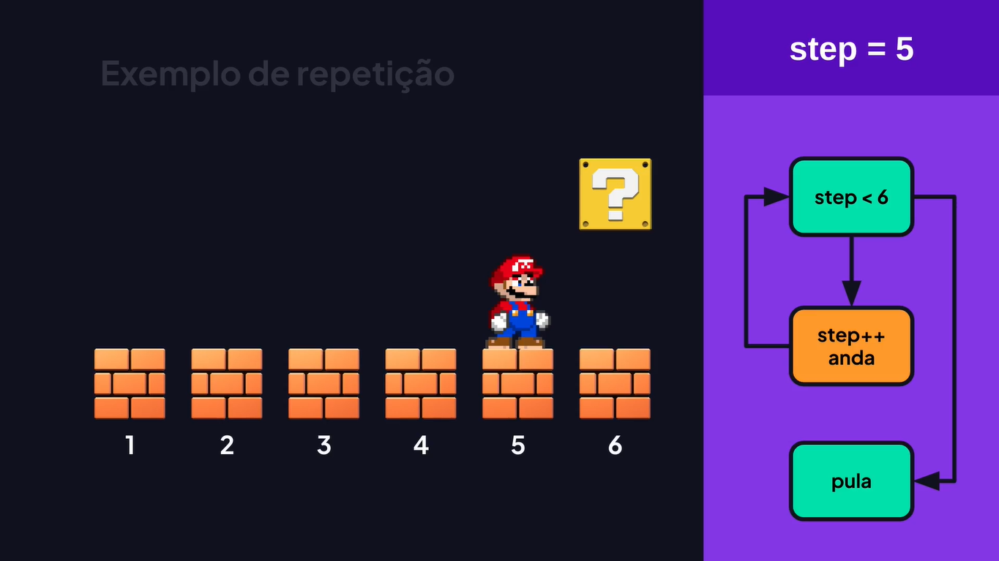
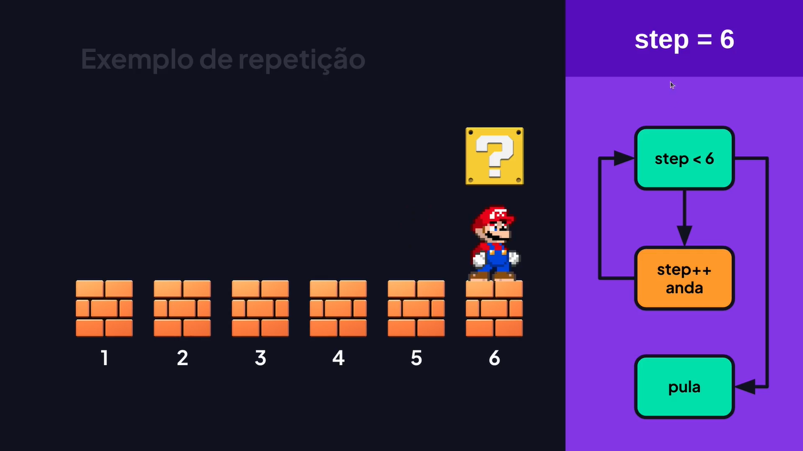
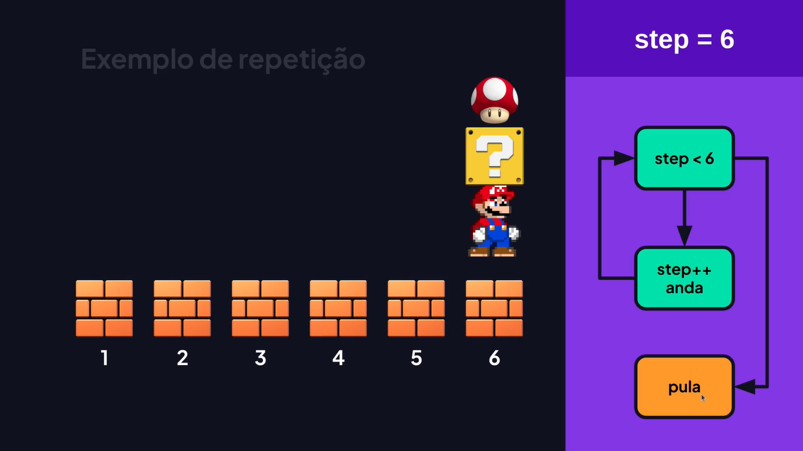

# Repetição e Iteração

---

## Aprendendo Sobre Repetições

















## Loop While

Executa até que a condição seja VERDADEIRA.

```js
let execute = true;

while (execute) {
	let response = window.prompt("Deseja continuar: 1 (SIM) ou 2 (NÃO)");
	
	if (response === "2") {
		execute = false;
	};
};

console.log("Segue o fluxo...");
```

## Loop Infinito

```js
let value = true;

while (value) {
	console.log("Executando while...");
};
```

## Loop Do While

Repete até que a condição especificada seja VERDADEIRA. No entanto, a instrução será executada pelo menos uma vez antes da condição ser verificada.

```js
let value = 0;

do {
	value++;
	console.log(value);
} while (value < 10);

console.log("Segue fluxo...");
```

## Loop For

Repete até que a condição especificada seja FALSA.

- Variável de controle.
- Condição.
- Incremento ou decremento da variável de controle.

```js
for (let step = 0; step < 10; step++) {
	console.log(step);
};
```

### Exemplo de tabuada

Sem FOR.

```js
console.log("### TABUADA ###");
console.log(`7 x 0 = ${7 * 0}`);
console.log(`7 x 1 = ${7 * 1}`);
console.log(`7 x 2 = ${7 * 2}`);
console.log(`7 x 3 = ${7 * 3}`);
console.log(`7 x 4 = ${7 * 4}`);
console.log(`7 x 5 = ${7 * 5}`);
console.log(`7 x 6 = ${7 * 6}`);
console.log(`7 x 7 = ${7 * 7}`);
console.log(`7 x 8 = ${7 * 8}`);
console.log(`7 x 9 = ${7 * 9}`);
console.log(`7 x 10 = ${7 * 10}`);
```

Com FOR.

```js
let number = 7;

for (let step = 0; step <= 10; step++) {
	console.log(`${number} x ${step} = ${number * step}`);
};
```

## For In

Executa iterações a partir de um objeto e percorre as propriedades.

```js
let person = {
	name: "Rodrigo",
	surname: "Gonçalves",
	email: "rodrigo@email.com",
};

for (let property in person) {	
	// Exibe o nome da propriedade.
	console.log(property);
	
	// Exibe o contéudo da propriedade.
	console.log(person[property]);
};

let students = ["Rodrigo", "João", "Amanda"];

for (let index in students) {
	// console.log(index);
	console.log(students[index]);
};
```

## For Of

Itera sobre valores de um objeto iterável.

```js
let students = ["Rodrigo", "Amanda", "John"];

for (let student of students) {
	console.log(student);
};

let user = [
	{
		name: "Rodrigo",
		email: "rodrigo@email.com",
	},
];

for (let value of user) {
	console.log(value.email);
};
```

## Break

Encerra a execução da repetição ou SWITCH para seguir para a instrução seguinte.

```js
let option = 2;

switch (option) {
	case 1:
		console.log("Cadastrar");
		break;
	case 2:
		console.log("Atualizar");
		break;
	case 3:
		console.log("Remover");
		break;
	default:
		console.log("Opção inválida");
		break;
};
```

### Utilizando o BREAK para finalizar a repetição.

```js
for (let i = 0; i < 10; i++) {
	if (i === 5) {
		break;
	};
	
	console.log(i);
};
```

## Continue

Encerra (pula) a execução das instruções na iteração atual e continua a execução do loop com a próxima iteração.

```js
for (let i = 0; i < 10; i++) {
	if (i === 5) {
		continue;
	};

	console.log(i);
};
```
