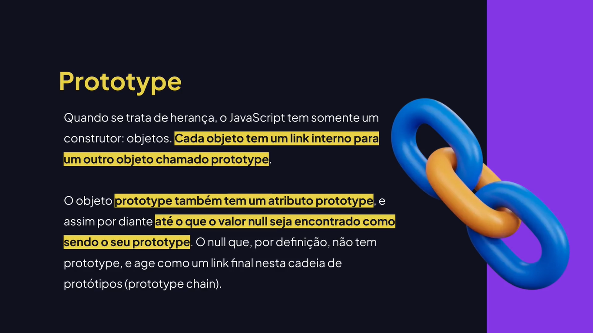

# Classes

---

## Aprendendo Sobre Classes


## Criando Uma Classe Com Um Método Construtor

```js
class Person {
	constructor(name) {
		console.log("Olá", name);
	}
}

const person = new Person("Rodrigo");
```

## Criando Propriedades Dentro Das Classes

```js
class Product {
	constructor(name) {
		this.name = name;
	}
}

const product1 = new Product("Teclado");
console.log(product1.name);

const product2 = new Product("Mouse");
console.log(product2.name);
```

## Adicionando Métodos Nas Classes

```js
class User {
	constructor(name, email) {
		this.name = name;
		this.email = email;
	}
	
	sendEmail() {
		console.log("E-mail enviado para", this.name, "no endereço eletrônico", this.email);
	}
}

const user = new User("Rodrigo", "rodrigo@email.com");
user.sendEmail();
```

## O Que É Método Estático?

```js
class User {
	static showMessage(message) {
		console.log(message);
	}
}

// const user = new User();
// user.showMessage();

User.showMessage("Essa é uma mensagem");
```

## Como Aplicar Herança Com Classes?

```js
class Animal {
	constructor(name) {
		this.name = name;
	}
	
	makeNoise() {
		console.log("Algum som genérico do animal");
	}
}

class Dog extends Animal {
	// Não tem nada aqui
}

const dog = new Dog("Belu");
console.log(dog.name);
dog.makeNoise();

class Cat extends Animal {
	// Não tem nada aqui
}

const cat = new Cat("Mel");
console.log(cat.name);
cat.makeNoise();
```

## Sobrescrevendo Métodos

```js
class Animal {
	constructor(name) {
		this.name = name;
	}
	
	makeNoise() {
		console.log("Algum som genérico do animal");
	}
}

class Dog extends Animal {
	makeNoise() {
		console.log("Woof! Woof! Woof!");
	}
}

const dog = new Dog("Belu");
console.log(dog.name);
dog.makeNoise();

class Cat extends Animal {
	makeNoise() {
		console.log("Miau... Miau... Miau...");
	}
	
	run() {
		console.log("Correndo...");
	}
}

const cat = new Cat("Mel");
console.log(cat.name);
cat.makeNoise();

cat.run();
```

## Aprendendo Sobre Herança e Cadeia De Protótipos





## Criando Um Objeto Prototype

```js
const address = {
	city: "São Paulo",
	country: "Brazil",
};

console.log(address);

const users = ["Rodrigo", "João", "Maria"];

console.log(users);

const userName = "Rodrigo Gonçalves";
console.log(userName.__proto__);
```

## Como Utilizar Classes Pra Lidar Com Exceções

```js
let obj = [17];
let index = 300;

try {
	// obj.execute();
	
	if (!obj.includes(17)) {
		throw new Error("O número 17 não está disponível");
	};
	
	if (index > 99) {
		throw new RangeError("Número está fora do intervalo. Escolha um número de 0 À 99.");
	};
} catch (error) {
	if (error instanceof TypeError) {
		console.log("Método indisponível");
	} else if (error instanceof RangeError) {
		console.log(error.message);
	} else {
		console.log("Não foi possível realizar a ação");
	};	
};
```

## Como Utilizar Classes Para Criar Erros Customizados

```js
class MyCustomError {
	constructor(message) {
		this.message = "CLASSE DE ERRO CUSTOMIZADA: " + message;
	}
}

try {
	// throw new Error("Erro genérico");
	
	throw new MyCustomError("Erro personalizado lançado!");
} catch (error) {
	if (error instanceof MyCustomError) {
		console.log(error.message);
	} else {
		console.log("Não foi possível executar!");
	};
};
```
