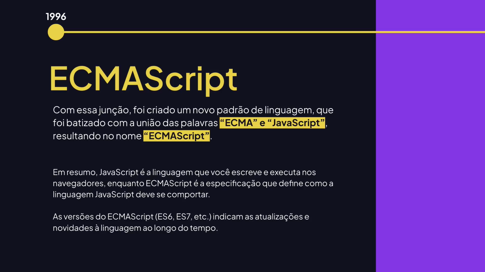

# JavaScript Moderno

---

## Conhecendo o ECMAScript





## Conhecendo o strict mode

```js
/* O strict mode (modo estrito): ativando esse modo, os
erros que eram silenciosos passam a gerar exceções no JavaScript */

"use strict"

function showMessage() {
  // personName = "Rodrigo Gonçalves";
	let personName = "Rodrigo Gonçalves";
	
	console.log("Olá", personName);
};

showMessage();

class Student {
	get point() {
		return 7;
	};
};

let student = new Student();
// Tenta mudar uma propriedade somente leitura.
// student.point = 10;

console.log(student.point());

// Tenta deletar uma propriedade de um objeto que não posso deletar.
// delete window.document;

// Quando passamos parâmetros duplicados
/* function sum(a, a, c) {
	return a + a + c;
};

const result = sum(1, 3, 2);
console.log("RESULTADO:", result); */
```

## Desestruturação de Array

```js
/* destructuring assigment (desestruturação) permite extrair
dados de arrays ou objetos em variáveis distintas. */

const data = ["Rodrigo Gonçalves", "rodrigo@email.com"];

// Desestruturando array
const [username, email] = data;
console.log("Nome:", username);
console.log("Email:", email);

const fruits = ["Banana", "Apple", "Orange"];

// Desestruturar somente o primeiro.
const [banana] = fruits;
console.log(banana);

// Ignorando o primeiro na desestruturação.
const [_, apple] = fruits;
console.log(apple);

// Ignorando o primeiro e o segundo na desestruturação.
const [, , orange] = fruits;
console.log(orange);
```

## Desestruturação de Objetos

```js
const product = {
	description: "Teclado",
	price: 150,
};

const {description, price} = product;
console.log("Descrição:", description);
console.log("Preço: R$", price);

function newProduct({description, price}) {
	console.log("### NOVO PRODUTO ###");
	console.log("Descrição:", description);
	console.log("Preço: R$", price);
};

newProduct({
	description: "Mouse",
	price: 70,
});
```

## Conhecendo rest params

```js
/* Rest params (...) permite representar um 
número indefinido de argumentos como um array. */

function values(a, ...rest) {
	// Mostra a quantidade de parâmetros.
	console.log(rest.length);
	
	// Exibindo o conteúdo do array.
	console.log(...rest);
	
	// Exibe o conteúdo do rest que é um array.
	console.log(rest);
};

values(2, 1, 3, 4);
```

## Conhecendo o spread

```js
/* spread (espalhar) permite que um objeto
iterável, como uma expressão de array ou uma
string seja expandido para ser usado onde
zero ou mais argumentos. */

const number = [1, 2, 3];
console.log(numbers);

// Spread
console.log(...numbers);

// Criando objeto
const data = [
	{
		name: "Rodrigo",
		email: "reodrigo@email.com",
		avatar: "r.png",
	},
	{
		name: "João",
		email: "joão@email.com",
		avatar: "j.png",
	},
];

console.log(data);

// Utilizando o spread no array com objetos.
console.log(...data);
```
