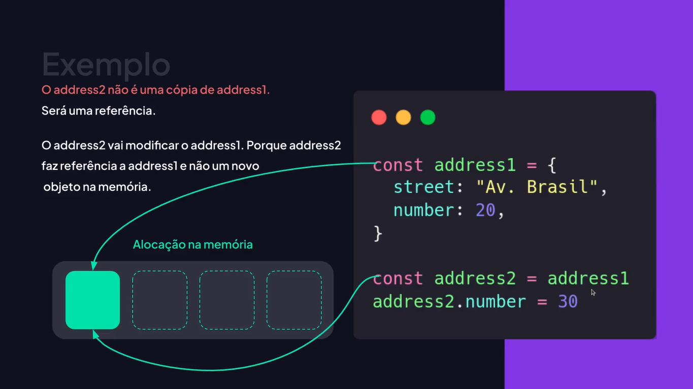
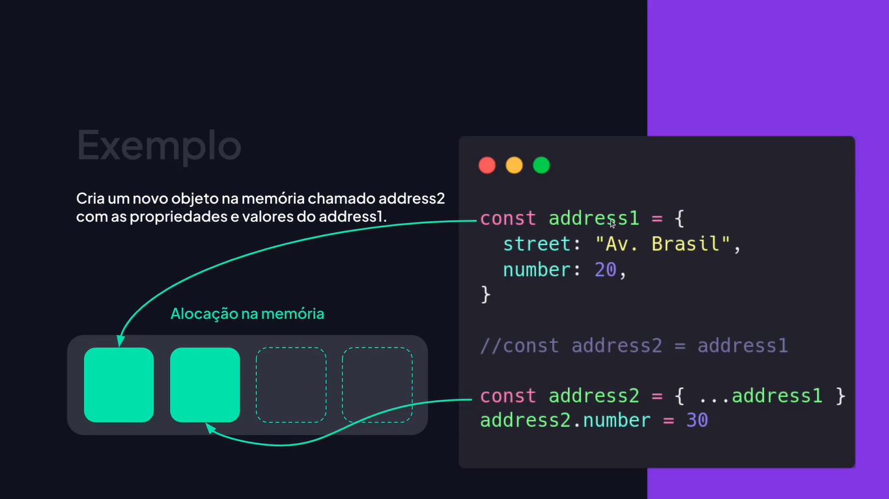
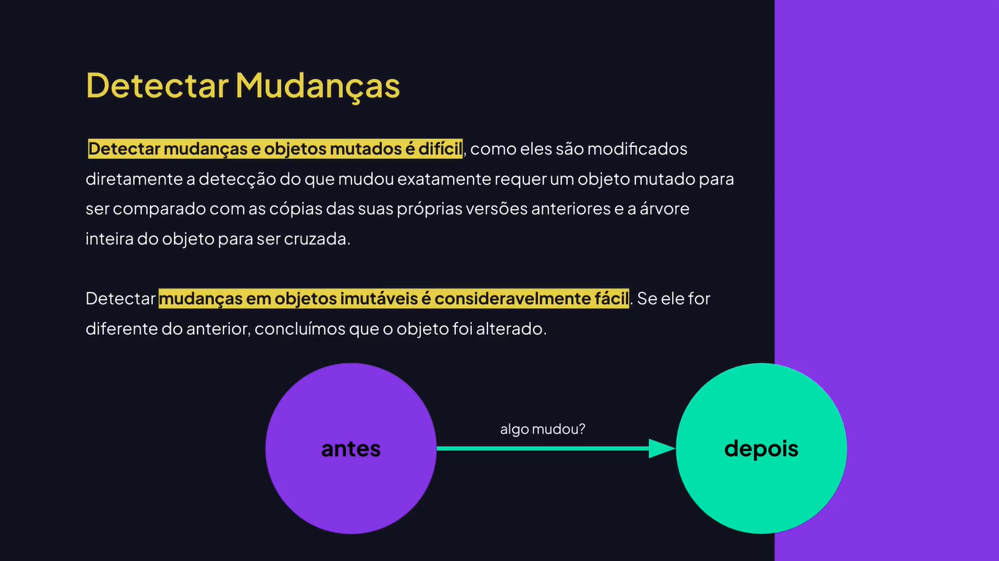

# Imutabilidade

---

## Conhecendo Sobre Imutabilidade











## Aplicando Imutabilidade

```js
const address1 = {
	street: "Av. Brasil",
	number: 20,
};

// Isso não é uma cópia. É uma referência.
// const address2 = address1;
// address2.number = 30;

// Aqui estamos criando um novo objeto utilizando as propriedades e valores de address1.
// const address2 = { ...address1 };
// address2.number = 30;

const address2 = { ...address1, number: 30 };
console.log(address1, address2);

const list1 = ["Apple", "Banana"];

// Exemplo de referência de Array
// const list2 = list1;
// list2.push("Watermelon");

const list2 = [...list1, "Watermelon"];
// list2.push("Watermelon");

console.log(list1, list2);
```

## Shallow e Deep Copy

```js
// Shallow Copy (cópia superficial): não pega os itens aninhados.

const htmlCourse = {
	course: "HTML",
	students: [{ name: "Rodrigo", email: "rodrigo@email.com" }],
};

/* const jsCourse = {
	...htmlCourse,
	course: "JavaScript",
}; */

// Vai modificar o htmlCourse também students é uma referência e não uma cópia.
// jsCourse.students.push({ name: "João", email: "joão@email.com" })

// Deep Copy (cópia profunda)

/* const jsCourse = {
	...htmlCourse,
	course: "JavaScript",
	students: [
		...htmlCourse.students,
		{ name: "Maria", email: "maria@email.com" }
	],
};

jsCourse.students.push({ name: "João", email: "joão@email.com" }) */

const jsCourse = {
	...htmlCourse,
	course: "JavaScript",
};

jsCourse.students = [
	...htmlCourse.students,
	{ name: "João", email: "joão@email.com" },
];

console.log(htmlCourse, jsCourse);
```

## Shallow Freezing

```js
const book = {
	title: "Objetos Imutáveis",
	category: "javascript",
	author: {
		name: "Rodrigo",
		email: "rodrigo@email.com"
	},
};

// O Javascript em si não impõe restrições à modificação dos objetos.
book.category = "HTML";

// Congela o objeto e impede a modificação.
Object.freeze(book);
book.category = "CSS"; // não modifica.

// O Object.freeze() não impede 
// modificações profundas em objetos aninhados (shallow freezing).)
book.author.name = "João";
console.log(book);
```

## Deep Freeze

```js
const book = {
	title: "Objetos Imutáveis",
	category: "javascript",
	author: {
		name: "Rodrigo",
		email: "rodrigo@email.com",
	},
};

function deepFreeze(object) {
	// Obtém um array com todas as propriedades do objeto.
	const props = Reflect.ownKeys(object);
	
	// Itera sobre todas as propriedades do objeto.
	for(const prop of props) {
		// Obtém o valor associado à propriedade atual.
		const value = object[prop];
		
		// Verifica se o valor é um objeto ou função para continuar o 
		// deepFreeze em objetos aninhados.
		if(value && typeof value === "object" || typeof value === "function") {
			deepFreeze(value);
		};
	};
	
	// Retorna o objeto congelado.
	return Object.freeze(object);
};

// Chama a função para congelar o objeto com Deep Freeze (congelamento profundo)
deepFreeze(book);

book.category = "HTML";
book.author.name = "João";

console.log(book);
```

## Manipulando Objetos Imutáveis

```js
const book = {
	title: "Objetos Imutáveis",
	category: "javascript",
	author: {
		name: "Rodrigo",
		email: "rodrigo@email.com",
	},
};

const updateBook = {
	...book,
	title: "Criando um Front-End moderno com HTML",
	category: "html",
	type: "Programming",
};

// Original intacto.
console.log(book);

// Modificado.
console.log(updatedBook);

// Utilizando operador de desestruturação (rest operator) para remover propriedades.
const { category, ...bookWithoutCategory } = book;
console.log(bookWithoutCategory)
```
