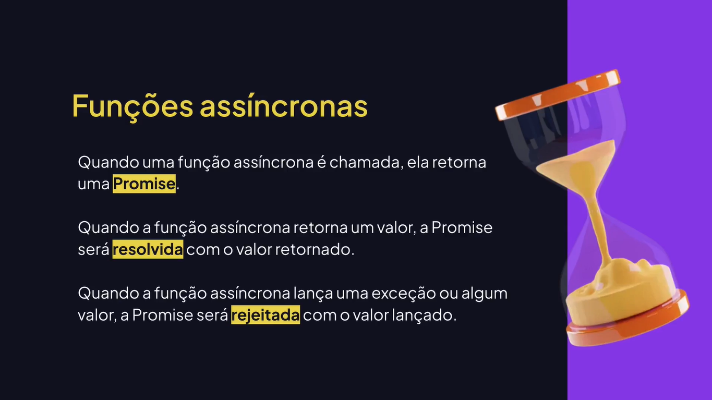
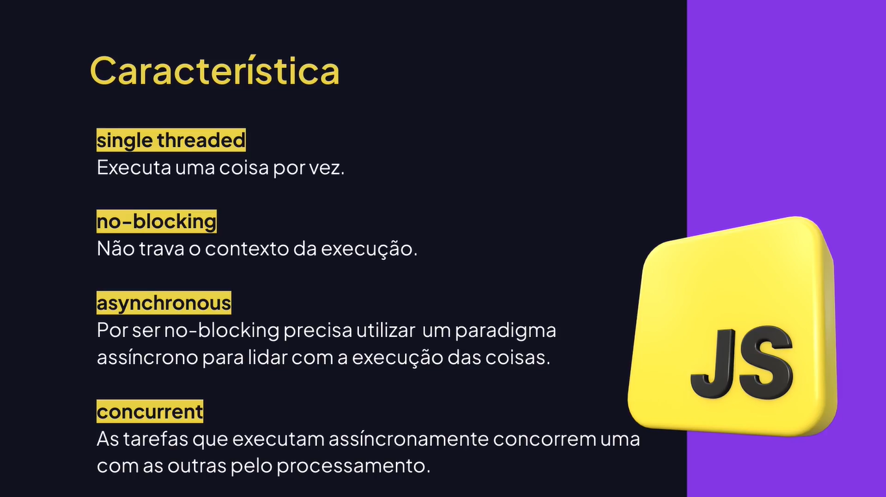
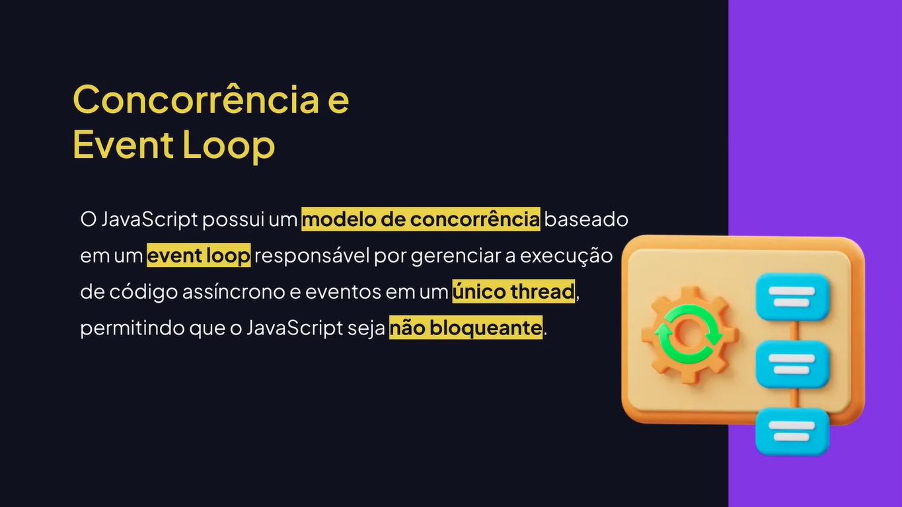
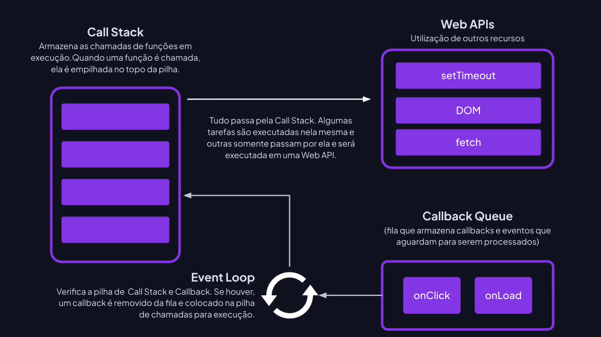
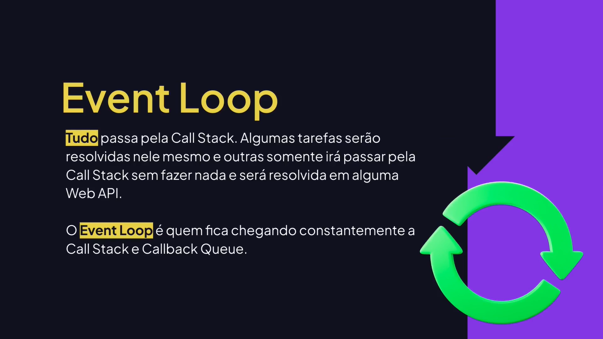
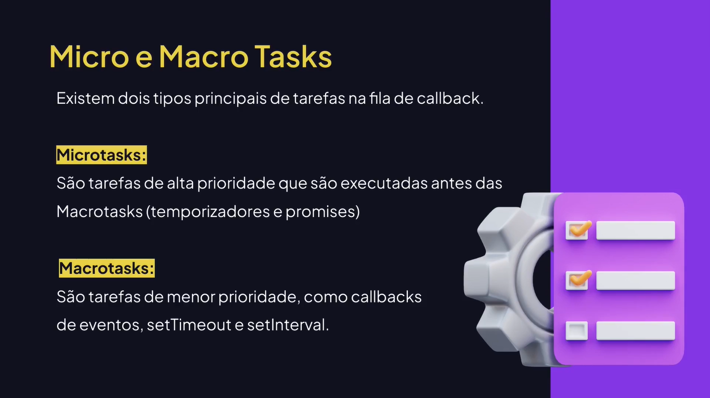
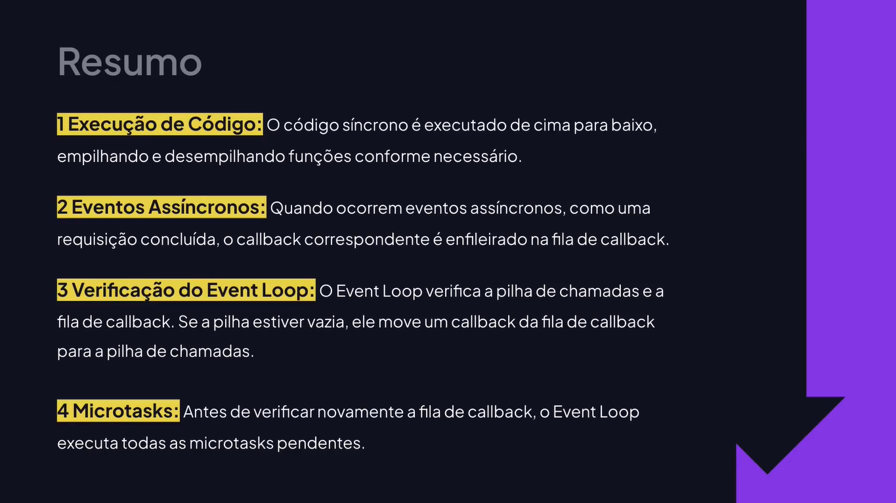

# Funções Assíncronas

---

## Conhecendo o setTimeOut()

```js
// setTimeOut() executa uma função após um intervalo de tempo especificado.

setTimeOut(() => {
	console.log("Olá, tudo bem?");
}, 3000); // tempo em milissegundos
```

## Conhecendo o setInterval()

```js
// setInterval() executa uma função após um intervalo de tempo especificado.
let value = 10;

const interval = setInterval(() => {
	console.log(value);
	value--;
	
	if (value === 0) {
		console.log("FELIZ ANO NOVO!!!");
		
		// Interrompe o intervalo de execuções.
		clearInterval(interval);
	}
}, 1000);
```

## Conhecendo Funções Assíncronas




## Conhecendo Promises

```js
// Função que retorna uma Promise.
function asyncFunction() {
	return new Promise((resolve, reject) => {
		// Simula uma operação assíncrona.
		setTimeOut(() => {
			const isSuccess = true;
		
			if (isSuccess) {
				resolve("A operação foi concluída com sucesso!");
			} else {
				reject("Algo deu errado!");
			};
		}, 3000); // Simula uma operação que leva 3 segundos.
	});
};

// Visualizando que o retorno é uma promise.
// console.log(asyncFunction());

console.log("Executando função assíncrona...");

// const response = asyncFunction();
// console.log(response);

asyncFunction()
	.then((response) => {
		console.log("Sucesso:", response);
	})
	.catch((error) => {
		console.log("Erro:", error);
	})
	.finally(() => {
		console.log("Fim da execução");
	});
```

## Conhecendo async e await

```js
// Função que retorna uma Promise.
function asyncFunction() {
	return new Promise((resolve, reject) => {
		setTimeOut(() => {
			const isSuccess = true;
		
			if (isSuccess) {
				resolve("A operação foi concluída com sucesso!");
			} else {
				reject("Algo deu errado!");
			};
		}, 3000);
	});
};

/* 
const fetch = async () => {
	const response = await asyncFunction();
	console.log(response);
}; 
*/

async function fetch() {
	try {
		const response = await asyncFunction();
		console.log("Sucesso:", response);
	} catch(error) {
		console.log("Erro:", error);
	} finally {
		console.log("Fim da execução!");
	}
};

fetch();
```

## Conhecendo o event loop













## Prioridade e Ordem de Execução

```js
// (1) Executa o código de forma síncrona e o valor 1 é
// impresso imediatamente no console.
console.log(1);

// (3) Microtasks são executadas antes de temporizadores e promessas.
queueMicrotask(() => {
	console.log(2);
});

// (5) Macrotasks que aguarda o evento de temporizador ser acionado.
setTimeOut(() => {
	console.log(3);
}, 1000);

// (2) Execução síncrona.
console.log(4);

// (4) Adiciona uma microtask.
Promise.resolve(true).then(() => {
	console.log(5);
});
```
