# Pacotes

---

## O Que São Pacotes?

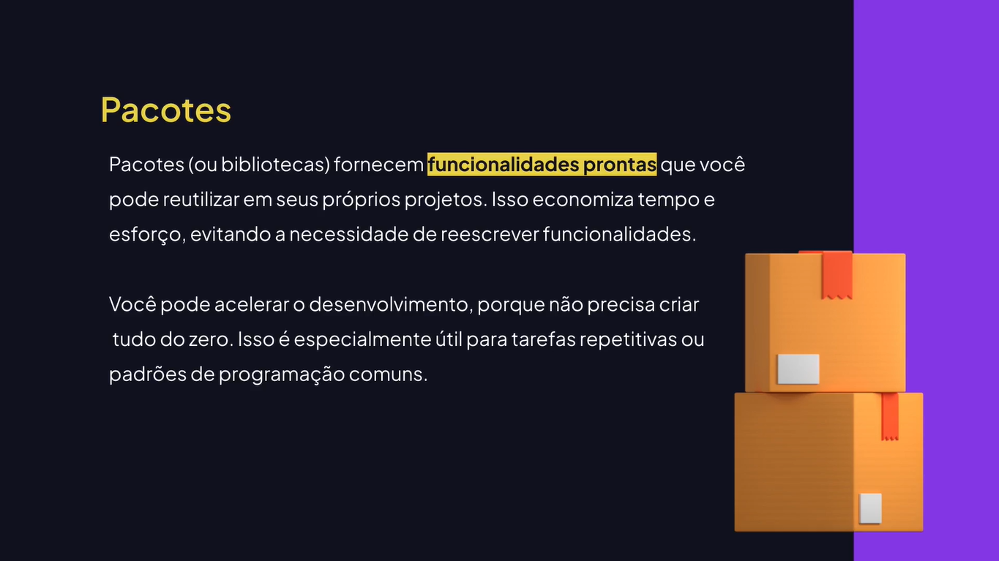

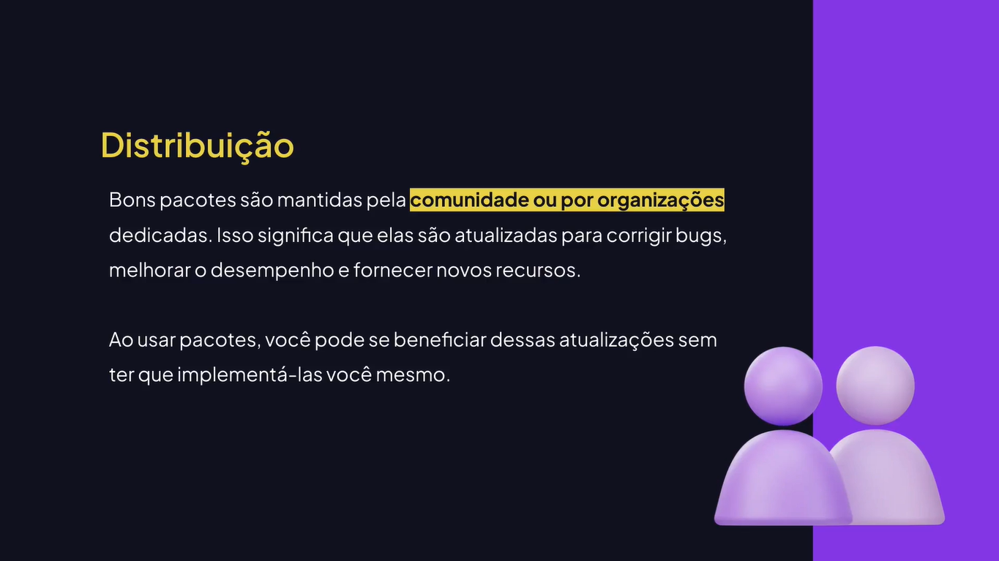

## Conhecendo o Pacote day.js

[Day.js](https://day.js.org)

[npm](https://npmjs.com)

## Utilizando o day.js Pelo Browser

```html
<!DOCTYPE html>
<html lang="en">
	<head>
		<meta charset="UTF-8" />
		<meta name="viewport" content="width=device-width, initial-scale=1.0" />
		
		<title>Aulas de Javascript</title>
	</head>
	<body>
		<!-- Adiciona pacote/biblioteca no projeto -->
		<script src="https://cdn.jsdelivr.net/npm/dayjs@1/dayjs.min.js"></script>
		<script type="module" src="main.js"></script>
	</body>
</html>
```

```js
const now = dayjs();
console.log(now.format("DD/MM - HH:mm"));
```

## Gerenciadores de Pacote

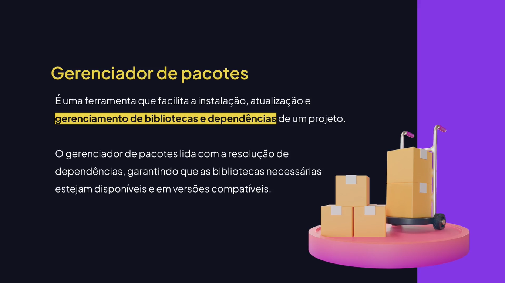

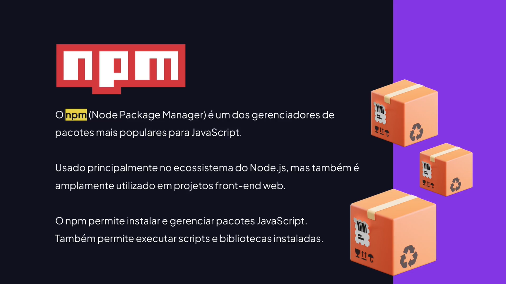

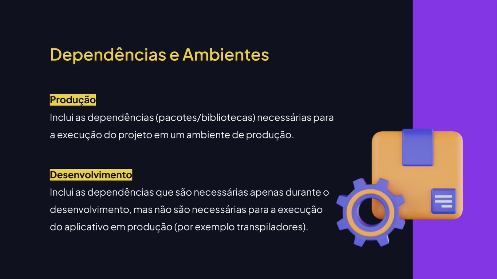

## Conhecendo o Node e o npm

[Node.js](https://nodejs.org)

## Resolução de Dependências

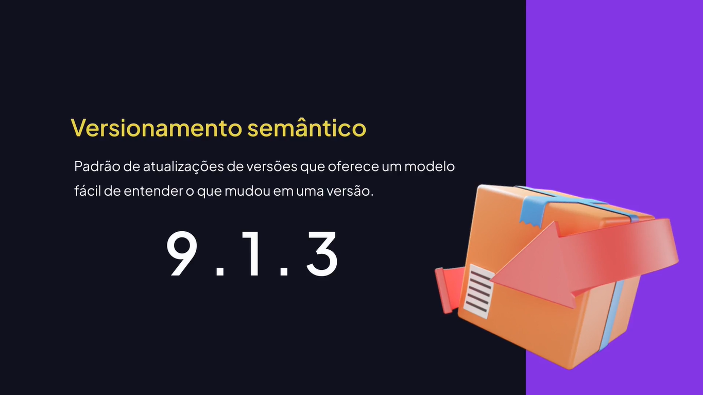

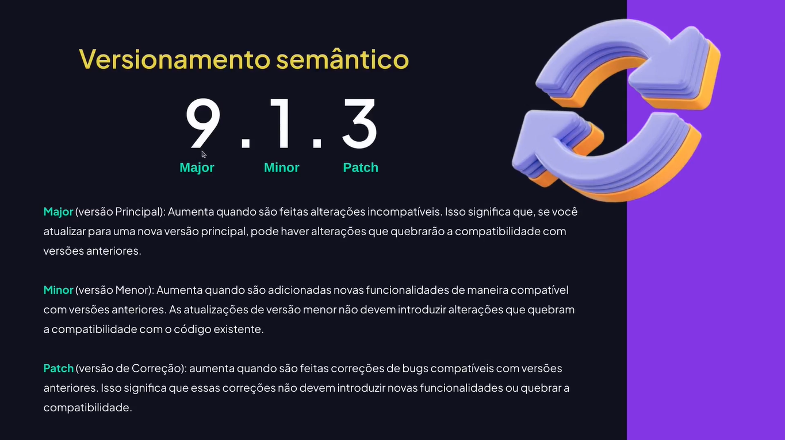

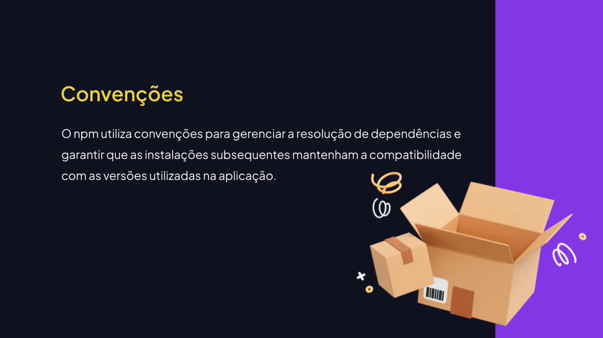

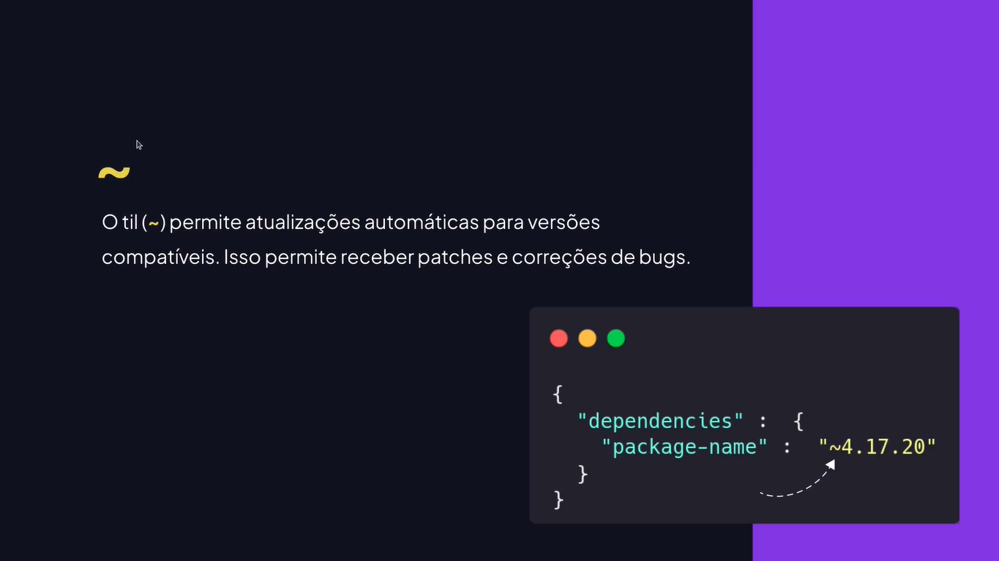

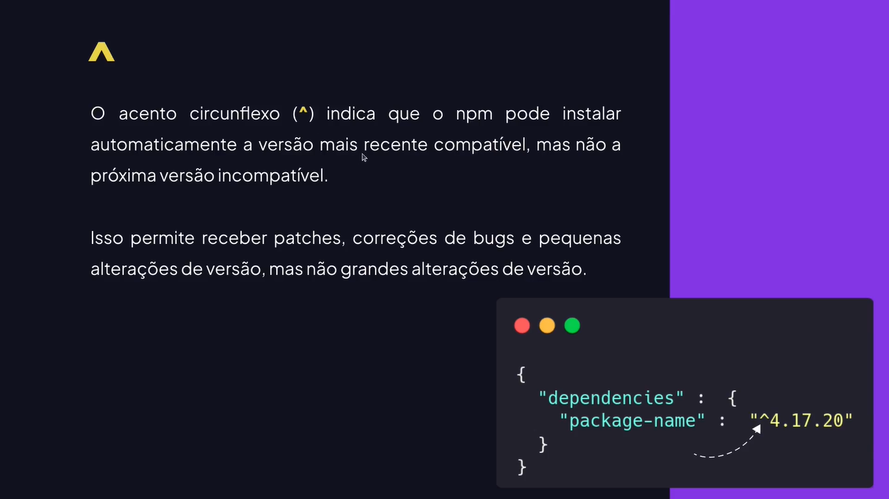

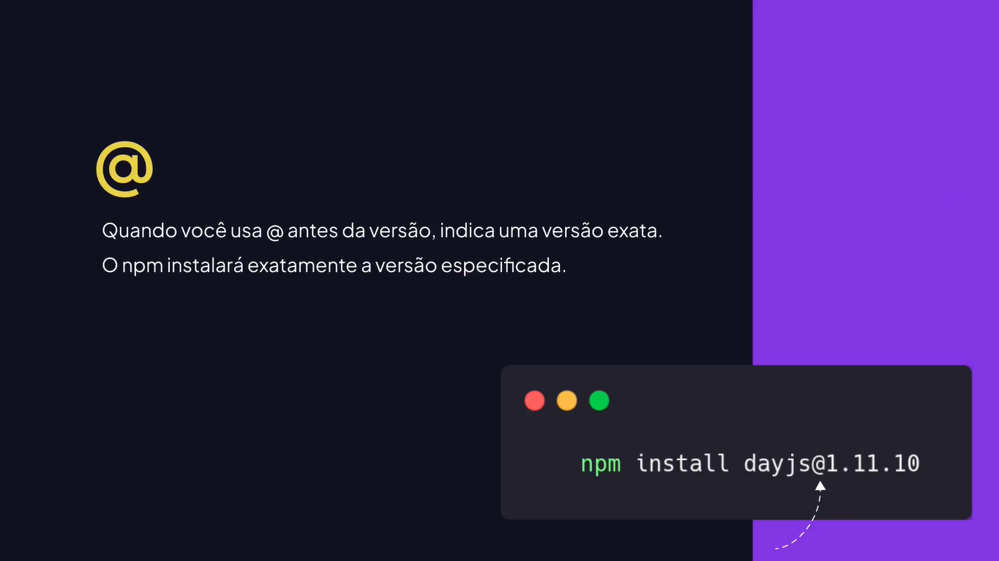
