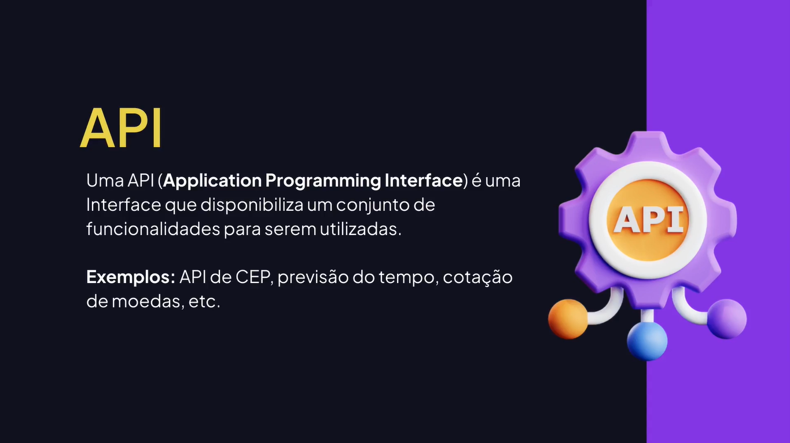
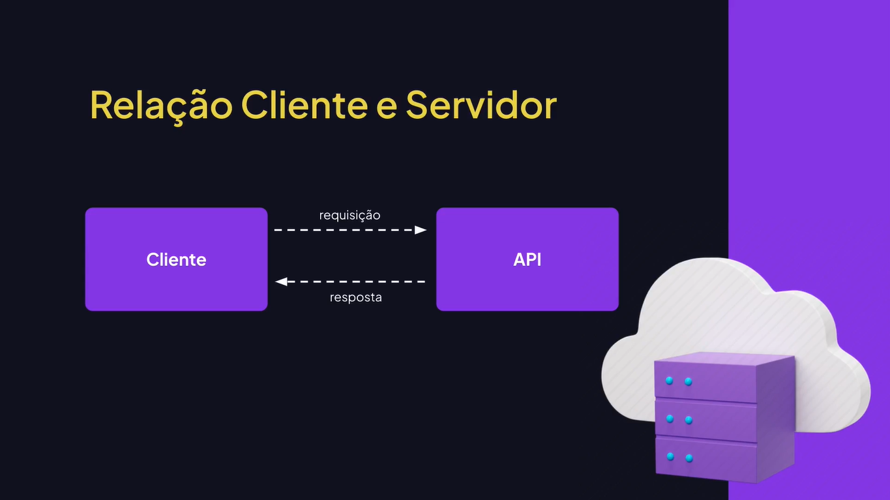
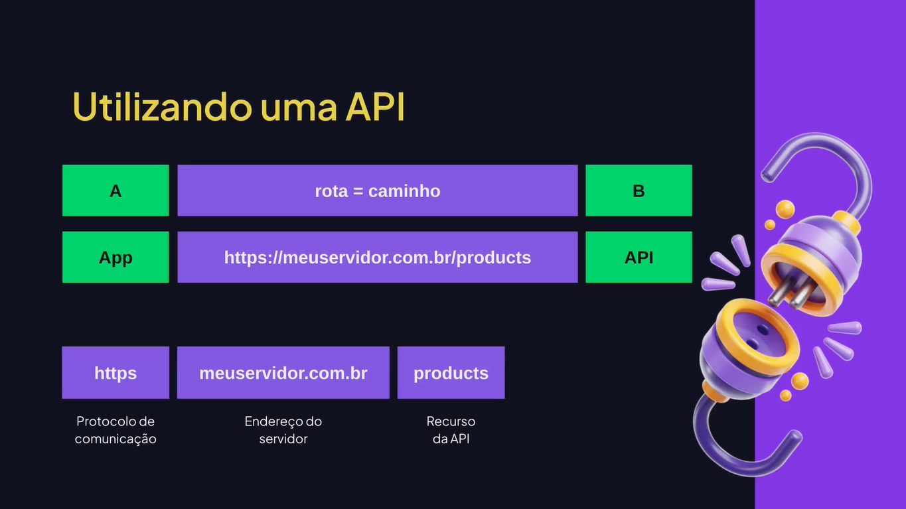
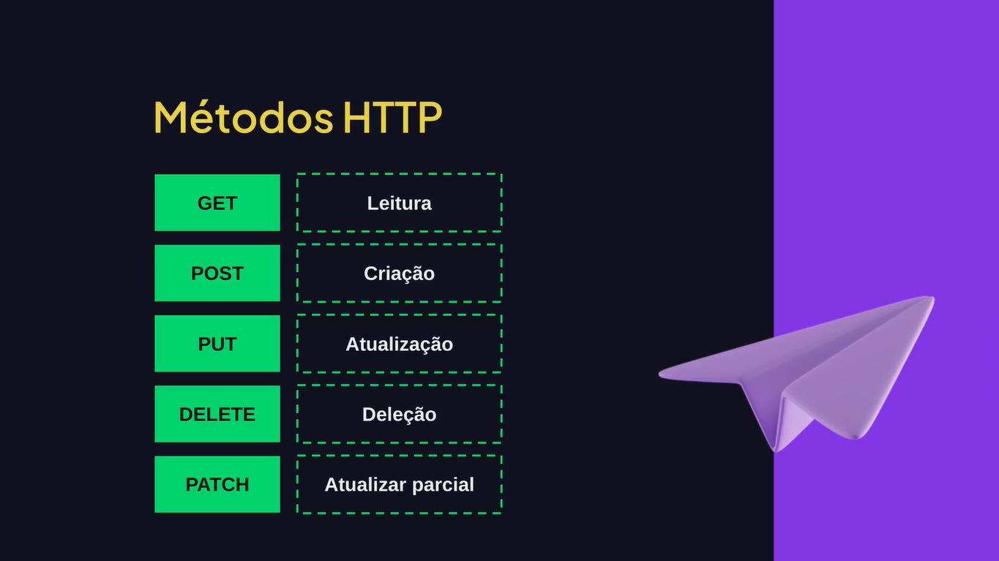
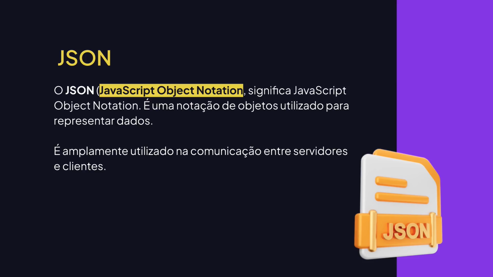
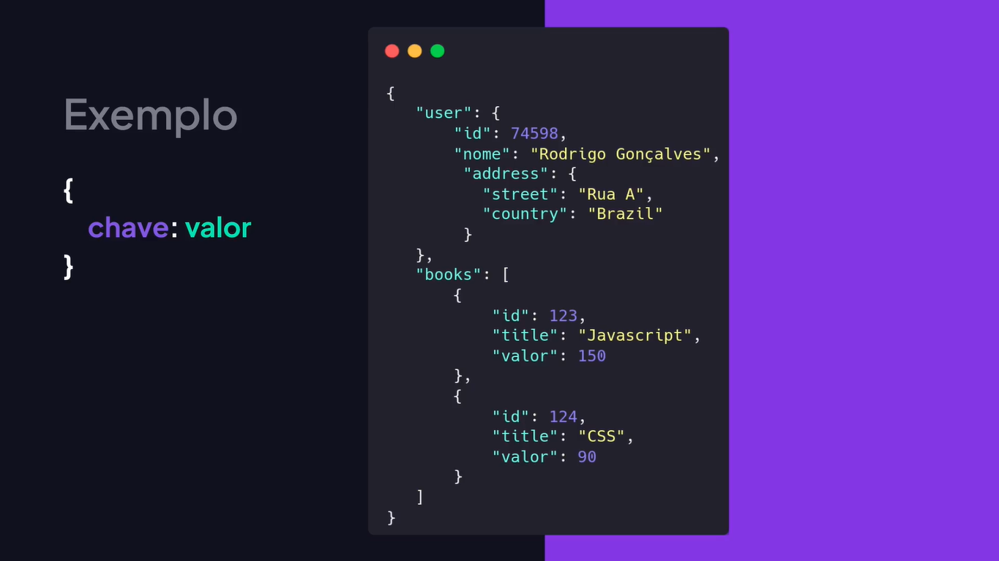

# Working APIs

---

## O Que é uma API?













## Instalando o json-server

[GitHub - json-server](https://github.com/typicode/json-server/tree/v0)

```bash
npm install json-server
```

server.json

```json
{
	"test": {
		"name": "Rodrigo Gonçalves"
	}
}
```

package.json

```json
{
	"scripts": {
		"server": "json-server server.json --port=3333"
	}, 
	"dependencies": {
		"json-server": "^1.0.0-alpha.17"
	}
}
```

```bash
npm run server
```

## Instalando uma Versão Específica

```bash
npm install json-server@0.17.4
```

```bash
npm install json-server@1.0.0-alpha.17
```

## Criando uma API de Exemplo

```json
{
	"products": [
		{ "id": 1, "name": "Mouse", "price": 150.25 },
		{ "id": 2, "name": "Teclado", "price": 90 },
		{ "id": 3, "name": "Monitor", "price": 500 },
	]
}
```

```bash
npm run server
```

```bash
http://localhost:3333/products
```

```bash
http://localhost:3333/products/3
```

## Utilizando o fetch

main.js

```js
// Utilizando o fetch com then.
fetch("http://localhost:3333/products")
	.then((response) => response.json())
	.then((data) => console.log(data));
```

## Utilizando async e await

main.js

```js
// Utilizando o fetch com async/await.
async function fetchProducts() {
	const response = await fetch("http://localhost:3333/products");
	const data = await response.json();
	console.log(data);
};

fetchProducts();
```

## Passando Parâmetros na Requisição

main.js

```js
async function fetchProductById(id) {
	const response = await fetch(`http://localhost:3333/products/${id}`);
	const data = await response.json();
	console.log(data);
};

fetchProductById("1");
```

## Fetch com POST

```html
<!DOCTYPE html>
<html lang="en">
	<head>
		<meta charset="UTF-8" />
		<meta name="viewport" content="width=device-width, initial-scale=1.0" />
		
		<title>Aulas de Javascript</title>
	</head>
	<body>
		<form>
			<input type="text" id="name" placeholder="Nome do produto" />
			<input type="text" id="price" placeholder="Preço do produto" />
			<button type="submit">Cadastrar</button>
		</form>
		<script src="main.js"></script>
	</body>
</html>
```

main.js

```js
const productName = document.getElementById("name");
const productPrice = document.getElementById("price");
const form = document.getElementByTagName("form");

addEventListener("submit", async (event) => {
	event.preventDefault();
	
	await fetch("http://localhost:3333/products", {
		method: "POST",
		headers: {
			"Content-Type": "application/json",
		},
		body: JSON.stringify({
			id: new Date().getTime().toString(),
			name: productName.value,
			price: productPrice.value,
		}),
	});
	
	await fetchProducts();
});
```
