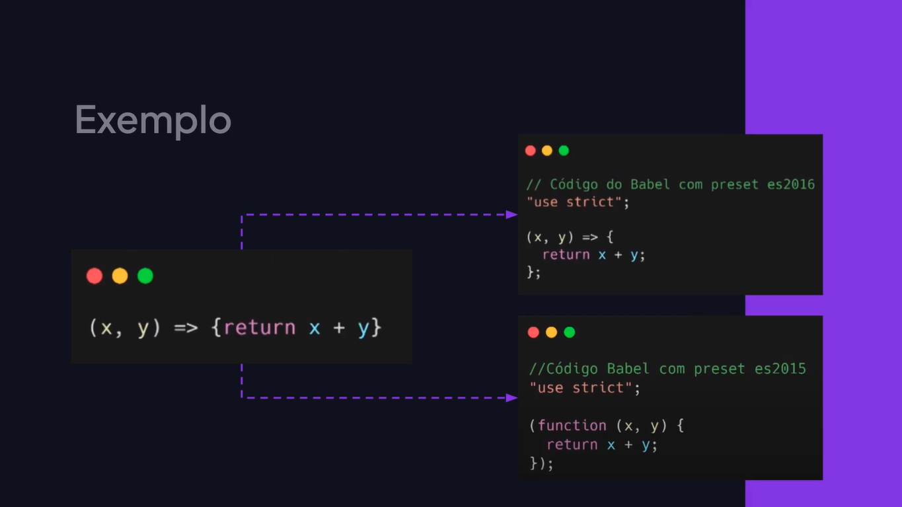

# Compiladores

---

## Conhecendo os Compiladores





## Instalando o Babel

[Babel](https://babeljs.io/)

```bash
npm install --save-dev @babel/core @babel/cli @babel/present-env
```

## Configurando e Utilizando o Babel

babel.config.js

```js
const presets = ["@babel/preset-env"];

module.exports = { presets };
```

```bash
./node_modules/.bin/babel main.js --out-dir dist
```

main.js

```js
class User {
	constructor({ email }) {
		this.email = email;
	};
};

let user = new User({ email: "rodrigo@email.com" });
```

## Criando um Script Para Compilar

package.json

```json
{
	"scripts": {
		"build": "babel main.js --out-dir ./dist"
	},
	"devDependencies": {
		"@babel/cli": "^7.23.4",
		"@babel/core": "^7.23.7",
		"@babel/present-env": "^7.23.8",
	}
}
```

```bash
npm run build
```

## Utilizando o Arquivo Compilado

```js
class User {
	constructor({ email }) {
		this.email = email;
	};
	
	sendMessage() {
		console.log("Mensagem enviada para:", this.email);
	};
};

let user = new User({ email: "rodrigo@email.com" });
user.sendMessage();
```

```html
<!DOCTYPE html>
<html lang="en">
<head>
  <meta charset="UTF-8">
  <meta name="viewport" content="width=device-width, initial-scale=1.0">
  <title>Aulas de Javascript</title>
</head>
<body>
  <script src="./dist/main.js"></script>
</body>
</html>
```

```bash
npm run build
```

## Automatizando as Mudanças

package.json

```json
{
	"scripts": {
		"build": "babel main.js --watch --out-dir ./dist"
	},
	"devDependencies": {
		"@babel/cli": "^7.23.4",
		"@babel/core": "^7.23.7",
		"@babel/present-env": "^7.23.8",
	}
}
```

## Configurando Targets

```js
const presets = [
	[
		"@babel/preset-env", 
		{
			targets: {
				edge: "17",
				firefox: "60",
				chrome: "67",
				safari: "11.1",
			},
		},
	],
];

module.exports = { presets };
```

```json
{
	"scripts": {
		"build": "babel main.js --out-dir ./dist",
		"dev": "babel main.js --watch --out-dir ./dist"
	},
	"devDependencies": {
		"@babel/cli": "^7.23.4",
		"@babel/core": "^7.23.7",
		"@babel/present-env": "^7.23.8",
	}
}
```
