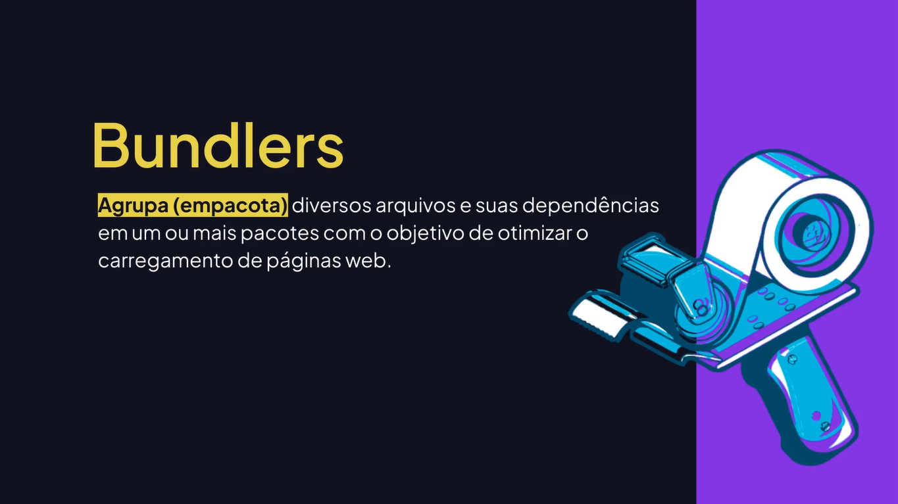
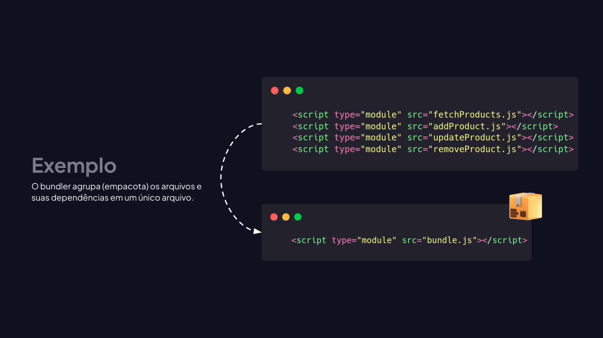
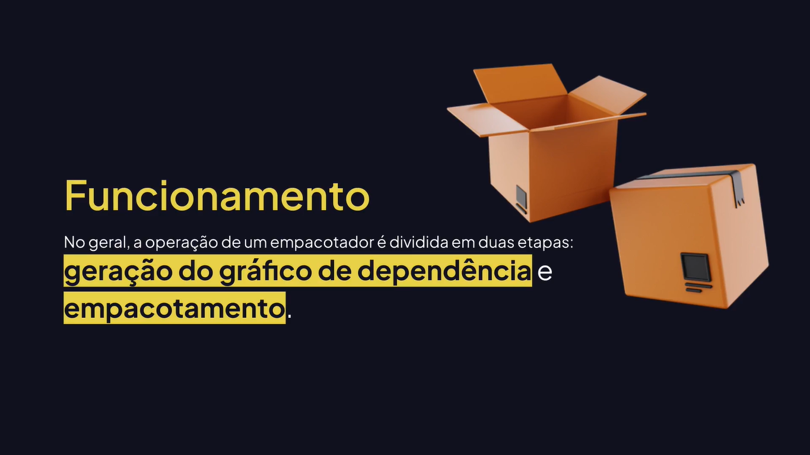
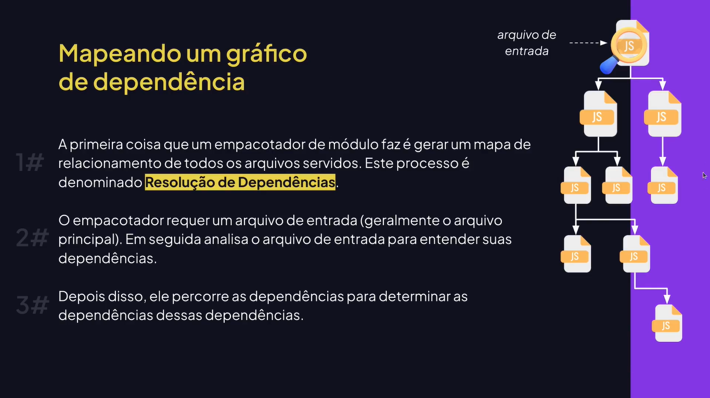
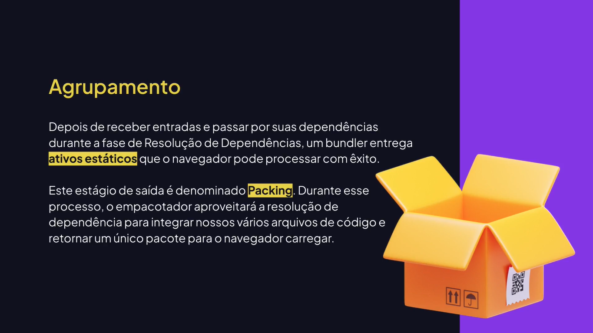

# Bundlers

---

## Conhecendo os Bundlers











## Instalando e Executando o Webpack

[webpack](https://webpack.js.org/)

src/index.html

```html
<!DOCTYPE html>
<html lang="en">
<head>
  <meta charset="UTF-8">
  <meta name="viewport" content="width=device-width, initial-scale=1.0">
  <title>Aulas de Javascript</title>
</head>
<body>
  <script type="module" src="./js/index.js"></script>
</body>
</html>
```

src/js/index.js

```js
import { title } from "./components.js";

title("Hello World!");
```

src/js/components.js

```js
export function title(title) {
	const element = document.createElement("h1");
	element.textContent = title;
	
	document.body.appendChild(element);
};
```

terminal

```bash
npm install webpack webpack-cli --save-dev
```

package.json

```json
{
	"scripts": {
		"build": "webpack ./src/js/index.js"
	},
	"devDependencies": {
		"webpack": "^5.89.0",
		"webpack-cli": "^5.1.4"
	}
}
```

## Configurando o Webpack

package.json

```json
{
	"scripts": {
		"build": "webpack"
	},
	"devDependencies": {
		"webpack": "^5.89.0",
		"webpack-cli": "^5.1.4"
	}
}
```

webpack.config.js

```js
const path = require("path");

module.exports = {
	entry: path.resolve(__dirname, "src", "js", "index.js"),
	output: {
		filename: "main.js",
		path: path.resolve(__dirname, "dist"),
	},
	mode: "development",
};
```

## Como Incluir o HTML

terminal

```bash
npm install --save-dev html-webpack-plugin
```

webpack.config.js

```js
const path = require("path");
const HTMLWebpackPlugin = require("html-webpack-plugin");

module.exports = {
	entry: path.resolve(__dirname, "src", "js", "index.js"),
	output: {
		filename: "main.js",
		path: path.resolve(__dirname, "dist"),
	},
	mode: "development",
	plugins: [new HTMLWebpackPlugin()],
};
```

## Como Incluir o CSS

/src/css/styles.css

```css
body {
	background-color: #000;
	color: #FFF;
}

h1 {
	text-transform: uppercase;
}
```

src/js/index.js

```js
import "../css/styles.css";

import { title } from "./components.js";

title("Hello World!");
```

webpack.config.js

```js
const path = require("path");
const HTMLWebpackPlugin = require("html-webpack-plugin");

module.exports = {
	entry: path.resolve(__dirname, "src", "js", "index.js"),
	output: {
		filename: "main.js",
		path: path.resolve(__dirname, "dist"),
	},
	mode: "development",
	plugins: [new HTMLWebpackPlugin()],
	module: {
		rules: [{
			test: /\.css$/i,
			use: ["style-loader", "css-loader"],
			exclude: "/node_modules",
		}],
	},
};
```

terminal

```bash
npm install style-loader css-loader --save-dev
```

## Como Incluir o Babel

terminal

```bash
npm install @babel/core @babel/preset-env babel-loader --save-dev
```

webpack.config.js

```js
const path = require("path");
const HTMLWebpackPlugin = require("html-webpack-plugin");

module.exports = {
	entry: path.resolve(__dirname, "src", "js", "index.js"),
	output: {
		filename: "main.js",
		path: path.resolve(__dirname, "dist"),
	},
	mode: "development",
	plugins: [new HTMLWebpackPlugin()],
	module: {
		rules: [
			{
				test: /\.css$/i,
				use: ["style-loader", "css-loader"],
				exclude: "/node_modules",
			},
			{
				test: /\.js$/i,
				exclude: "/node_modules",
				use: {
					loader: "babel-loader",
					options: {
						presets: [["@babel/preset-env", { targets: "defaults" }]],
					}
				},
			},
		],
	},
};
```

## Webpack dev server

terminal

```bash
npm install webpack-dev-server --save-dev
```

webpack.config.js

```js
const path = require("path");
const HTMLWebpackPlugin = require("html-webpack-plugin");

module.exports = {
	entry: path.resolve(__dirname, "src", "js", "index.js"),
	output: {
		filename: "main.js",
		path: path.resolve(__dirname, "dist"),
	},
	mode: "development",
	devServer: {
		static: {
			directory: path.join(__dirname, "dist", "index.html"),	
		},
		port: 3000,
		open: true,
	},
	plugins: [new HTMLWebpackPlugin()],
	module: {
		rules: [
			{
				test: /\.css$/i,
				use: ["style-loader", "css-loader"],
				exclude: "/node_modules",
			},
			{
				test: /\.js$/i,
				exclude: "/node_modules",
				use: {
					loader: "babel-loader",
					options: {
						presets: [["@babel/preset-env", { targets: "defaults" }]],
					}
				},
			},
		],
	},
};
```

package.json

```json
{
	"scripts": {
		"build": "webpack",
		"dev": "webpack serve"
	},
	"devDependencies": {
		"webpack": "^5.89.0",
		"webpack-cli": "^5.1.4"
	}
}
```
