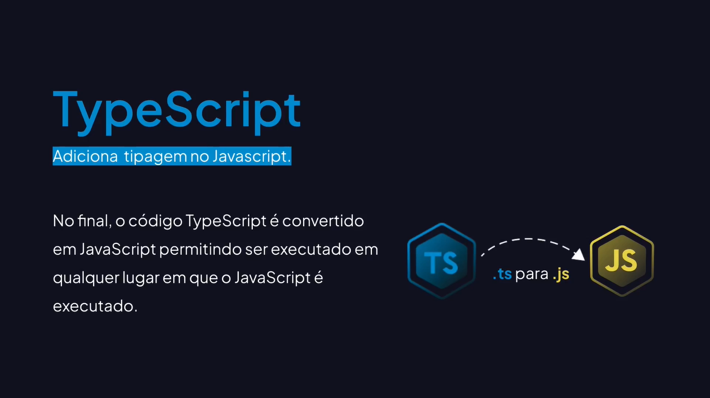
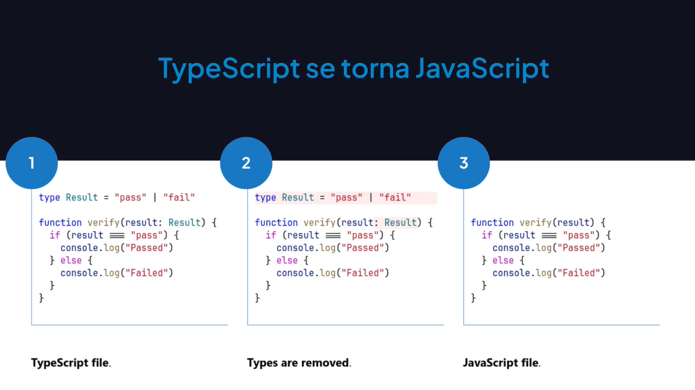

# Conhecendo o TypeScript

---

## O Que é o TypeScript?







## Usando o TypeScript Playground

[TS Playground - An online editor for exploring TypeScript and JavaScript](https://www.typescriptlang.org/play/)

[JavaScript With Syntax For Types.](https://www.typescriptlang.org/)

```ts
console.log("Hello Typescript!");
```

## Verificação de Tipo Estático

```ts
// const message = "Hello Typescript!";
let message = "Hello Typescript!";

function showMessage() {
    console.log(message);
}

// Consigo mudar?
message = "Typescript!";

// Consigo executar?
// message();
showMessage();

const user = {
    name: "Rodrigo Gonçalves",
    email: "rodrigo@email.com"
};

// Propriedade existe?
// console.log(user.avatar);
console.log(user.email);
```
