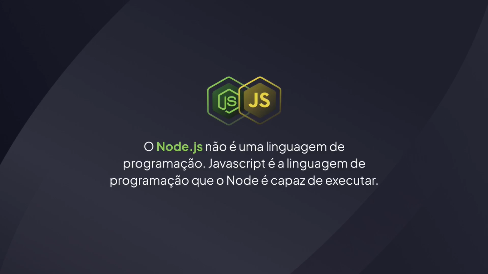
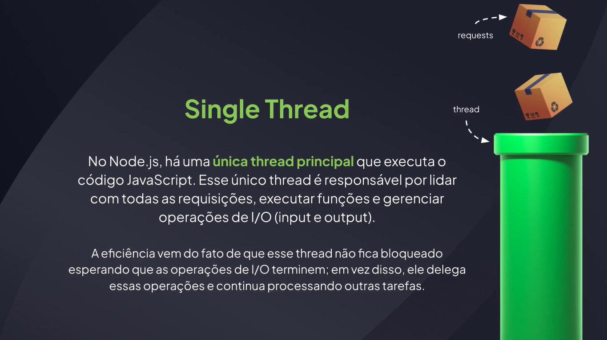
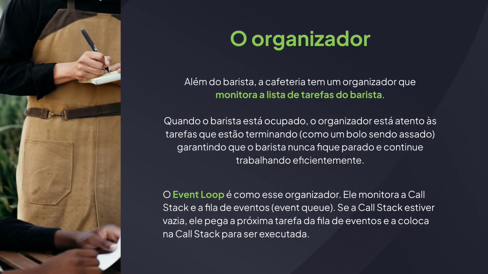
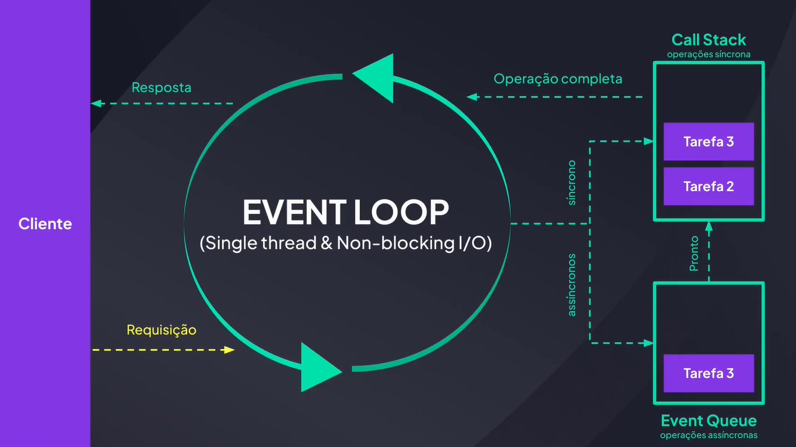

# Iniciando com Node.js

---

## Conhecendo o Node.js




## O Funcionamento do Node.js









## Ambiente de Desenvolvimento

[Node.js](https://nodejs.org/pt)

[Instalando o Node e o NPM](https://efficient-sloth-d85.notion.site/Instalando-o-Node-e-o-NPM-d162e2582d5c48499bc6703526912456)

## Criando um Projeto Node.js

comando para iniciar um projeto Node.js

```bash
npm init
```

comando com respostas padrões “sim”

```bash
npm init -y
```

package.json

```json
{
  "name": "api",
  "version": "1.0.0",
  "description": "Meu primeiro projeto Node.js",
  "main": "index.js",
  "scripts": {
    "test": "echo \"Error: no test specified\" && exit 1"
  },
  "author": "Paulo Alvares",
  "license": "ISC"
}
```

## Executando um Arquivo JavaScript

package.json

```json
{
  "name": "api",
  "version": "1.0.0",
  "description": "Meu primeiro projeto Node.js",
  "main": "./src/server.js",
  "scripts": {
    "test": "echo \"Error: no test specified\" && exit 1"
  },
  "author": "Paulo Alvares",
  "license": "ISC"
}
```

src/server.js

```js
const a = 10;
const b = 5;
const result = a + b;

console.log("Resultado: ", result);
```

terminal

```bash
node src/server.js
```

## Import com CommonJS e ES Modules

package.json

```json
{
  "name": "api",
  "version": "1.0.0",
  "description": "Meu primeiro projeto Node.js",
  "main": "./src/server.js",
  "type": "module",
  "scripts": {
    "test": "echo \"Error: no test specified\" && exit 1"
  },
  "author": "Paulo Alvares",
  "license": "ISC"
}
```

server.js

```js
import http from "node:http";
```

terminal

```bash
node src/server.js
```

[Day.js](https://day.js.org/)

## Criando o Primeiro Servidor Node.js

server.js

```js
import http from "node:http";

const server = http.createServer((request, response) => {
  return response.end("Hello World!");
});

server.listen(3333);
```

terminal

```bash
node src/server.js
```

## Node Watch

server.js

```js
import http from "node:http";

const server = http.createServer((request, response) => {
  return response.end("Meu primeiro servidor!");
});

server.listen(3333);
```

terminal

```bash
node --watch src/server.js
```

## Criando Scripts Personalizados

package.json

```json
{
  "name": "api",
  "version": "1.0.0",
  "description": "Meu primeiro projeto Node.js",
  "main": "./src/server.js",
  "type": "module",
  "scripts": {
    "dev": "node --watch src/server.js"
  },
  "author": "Paulo Alvares",
  "license": "ISC"
}
```

terminal

```bash
npm run dev
```

exemplo com “start” (padrão do node)

```json
{
  "name": "api",
  "version": "1.0.0",
  "description": "Meu primeiro projeto Node.js",
  "main": "./src/server.js",
  "type": "module",
  "scripts": {
    "start": "node --watch src/server.js"
  },
  "author": "Paulo Alvares",
  "license": "ISC"
}
```

```bash
npm start
```
