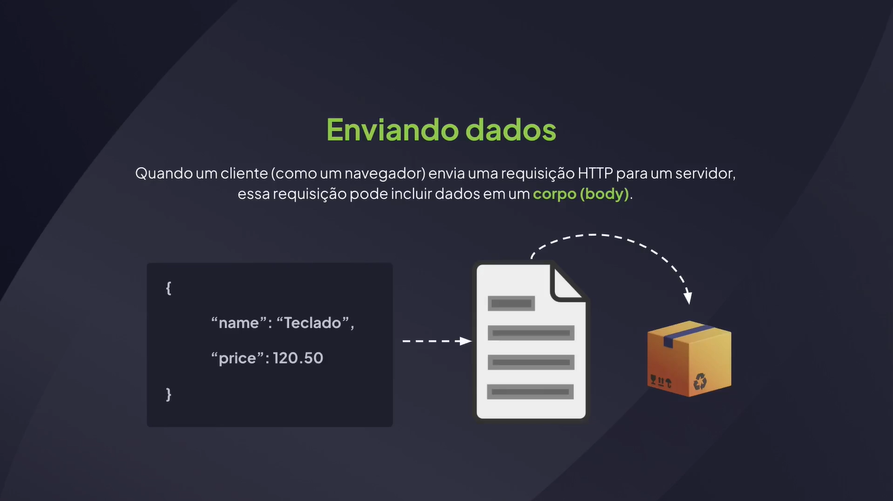
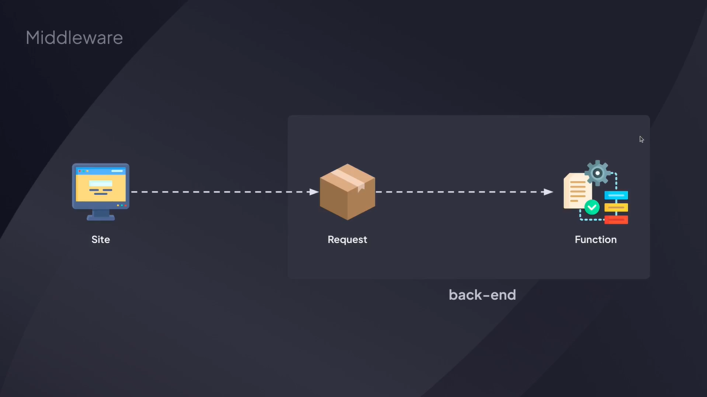
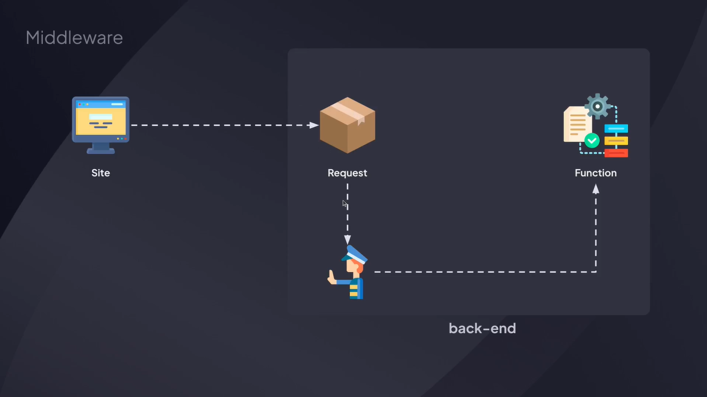
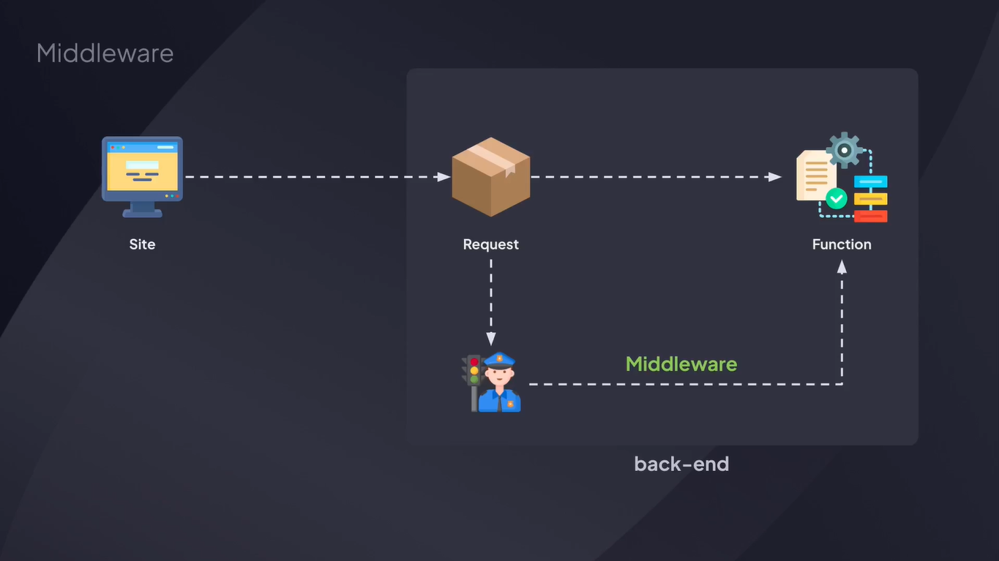

# Fundamentos de API

---

## O Que é uma API


## API Client - Insomnia

[Insomnia](https://insomnia.rest/)

[Postman](https://www.postman.com/)

Extensão do VSCode: Thunder Client

## Utilizando o Insomnia

api/src/server.js

```js
import http from "node:http";

const server = http.createServer((request, response) => {
  return response.end("Minha primeira API!");
});

server.listen(3333);
```

## Métodos HTTP


## Identificando o Método HTTP

```js
import http from "node:http";

const server = http.createServer((request, response) => {
  const { method } = request;

  return response.end("Método: " + method);
  
  // return response.end("Método: " + request.method);
});

server.listen(3333);
```

## Utilizando Status Code

```js
import http from "node:http";

const server = http.createServer((request, response) => {
  const { method } = request;

  return response.writeHead(200).end("Método: " + method);
});

server.listen(3333);
```

## URL da Requisição

```js
import http from "node:http";

const server = http.createServer((request, response) => {
  const { method, url } = request;

  if(method === "GET" && url === "/products") {
    return response.end("Lista de produtos!");
  }

  if(method === "POST" && url === "/products") {
    return response.writeHead(201).end("Produto cadastrado!");
  }

  return response.writeHead(404).end("Rota não encontrada!");
});

server.listen(3333);
```

## Como o Node.js Lida com Requisições HTTP




## Recuperando Dados no Body

Body no Insomnia (Método POST): 

```bash
{
	"name": "Teclado",
	"price": 120.50
}
```

server.js

```js
import http from "node:http";

const server = http.createServer(async (request, response) => {
  const { method, url } = request;

  if(method === "GET" && url === "/products") {
    return response.end("Lista de produtos!");
  }

  if(method === "POST" && url === "/products") {
    const buffers = []

    for await (const chunk of request) {
      buffers.push(chunk);
    }

    console.log(Buffer.concat(buffers).toString());

    return response.writeHead(201).end("Produto cadastrado!");
  }

  return response.writeHead(404).end("Rota não encontrada!");
});

server.listen(3333);
```

## Conceito de Middleware








## Utilizando Middleware

Body no Insomnia (Método POST): 

```bash
{
	"name": "Teclado",
	"price": 120.50
}
```

src/server.js

```js
import http from "node:http";
import { jsonBodyHandler } from "../src/middlewares/jsonHandler.js";

const server = http.createServer(async (request, response) => {
  const { method, url } = request;

  await jsonBodyHandler(request, response);

  if (method === "GET" && url === "/products") {
    return response.end("Lista de produtos!");
  }

  if (method === "POST" && url === "/products") {
    return response.writeHead(201).end(JSON.stringify(request.body));
  }

  return response.writeHead(404).end("Rota não encontrada!");
});

server.listen(3333);
```

src/middleware/jsonHandler.js

```js
export async function jsonBodyHandler(request, response) {
  // Adicionar cada chunck.
  const buffers = [];

  // Coleta os chuncks de dados da requisição.
  for await (const chunck of request) {
    buffers.push(chunck);
  }

  try {
    // Concatena os chuncks e converte para string. Em seguida, converte a string para JSON.
    request.body = JSON.parse(Buffer.concat(buffers).toString());
  } catch (error) {
    request.body = null;
  }

  // Define o header de resposta como JSON.
  response.setHeader("Content-Type", "application/json");
}
```

## Separando as Rotas

src/server.js

```js
import http from "node:http";
import { jsonBodyHandler } from "../src/middlewares/jsonHandler.js";
import { routeHandler } from "./middlewares/routeHandler.js";

const server = http.createServer(async (request, response) => {
  await jsonBodyHandler(request, response);
  routeHandler(request, response);
});

server.listen(3333);
```

src/middleware/routeHandler.js

```js
import { routes } from "../routes.js";

export function routeHandler(request, response) {
  const route = routes.find((route) => {
    return route.method === request.method && route.path === request.url;
  });

  if (route) {
    return route.controller(request, response);
  }

  return response.writeHead(404).end("Rota não encontrada!");
}
```

src/routes.js

```js
export const routes = [
  {
    method: "GET",
    path: "/products",
    controller: (request, response) => {
      return response.end("Lista de produtos!");
    },
  },
  {
    method: "POST",
    path: "/products",
    controller: (request, response) => {
      return response.writeHead(201).end(JSON.stringify(request.body));
    },
  },
];
```

## Route Params

src/routes.js

```js
export const routes = [
  {
    method: "GET",
    path: "/products",
    controller: (request, response) => {
      return response.end("Lista de produtos!");
    },
  },
  {
    method: "POST",
    path: "/products",
    controller: (request, response) => {
      return response.writeHead(201).end(JSON.stringify(request.body));
    },
  },
  {
    method: "DELETE",
    path: `/products/:id`,
    controller: (request, response) => {
      console.log(request.params);
      return response.end("Removido!");
    },
  },
];
```

## Obtendo o Parâmetro

src/utils/parseRoutePath.js

```js
export function parseRoutePath(path) {
  const routeParametersRegex = /:([a-zA-Z]+)/g;

  const params = path.replaceAll(routeParametersRegex, "(?<$1>[a-z0-9-_]+)");

  const pathRegex = new RegExp(params);

  return pathRegex;
}
```

src/middleware/routeHandler.js

```js
import { routes } from "../routes.js";

export function routeHandler(request, response) {
  const route = routes.find((route) => {
    return route.method === request.method && route.path.test(request.url);
  });

  if (route) {
    const routeParams = request.url.match(route.path);
    const { ...params } = routeParams.groups;

    request.params = params;

    return route.controller(request, response);
  }

  return response.writeHead(404).end("Rota não encontrada!");
}
```

src/routes.js

```js
import { parseRoutePath } from "./utils/parseRoutePath.js";

export const routes = [
  {
    method: "GET",
    path: "/products",
    controller: (request, response) => {
      return response.end("Lista de produtos!");
    },
  },
  {
    method: "POST",
    path: "/products",
    controller: (request, response) => {
      return response.writeHead(201).end(JSON.stringify(request.body));
    },
  },
  {
    method: "DELETE",
    path: `/products/:id`,
    controller: (request, response) => {
      console.log(request.params);
      return response.end("Produto removido com ID: " + request.params.id);
    },
  },
].map((route) => {
  return {
    ...route,
    path: parseRoutePath(route.path),
  };
});
```

## Parâmetros Nomeados

através da URL

http://localhost:3333/products?category=computer&price=5000

## Obtendo Parâmetros Nomeados

src/utils/parseRoutePath.js

```js
export function parseRoutePath(path) {
  const routeParametersRegex = /:([a-zA-Z]+)/g;

  const params = path.replaceAll(routeParametersRegex, "(?<$1>[a-z0-9-_]+)");

  const pathRegex = new RegExp(`${params}(?<query>\\?(.*))?$`);

  return pathRegex;
}
```

## Separando Parâmetros

src/utils/extract-query-params.js

```js
export function extractQueryParams(query) {
  return query
    .slice(1)
    .split("&")
    .reduce((queryParams, param) => {
      const [key, value] = param.split("=");
      queryParams[key] = value;
      return queryParams;
    }, {});
}
```

src/routes.js

```js
import { parseRoutePath } from "./utils/parseRoutePath.js";

export const routes = [
  {
    method: "GET",
    path: "/products",
    controller: (request, response) => {
      console.log(request.query);
      return response.end(JSON.stringify(request.query));
    },
  },
  {
    method: "POST",
    path: "/products",
    controller: (request, response) => {
      return response.writeHead(201).end(JSON.stringify(request.body));
    },
  },
  {
    method: "DELETE",
    path: `/products/:id`,
    controller: (request, response) => {
      console.log(request.params);
      return response.end("Produto removido com ID: " + request.params.id);
    },
  },
].map((route) => {
  return {
    ...route,
    path: parseRoutePath(route.path),
  };
});
```

src/middleware/routeHandler.js

```js
import { routes } from "../routes.js";
import { extractQueryParams } from "../utils/extract-query-params.js";

export function routeHandler(request, response) {
  const route = routes.find((route) => {
    return route.method === request.method && route.path.test(request.url);
  });

  if (route) {
    const routeParams = request.url.match(route.path);

    const { query, ...params } = routeParams.groups;

    request.params = params;

    request.query = query ? extractQueryParams(query) : {};

    return route.controller(request, response);
  }

  return response.writeHead(404).end("Rota não encontrada!");
}
```
