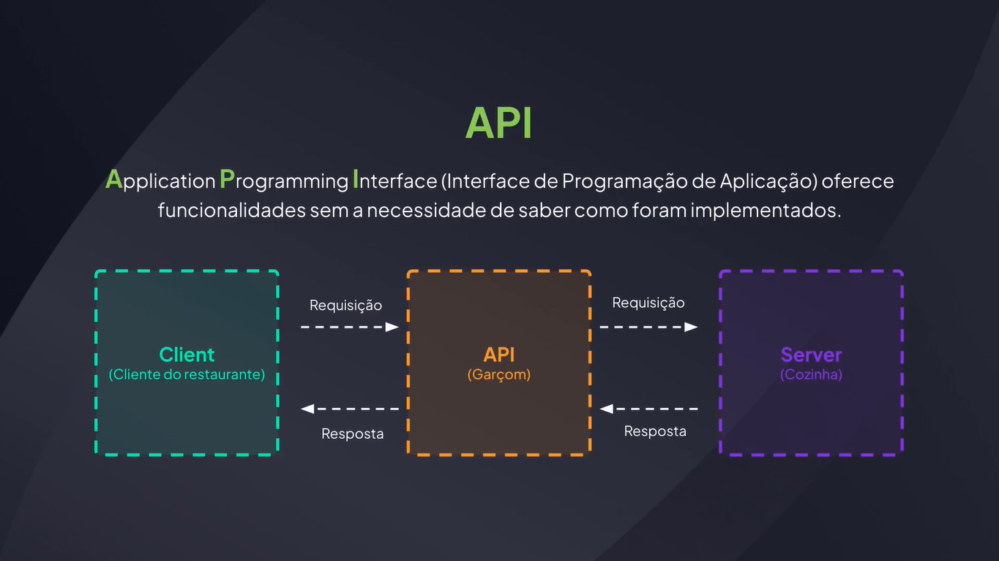
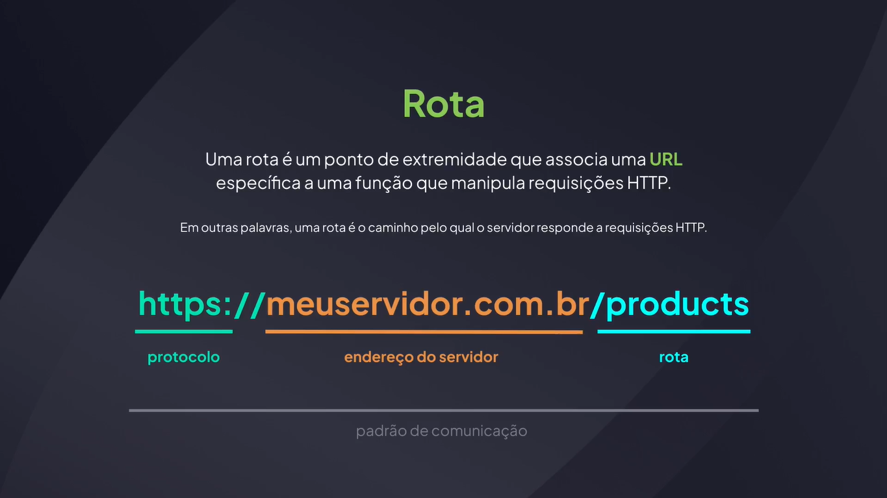
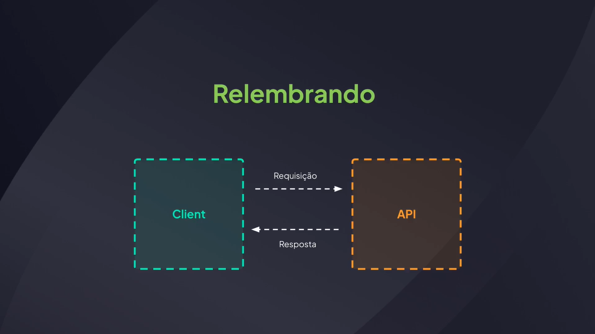
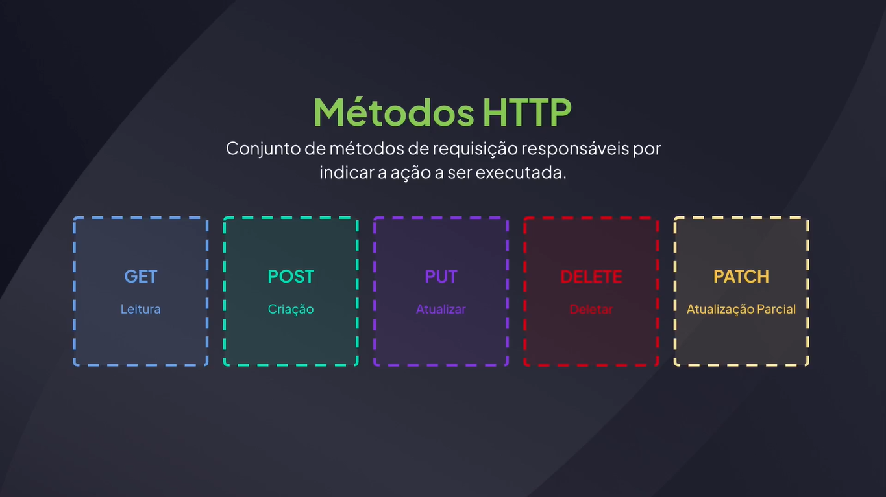
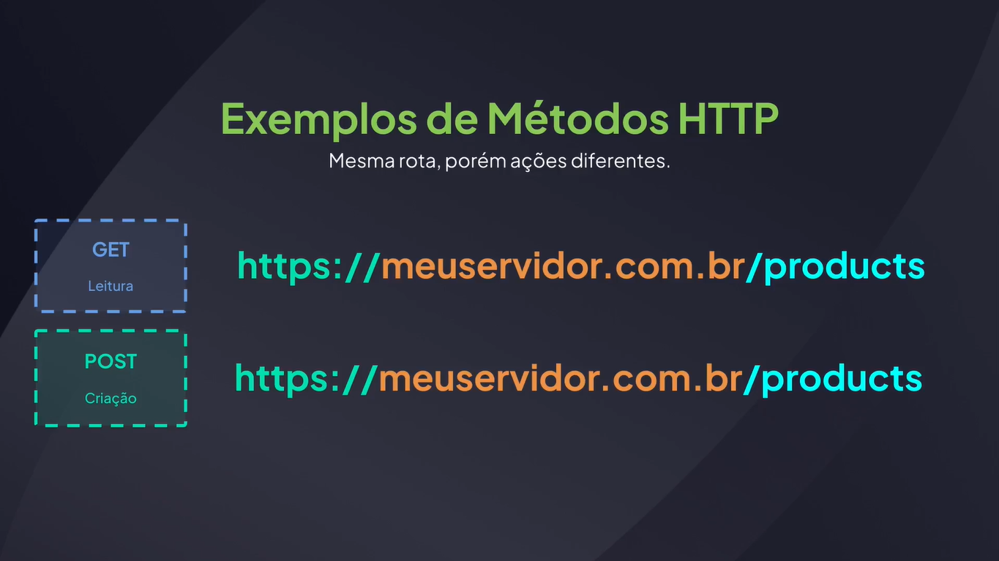
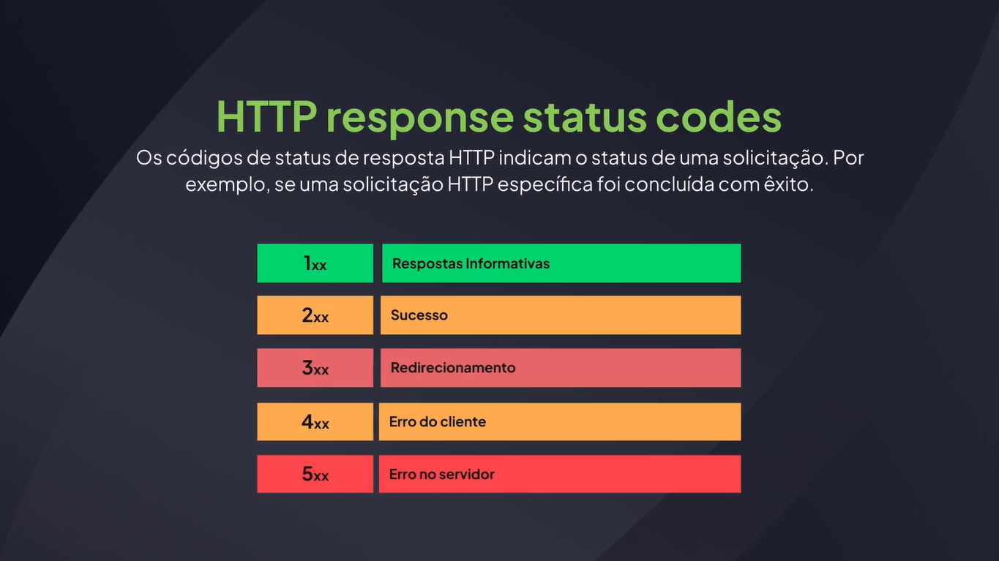
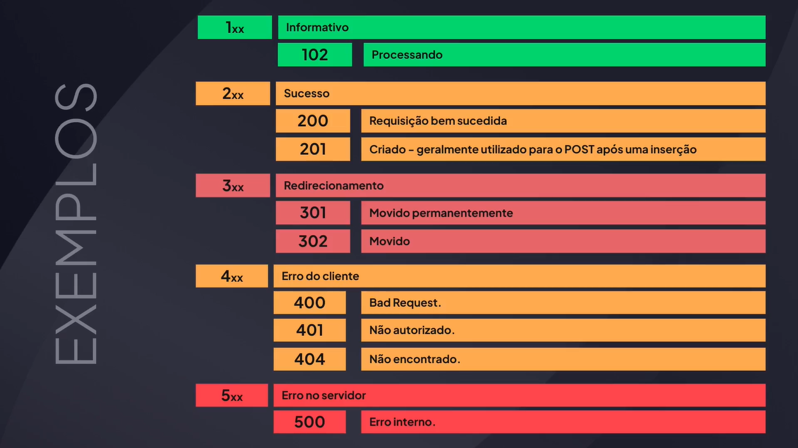

# Fundamentos de API

## O Que é uma API





## API Client - Insomnia

[Insomnia](https://insomnia.rest/)

[Postman](https://www.postman.com/)

Extensão do VSCode: Thunder Client

## Utilizando o Insomnia

api/src/server.js

```js
import http from "node:http";

const server = http.createServer((request, response) => {
  return response.end("Minha primeira API!");
});

server.listen(3333);
```

## Métodos HTTP










