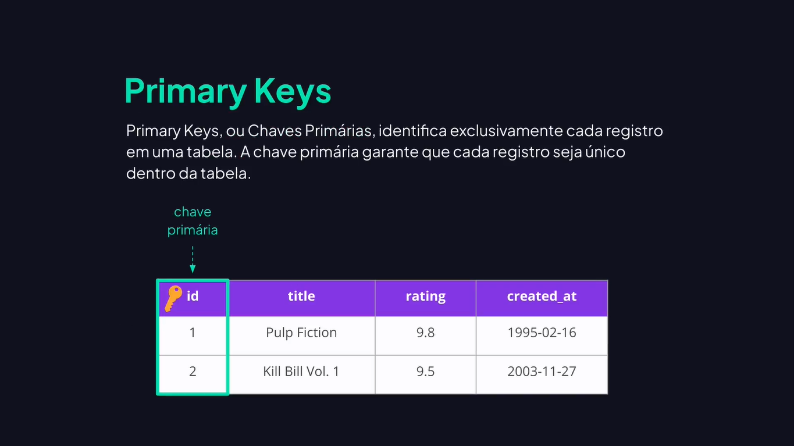
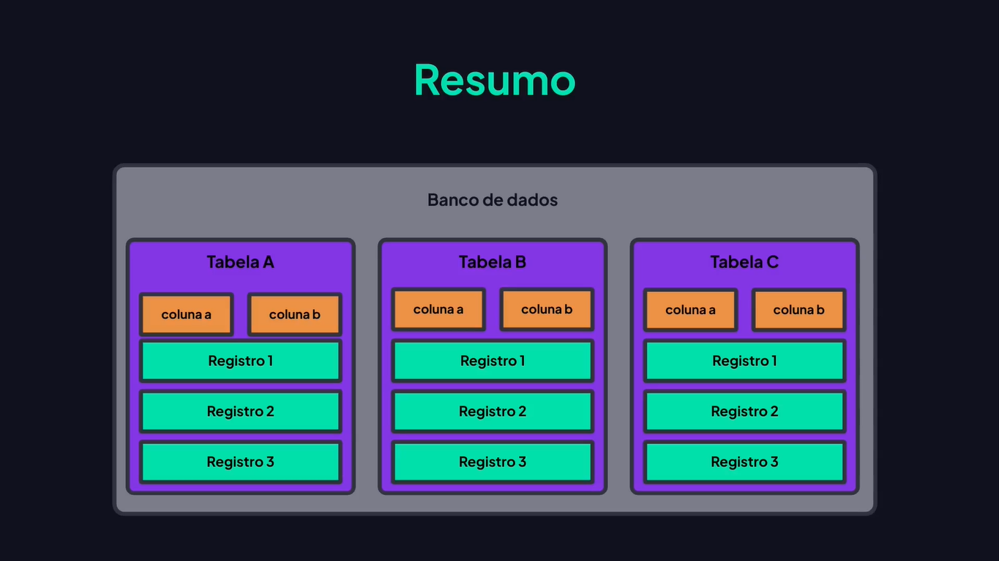

# Introdução a Banco de Dados

---

## Introdução a Banco de Dados


## Banco de Dados Relacional






## SQLite


## Criando o Banco de Dados

```bash
cd C://nome_do_pc/pasta/database
```

```bash
touch database.db
```

## Beekeeper Database Manager

[Beekeeper Studio](https://www.beekeeperstudio.io/)
