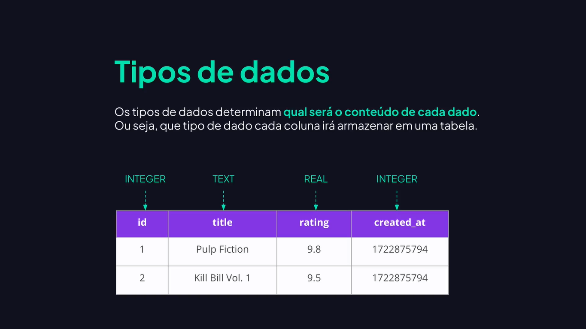

# SQL

---

## Introdução ao SQL


## Tipos de Dados




## Criando Tabela Via Código

```sql
CREATE TABLE products (
  id INTEGER NOT NULL PRIMARY KEY AUTOINCREMENT,
  name TEXT NOT NULL,
  price REAL NOT NULL,
  category TEXT NULL DEFAULT 'general'
)
```

## Adicionando e Removendo Coluna

```sql
ALTER TABLE products ADD quantity INTEGER NOT NULL

ALTER TABLE products DROP COLUMN quantity
```

## Renomeando Coluna

```sql
ALTER TABLE products RENAME COLUMN description TO name
```

## Renomear Tabela

```sql
ALTER TABLE items RENAME TO products
```

## Remover Tabela

```sql
DROP TABLE products
```

## Inserindo Dados

```sql
/*
CREATE TABLE products (
  id INTEGER NOT NULL PRIMARY KEY AUTOINCREMENT,
  name TEXT NOT NULL,
  price REAL NOT NULL,
  category TEXT NULL DEFAULT 'general'
)
*/

-- Seleciona os registros
SELECT * FROM products

INSERT INTO products (name, price) VALUES ('Mouse', 50)
INSERT INTO products (name, price, category) VALUES ('Teclado', 500.50, 'accessory')
```

## Compreendendo a Tabela sqlite_sequence

```sql
SELECT * FROM sqlite_sequence
SELECT * FROM products
```

## Visualizando Dados

```sql
-- Seleciona todas as colunas.
SELECT * FROM products

-- Seleciona colunas especificas.
SELECT name, price FROM products

-- Definindo a ordem de exibição das colunas.
SELECT price, name FROM products
```

## Atualizando Dados

```sql
SELECT * FROM products

UPDATE products SET category = 'general' WHERE id = 1
UPDATE products SET price = 500.50 WHERE id = 2
```

## Removendo Registros

```sql
SELECT * FROM products

INSERT INTO products (name, price, category) VALUES ('Microfone', 550, 'audio');
INSERT INTO products (name, price, category) VALUES ('Webcam', 1200, 'image');
INSERT INTO products (name, price, category) VALUES ('Headseat', 800, 'audio');

DELETE FROM products WHERE id = 3
```
