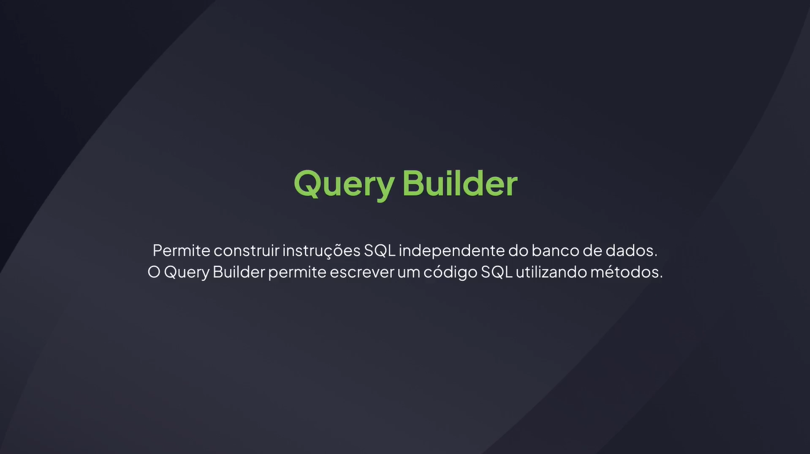
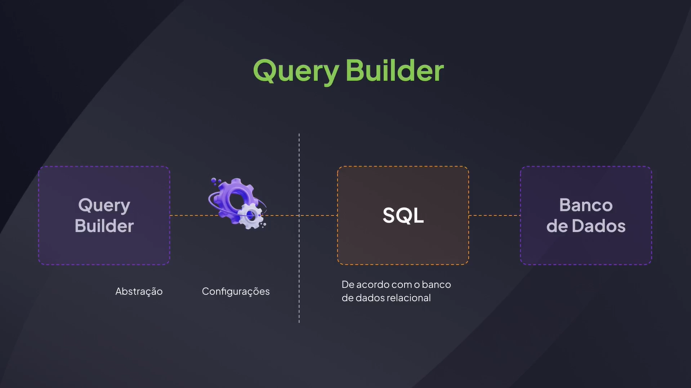
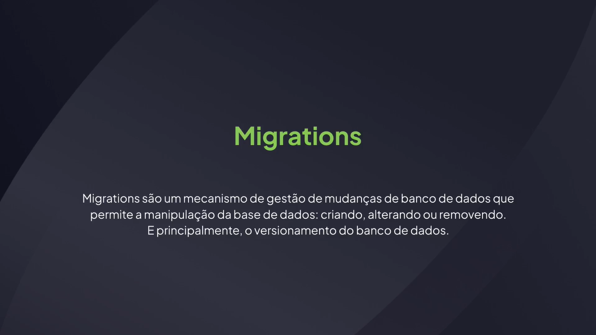

# Query Builder

---

# O Que é um Query Builder





## A Aplicação Que Vamos Utilizar

[GitHub - rocketseat-education/fullstack-query-builder-template](https://github.com/rocketseat-education/fullstack-query-builder-template)

## Instalando o Knex.js

[SQL Query Builder for Javascript | Knex.js](https://knexjs.org/)

```bash
npm i knex@3.1.0 sqlite3@5.1.7
```

## Compreendendo o que são migrations




## Configurando o Knex.js

src/knexfile.ts

```tsx
export default {
  client: "sqlite3",
  connection: {
    filename: "./src/database/database.db",
  },
  useNullAsDefault: true,
  migrations: {
    extensions: "ts",
    directory: "./src/database/migrations",
  },
};
```

## Script de Execução

```json
{
  "name": "query_builder",
  "version": "1.0.0",
  "description": "Aulas de Query builder",
  "main": "index.js",
  "scripts": {
    "dev": "tsx watch src/server.ts",
    // "knex": "node --import tsx ./node_modules/.bin/knex" -- Desatualizado
    "knex": "tsx ./node_modules/knex/bin/cli.js"
  },
  "author": "Rodrigo",
  "license": "ISC",
  "devDependencies": {
    "@types/express": "^4.17.21",
    "@types/node": "^22.2.0",
    "typescript": "^5.5.4"
  },
  "dependencies": {
    "express": "^4.19.2",
    "knex": "^3.1.0",
    "sqlite3": "^5.1.7",
    "tsx": "^4.17.0"
  }
}
```

```bash
npm run knex -- migrate:make create-courses
```

## Criando Tabela

create-courses.ts

```tsx
import type { Knex } from "knex";

export async function up(knex: Knex): Promise<void> {
  await knex.schema.createTable("courses", (table) => {
    table.increments("id").primary(),
      table.text("name").notNullable(),
      table.timestamp("created_at").defaultTo(knex.fn.now());
  });
}

export async function down(knex: Knex): Promise<void> {
  await knex.schema.dropTable("courses");
}
```

```bash
npm run knex -- migrate:latest
```

## Abrindo Banco de Dados

```sql
SELECT * FROM sqlite_sequence;

SELECT * FROM knex_migrations;

SELECT * FROM courses;
```

## Criando Migration Para Alterar Tabela

```bash
npm run knex -- migrate:make add-update-courses
```

add-update-courses.ts

```tsx
import type { Knex } from "knex";

export async function up(knex: Knex): Promise<void> {
  await knex.schema.alterTable("courses", (table) => {
    table.timestamp("updated_at").defaultTo(knex.fn.now()).after("created_at");
  });
}

export async function down(knex: Knex): Promise<void> {
  await knex.schema.alterTable("courses", (table) => {
    table.dropColumn("updated_at");
  })
}

```

```bash
npm run knex -- migrate:latest
```

## Revertendo Migration

listar todas as migrations

```bash
npm run knex -- migrate:list
```

desfazer a última migration

```bash
npm run knex -- migrate:down 20250930230125_add-update-courses.ts
```

alternativa:

```bash
npm run knex -- migrate:rollback
```

desfazer todas as migrations

```bash
npm run knex -- migrate:rollback --all
```

## Método de Insert

src/server.ts

```tsx
import express, { Request, Response } from "express";
import { knex } from "./database/knex";

const app = express();
app.use(express.json());

app.post("/courses", async (request: Request, response: Response) => {
  const { name } = request.body;

  await knex("courses").insert({ name });

  response.status(201).json();
});

app.listen(3333, () => console.log(`Server is running on port 3333`));
```

src/database/knex.ts

```tsx
import { knex as knexConfig } from "knex";
import config from "../../knexfile";

export const knex = knexConfig(config);
```

## Insert com Knex Raw

src/server.ts

```tsx
import express, { Request, Response } from "express";
import { knex } from "./database/knex";

const app = express();
app.use(express.json());

app.post("/courses", async (request: Request, response: Response) => {
  const { name } = request.body;

  // await knex("courses").insert({ name });
  await knex.raw(`INSERT INTO courses (name) VALUES (?)`, [name]);
  await knex.raw(`INSERT INTO courses (name) VALUES ('${name}')`);

  response.status(201).json();
});

app.listen(3333, () => console.log(`Server is running on port 3333`));
```

## Select

src/server.ts

```tsx
import express, { Request, Response } from "express";
import { knex } from "./database/knex";

const app = express();
app.use(express.json());

app.post("/courses", async (request: Request, response: Response) => {
  const { name } = request.body;

  await knex("courses").insert({ name });
  // await knex.raw(`INSERT INTO courses (name) VALUES ('${name}')`);
  // await knex.raw(`INSERT INTO courses (name) VALUES (?)`, [name]);

  response.status(201).json();
});

app.get("/courses", async (request: Request, response: Response) => {
  // const courses = await knex.raw(`SELECT * FROM courses`);
  const courses = await knex("courses").select().orderBy("name");

  return response.json(courses);
});

app.listen(3333, () => console.log(`Server is running on port 3333`));
```

## Update

```tsx
import express, { Request, Response } from "express";
import { knex } from "./database/knex";

const app = express();
app.use(express.json());

app.post("/courses", async (request: Request, response: Response) => {
  const { name } = request.body;

  await knex("courses").insert({ name });
  // await knex.raw(`INSERT INTO courses (name) VALUES ('${name}')`);
  // await knex.raw(`INSERT INTO courses (name) VALUES (?)`, [name]);

  return response.status(201).json();
});

app.get("/courses", async (request: Request, response: Response) => {
  // const courses = await knex.raw(`SELECT * FROM courses`);
  const courses = await knex("courses").select().orderBy("name");

  return response.json(courses);
});

app.put("/courses/:id", async (request: Request, response: Response) => {
  const { id } = request.params;
  const { name } = request.body;

  await knex("courses").update({ name }).where({ id });

  return response.json();
})

app.listen(3333, () => console.log(`Server is running on port 3333`));
```

## Delete

```tsx
import express, { Request, Response } from "express";
import { knex } from "./database/knex";

const app = express();
app.use(express.json());

app.post("/courses", async (request: Request, response: Response) => {
  const { name } = request.body;

  await knex("courses").insert({ name });
  // await knex.raw(`INSERT INTO courses (name) VALUES ('${name}')`);
  // await knex.raw(`INSERT INTO courses (name) VALUES (?)`, [name]);

  return response.status(201).json();
});

app.get("/courses", async (request: Request, response: Response) => {
  // const courses = await knex.raw(`SELECT * FROM courses`);
  const courses = await knex("courses").select().orderBy("name");

  return response.json(courses);
});

app.put("/courses/:id", async (request: Request, response: Response) => {
  const { id } = request.params;
  const { name } = request.body;

  await knex("courses").update({ name }).where({ id });

  return response.json();
})

app.delete("/courses/:id", async (request: Request, response: Response) => {
  const { id } = request.params;

  await knex("courses").delete().where({ id });

  return response.json();
})

app.listen(3333, () => console.log(`Server is running on port 3333`));
```

## Utilizando Seed

knexfile.ts

```tsx
export default {
  client: "sqlite3",
  connection: {
    filename: "./src/database/database.db",
  },
  useNullAsDefault: true,
  migrations: {
    extensions: "ts",
    directory: "./src/database/migrations",
  },
  seeds: {
    extensions: "ts",
    directory: "./src/database/seeds",
  },
};
```

```bash
npm run knex -- seed:make insert-courses-modules
```

seeds/insert-courses-modules.ts

```tsx
import { Knex } from "knex";

export async function seed(knex: Knex): Promise<void> {
  await knex("courses").insert([
    { name: "CSS" },
    { name: "Javascript" },
    { name: "React" },
    { name: "Node.js" },
    { name: "Git" },
    { name: "Github" },
    { name: "Typescript" },
    { name: "Express.js" },
    { name: "Banco de dados" },
  ]);
}
```

```bash
npm run knex -- seed:run
```

## Criando Relacionamento

```bash
npm run knex -- migrate:make create-course-modules
```

migrations/create-course-modules.ts

```tsx
import type { Knex } from "knex";

export async function up(knex: Knex): Promise<void> {
  await knex.schema.createTable("course_modules", (table) => {
    table.increments("id").primary(),
      table.text("name").notNullable(),
      table
        .integer("course_id")
        .notNullable()
        .references("id")
        .inTable("courses");
  });
}

export async function down(knex: Knex): Promise<void> {
  await knex.schema.dropTable("course_modules");
}
```

```bash
npm run knex -- migrate:latest
```

## Cadastrando Módulos

knexfile.ts

```tsx
export default {
  client: "sqlite3",
  connection: {
    filename: "./src/database/database.db",
  },
  pool: {
    afterCreate: (connection: any, done: any) => {
      connection.run("PRAGMA foreign_keys = ON");
      done();
    },
  },
  useNullAsDefault: true,
  migrations: {
    extensions: "ts",
    directory: "./src/database/migrations",
  },
  seeds: {
    extensions: "ts",
    directory: "./src/database/seeds",
  },
};
```

server.ts

```tsx
import express, { Request, Response } from "express";
import { knex } from "./database/knex";

const app = express();
app.use(express.json());

app.post("/courses", async (request: Request, response: Response) => {
  const { name } = request.body;

  await knex("courses").insert({ name });
  // await knex.raw(`INSERT INTO courses (name) VALUES ('${name}')`);
  // await knex.raw(`INSERT INTO courses (name) VALUES (?)`, [name]);

  return response.status(201).json();
});

app.get("/courses", async (request: Request, response: Response) => {
  // const courses = await knex.raw(`SELECT * FROM courses`);
  const courses = await knex("courses").select().orderBy("name");

  return response.json(courses);
});

app.put("/courses/:id", async (request: Request, response: Response) => {
  const { id } = request.params;
  const { name } = request.body;

  await knex("courses").update({ name }).where({ id });

  return response.json();
});

app.delete("/courses/:id", async (request: Request, response: Response) => {
  const { id } = request.params;

  await knex("courses").delete().where({ id });

  return response.json();
});

app.post("/modules", async (request: Request, response: Response) => {
  const { name, course_id } = request.body;

  await knex("course_modules").insert({ name, course_id });

  return response.status(201).json();
});

app.get("/modules", async (request: Request, response: Response) => {
  const modules = await knex("course_modules").select();

  return response.json(modules);
});

app.listen(3333, () => console.log(`Server is running on port 3333`));
```

## Select com Join

server.ts

```tsx
import express, { Request, Response } from "express";
import { knex } from "./database/knex";

const app = express();
app.use(express.json());

app.post("/courses", async (request: Request, response: Response) => {
  const { name } = request.body;

  await knex("courses").insert({ name });
  // await knex.raw(`INSERT INTO courses (name) VALUES ('${name}')`);
  // await knex.raw(`INSERT INTO courses (name) VALUES (?)`, [name]);

  return response.status(201).json();
});

app.get("/courses", async (request: Request, response: Response) => {
  // const courses = await knex.raw(`SELECT * FROM courses`);
  const courses = await knex("courses").select().orderBy("name");

  return response.json(courses);
});

app.put("/courses/:id", async (request: Request, response: Response) => {
  const { id } = request.params;
  const { name } = request.body;

  await knex("courses").update({ name }).where({ id });

  return response.json();
});

app.delete("/courses/:id", async (request: Request, response: Response) => {
  const { id } = request.params;

  await knex("courses").delete().where({ id });

  return response.json();
});

app.post("/modules", async (request: Request, response: Response) => {
  const { name, course_id } = request.body;

  await knex("course_modules").insert({ name, course_id });

  return response.status(201).json();
});

app.get("/modules", async (request: Request, response: Response) => {
  const modules = await knex("course_modules").select();

  return response.json(modules);
});

app.get(
  "/courses/:id/modules",
  async (request: Request, response: Response) => {
    const { id } = request.params;

    const modules = await knex("courses")
      .select(
        "courses.id AS course_id",
        "course_modules.id AS module_id",
        "course_modules.name AS module",
        "courses.name AS course"
      )
      .join("course_modules", "courses.id", "course_modules.course_id");

    return response.json(modules);
  }
);

app.listen(3333, () => console.log(`Server is running on port 3333`));
```
