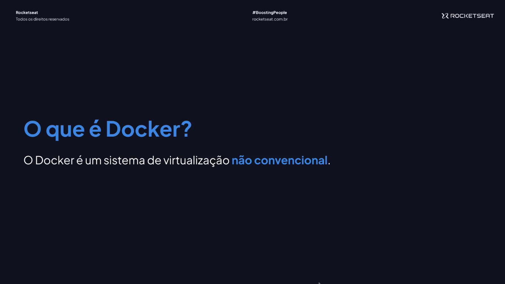
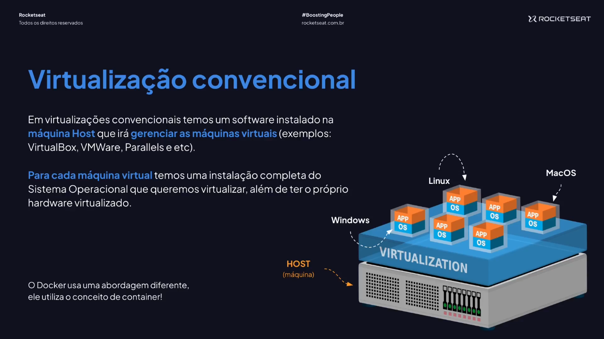
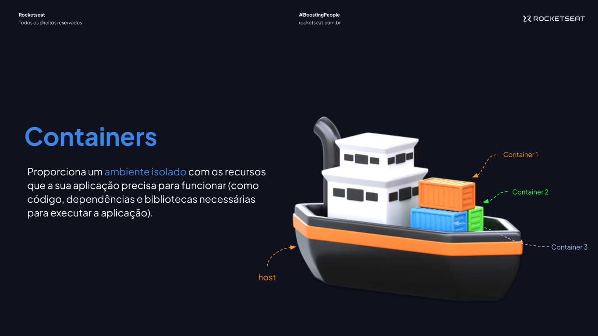
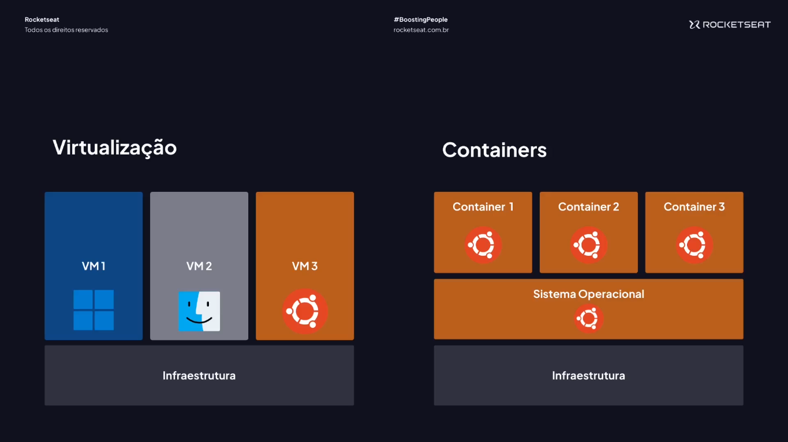
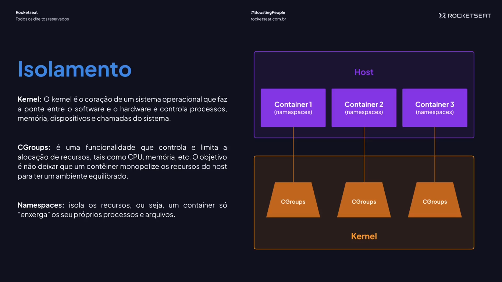
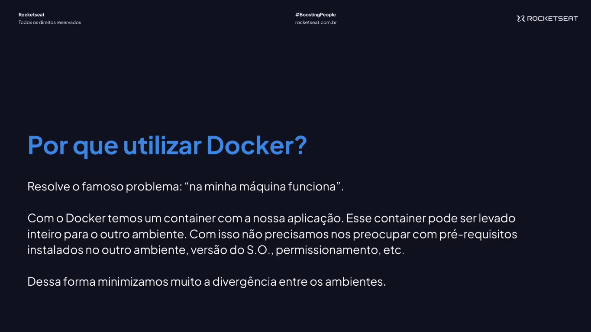
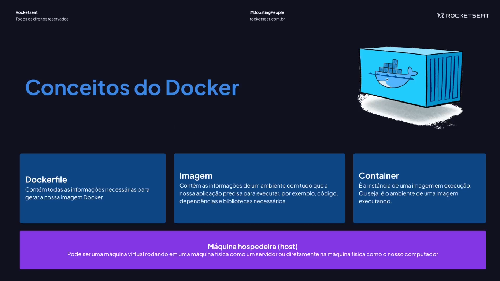

# Primeiros Passos com Docker

---

## Introdução ao Docker















## Instalação do Docker

[Docker](https://www.docker.com/)

```bash
docker --version
```

```bash
docker --v
```

## Projeto que Vamos Utilizar

[GitHub - rocketseat-education/fullstack-docker-api](https://github.com/rocketseat-education/fullstack-docker-api)
