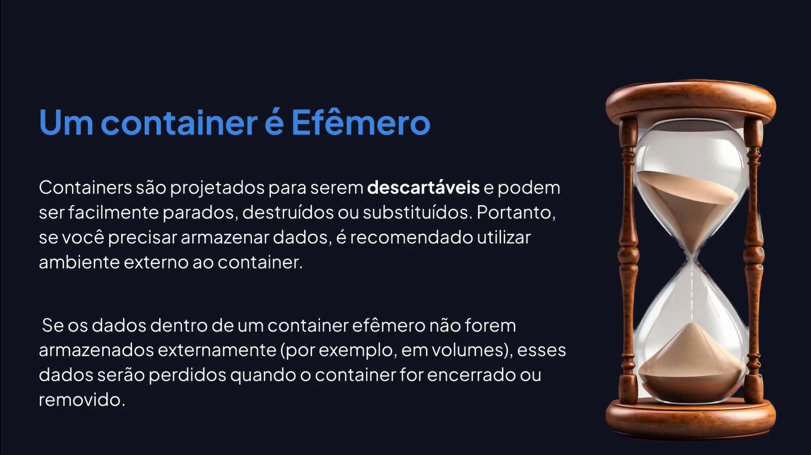

# Volumes

---

## Efemeridade em Containers




## Acessando Diretório de Trabalho

```bash
docker exec -it ecb78091ab16 bash
```

```bash
docker exec -it ecb78091ab16 //bin/sh
```

```bash
ls
```

## Efemeridade na Prática

```bash
touch teste.txt
```

```bash
exit
```

## Criando Volumes

```bash
docker container inspect 6cdec300dd7e
```

```bash
docker volume create api-volume
```

```bash
docker volume inspect api-volume
```

```bash
docker run -v api-volume:/usr/src/app -p 3333:3333 -d api
```

## Removendo Volumes

```bash
docker volume ls
```

```bash
docker volume rm api-volume
```

```bash
docker container prune
```

```bash
docker volume prune
```
