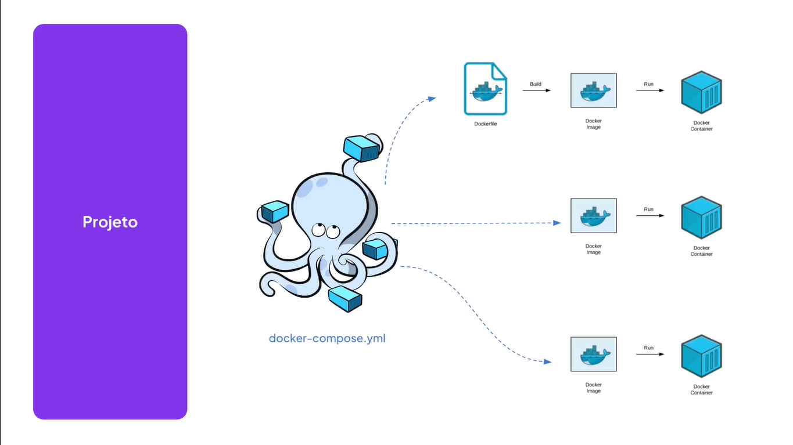
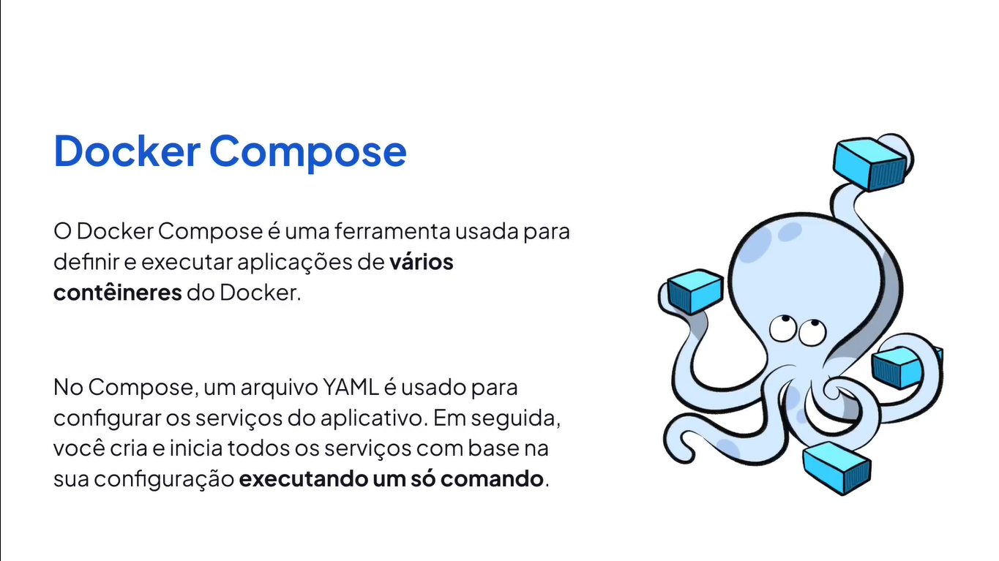

# Docker Compose

---

## Utilizando Imagem do PosgreSQL

[hub.docker.com](https://hub.docker.com/r/bitnami/postgresql)

```bash
docker run --name db-postgres -e POSTGRES_USER=postgres -e POSTGRES_PASSWORD=postgres -p 5432:5432 -d bitnami/postgresql:latest
```

## Entendendo o Docker Compose





## Instalação do Docker Compose

[Install](https://docs.docker.com/compose/install/)

```bash
docker-compose --version
```

## Criando o Docker Compose

```docker
version: "3.9"

services:
  api:
    build:
      context: .
      dockerfile: Dockerfile
    image: nodejs
    container_name: api
    ports:
      - "3333:3333"
    depends_on:
      - postgres

  postgres:
    image: "bitnami/postgresql:latest"
    container_name: postgres
    ports:
      - "5432:5432"
    environment:
      POSTGRES_USER: postgres
      POSTGRES_PASSWORD: postgres
      POSTGRES_DB: api
    volumes:
      - database:/var/lib/postgresql/data

volumes:
  database:
```

## Executando o Docker Compose

```bash
docker-compose up -d
```
