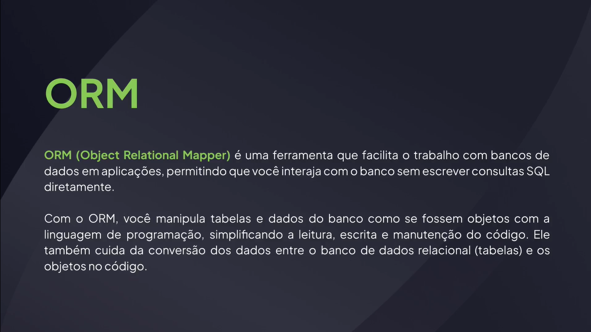
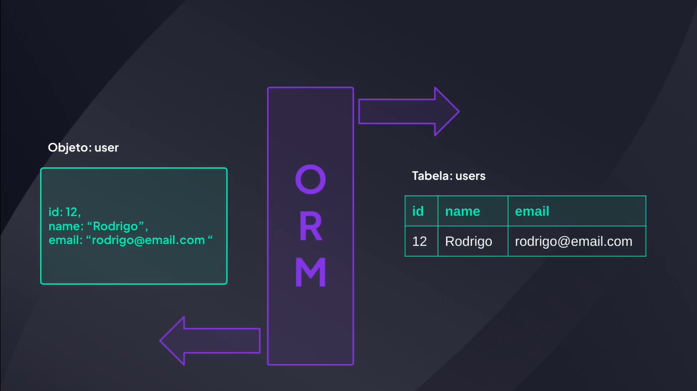
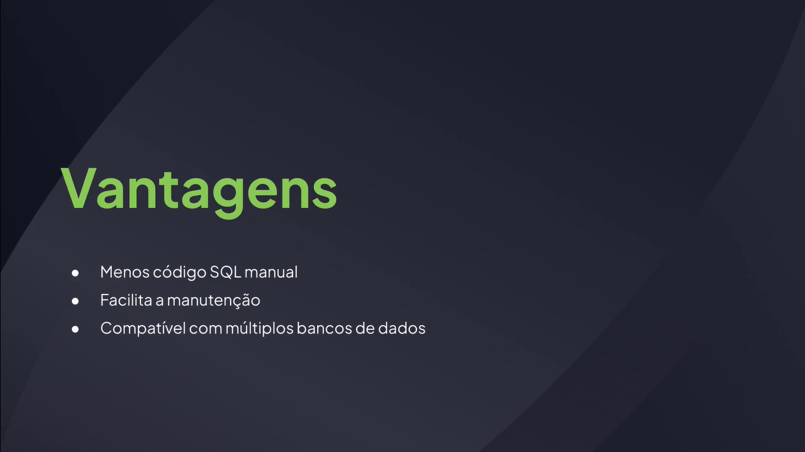
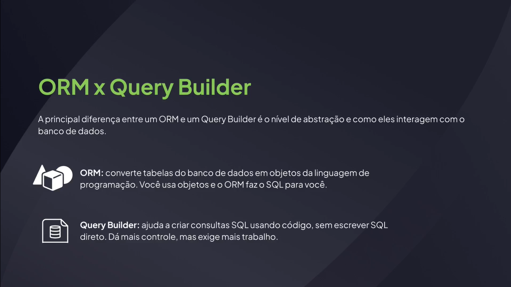

# Introdução

---

## O que é um ORM









## O banco de dados

[PostgreSQL](https://www.postgresql.org/)

## O projeto

[GitHub - rocketseat-education/fullstack-orm-template](https://github.com/rocketseat-education/fullstack-orm-template)

## Express Async Erros

```bash
npm i express-async-errors@3.1.1
```
