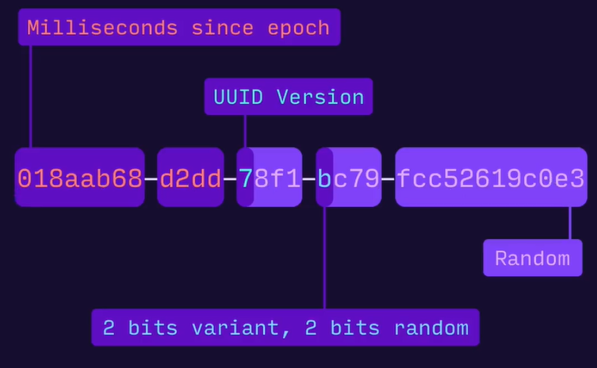

# Prisma

---

## Conhecendo o Prisma

[Prisma](https://www.prisma.io/)

Extensão para VSCode - Prisma - prisma.io

## Instalação e configurando o Prisma

```bash
npm i prisma@5.19.1
```

```bash
npx prisma init --datasource-provider postgresql
```

## UUID X Incremental




## Criando tabela de usuário

```jsx
generator client {
  provider = "prisma-client-js"
}

datasource db {
  provider = "postgresql"
  url      = env("DATABASE_URL")
}

model User {
  id String @id @default(uuid())
  name String
  email String @unique
  
  @@map("users")
}
```

```bash
npx prisma migrate dev
```

## Prisma Studio

```bash
npx prisma studio
```

## Inserindo usuário

```tsx
  async create(request: Request, response: Response) {
    const { name, email } = request.body;

    await prisma.user.create({ data: { name, email } });

    return response.status(201).json();
  }
```

## FindMany

```tsx
  async index(request: Request, response: Response) {
    const users = await prisma.user.findMany();

    return response.json(users);
  }
```

## FindUnique

```tsx
  async show(request: Request, response: Response) {
    const { id } = request.params;

    const user = await prisma.user.findUnique({ where: { id } });

    return response.json(user);
  }
```

## Criando Table de perguntas

```jsx
model Question {
  id String @id @default(uuid())
  title String
  content String

  createdAt DateTime @default(now()) @map("created_at")
  updatedAt DateTime @updatedAt() @map("updated_at")

  userId String @map("user_id")

  @@map("questions")
}
```

## Relacionamentos

```jsx
model User {
  id String @id @default(uuid())
  name String  
  email String @unique

  question Question[]
  
  @@map("users")
}

model Question {
  id String @id @default(uuid())
  title String
  content String

  createdAt DateTime @default(now()) @map("created_at")
  updatedAt DateTime @updatedAt() @map("updated_at")

  userId String @map("user_id")

  user User @relation(fields: [userId], references: [id])

  @@map("questions")
}
```

## Listando perguntas

```tsx
  async index(request: Request, response: Response) {
    const questions = await prisma.question.findMany();
    
    return response.json(questions);
  }
```

## Consulta

```tsx
  async index(request: Request, response: Response) {
    const questions = await prisma.question.findMany({
      where: {
        title: {
          contains: request.query.title?.toString().trim(),
          mode: "insensitive",
        },
      },
      orderBy: {
        title: "asc",
      },
    });

    return response.json(questions);
  }
```

## Update

```tsx
  async update(request: Request, response: Response) {
    const { id } = request.params;
    const { title, content } = request.body;

    await prisma.question.update({ data: { title, content }, where: { id } });

    return response.json();
  }
```

## Delete

```tsx
  async remove(request: Request, response: Response) {
    const { id } = request.params;

    await prisma.question.delete({ where: { id } });

    return response.json();
  }
```

## Seed

```tsx
import { prisma } from "@/prisma";

async function seed() {
  await prisma.user.createMany({
    data: [
      {
        name: "Mayk Brito",
        email: "mayk@email.com",
      },
      {
        name: "Diego Fernandes",
        email: "diego@email.com",
      },
    ],
  });
}

seed().then(() => {
  console.log("Database seeded!");
  prisma.$disconnect();
});

```

```json
  "prisma": {
    "seed": "tsx prisma/seed.ts"
  },
```

```bash
npx prisma db seed
```
