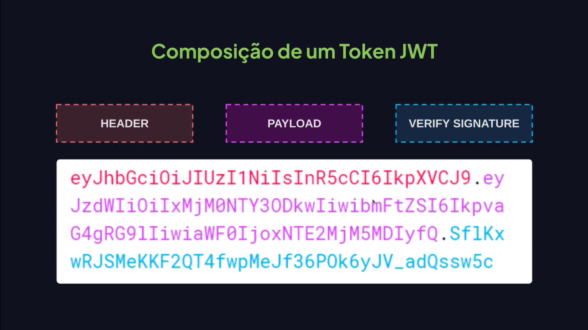
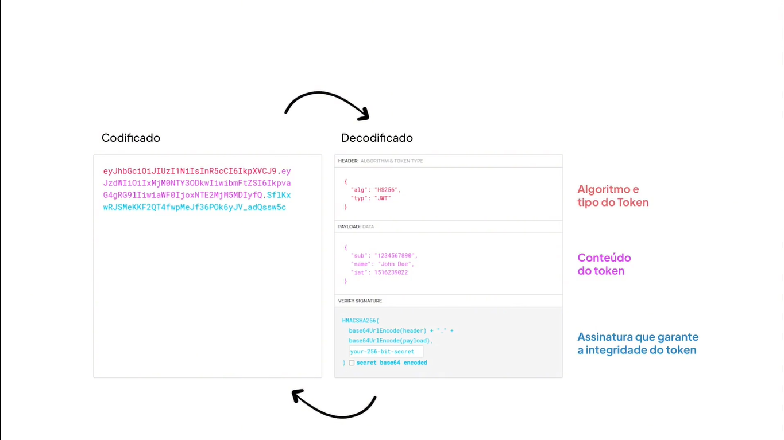

# Autenticação e Autorização

---

## JWT







## JWT.io

[JWT.IO](https://www.jwt.io/)

## Autenticação e autorização


## O projeto que vamos utilizar

[GitHub - rocketseat-education/fullstack-auth-template](https://github.com/rocketseat-education/fullstack-auth-template)

## Utilizando variável de ambiente

```bash
{
  "name": "fullstack-auth-template",
  "version": "1.0.0",
  "description": "",
  "main": "index.js",
  "scripts": {
    "dev": "tsx watch --env-file=.env src/server.ts"
  },
  "license": "ISC",
  "dependencies": {
    "express": "^4.21.0",
    "express-async-errors": "^3.1.1",
    "jsonwebtoken": "^9.0.2",
    "tsx": "^4.19.1"
  },
  "devDependencies": {
    "@types/express": "^4.17.21",
    "@types/jsonwebtoken": "^9.0.6",
    "@types/node": "^22.5.4",
    "typescript": "^5.6.2"
  }
}

```

```notion
AUTH_SECRET=rodrigo
```

## JSON Web Token

```bash
npm i jsonwebtoken@9.0.2
```

```bash
npm i @types/jsonwebtoken@9.0.6 -D
```

## Criando sessão

```tsx
export const authConfig = {
  jwt: {
    secret: process.env.AUTH_SECRET || "default",
    expiresIn: "1d",
  },
};
```

```tsx
import { Request, Response } from "express";
import { AppError } from "@/utils/AppError";
import { authConfig } from "@/configs/auth";
import { sign } from "jsonwebtoken";

class SessionsController {
  async create(request: Request, response: Response) {
    const { username, password } = request.body;

    const fakeUser = {
      id: 1,
      username: "rodrigo",
      password: "123456",
    };

    if (username !== fakeUser.username || password !== fakeUser.password) {
      throw new AppError("Usuário e/ou senha incorreta!", 401);
    }

    const { secret, expiresIn } = authConfig.jwt;
    const token = sign({}, secret, {
      expiresIn,
      subject: String(fakeUser.id),
    });

    return response.json({ message: token });
  }
}

export { SessionsController };
```

```tsx
import { AppError } from "@/utils/AppError";
import { log } from "console";
import { Request, Response, NextFunction } from "express";

function ensureAuthenticated(
  request: Request,
  response: Response,
  next: NextFunction
) {
  const authHeader = request.headers.authorization;

  if (!authHeader) {
    throw new AppError("JST token não informado", 401); 
  }

  const [, token] = authHeader.split(" ");

  console.log(token);

  return next();
}

export { ensureAuthenticated };
```

```tsx
import { Router } from "express"
import { ProductsController } from "@/controllers/products-controller"
import { ensureAuthenticated } from "@/middlewares/ensureAuthenticated"

const productsRoutes = Router()
const productsController = new ProductsController()

productsRoutes.get("/", productsController.index)
productsRoutes.post("/", ensureAuthenticated, productsController.create)

export { productsRoutes }
```

## Extraindo o Token

```tsx
import { AppError } from "@/utils/AppError";
import { Request, Response, NextFunction } from "express";
import { verify } from "jsonwebtoken";
import { authConfig } from "@/configs/auth";

function ensureAuthenticated(
  request: Request,
  response: Response,
  next: NextFunction
) {
  const authHeader = request.headers.authorization;

  if (!authHeader) {
    throw new AppError("JST token não informado", 401);
  }

  const [, token] = authHeader.split(" ");

  const { sub: user_id } = verify(token, authConfig.jwt.secret);

  request.user = {
    id: String(user_id),
  };

  return next();
}

export { ensureAuthenticated };
```

```tsx
declare namespace Express {
  export interface Request {
    user?: {
      id: string;
    };
  }
}
```

```tsx
import { Request, Response } from "express"

class ProductsController {
  async index(request: Request, response: Response) {
    return response.json({ message: "products" })
  }

  async create(request: Request, response: Response) {
    return response.json({ message: request.user?.id })
  }
}

export { ProductsController }
```

## Middleware de autenticação

## Definindo papel do usuário

```tsx
import { Request, Response } from "express";
import { AppError } from "@/utils/AppError";
import { authConfig } from "@/configs/auth";
import { sign } from "jsonwebtoken";

class SessionsController {
  async create(request: Request, response: Response) {
    const { username, password } = request.body;

    const fakeUser = {
      id: 1,
      username: "rodrigo",
      password: "123456",
      role: "customer",
    };

    if (username !== fakeUser.username || password !== fakeUser.password) {
      throw new AppError("Usuário e/ou senha incorreta!", 401);
    }

    const { secret, expiresIn } = authConfig.jwt;
    const token = sign({ role: fakeUser.role }, secret, {
      expiresIn,
      subject: String(fakeUser.id),
    });

    return response.json({ message: token });
  }
}

export { SessionsController };
```

```tsx
import { AppError } from "@/utils/AppError";
import { Request, Response, NextFunction } from "express";
import { verify } from "jsonwebtoken";
import { authConfig } from "@/configs/auth";

interface TokenPayload {
  role: string;
  sub: string;
}

function ensureAuthenticated(
  request: Request,
  response: Response,
  next: NextFunction
) {
  const authHeader = request.headers.authorization;

  if (!authHeader) {
    throw new AppError("JST token não informado", 401);
  }

  const [, token] = authHeader.split(" ");

  const { sub: user_id, role } = verify(
    token,
    authConfig.jwt.secret
  ) as TokenPayload;

  request.user = {
    id: String(user_id),
    role,
  };

  return next();
}

export { ensureAuthenticated };
```

```tsx
declare namespace Express {
  export interface Request {
    user?: {
      id: string;
      role: string;
    };
  }
}
```

## Middleware de autorização

```tsx
import { Request, Response, NextFunction } from "express";
import { AppError } from "@/utils/AppError";

function verifyUserAuthorization(role: string[]) {
  return (request: Request, response: Response, next: NextFunction) => {
    if(!request.user || !role.includes(request.user.role)) {
      throw new AppError("Unauthorized", 401);
    }

    return next();
  }
}

export { verifyUserAuthorization };
```

```tsx
import { Router } from "express";
import { ProductsController } from "@/controllers/products-controller";

import { ensureAuthenticated } from "@/middlewares/ensureAuthenticated";
import { verifyUserAuthorization } from "@/middlewares/verifyUserAuthorization";

const productsRoutes = Router();
const productsController = new ProductsController();

// Aplicar autorização em todas as rotas a seguir.
// productsRoutes.use(verifyUserAuthorization(["sale", "admin"]));

productsRoutes.get("/", productsController.index);

// Autorização em uma rota especifica
productsRoutes.post(
  "/",
  ensureAuthenticated,
  verifyUserAuthorization(["sale", "admin"]),
  productsController.create
);

export { productsRoutes };
```

```tsx
import { Request, Response } from "express";
import { AppError } from "@/utils/AppError";
import { authConfig } from "@/configs/auth";
import { sign } from "jsonwebtoken";

class SessionsController {
  async create(request: Request, response: Response) {
    const { username, password } = request.body;

    const fakeUser = {
      id: 1,
      username: "rodrigo",
      password: "123456",
      role: "customer",
    };

    if (username !== fakeUser.username || password !== fakeUser.password) {
      throw new AppError("Usuário e/ou senha incorreta!", 401);
    }

    const { secret, expiresIn } = authConfig.jwt;
    const token = sign({ role: fakeUser.role }, secret, {
      expiresIn,
      subject: String(fakeUser.id),
    });

    return response.json({ token });
  }
}

export { SessionsController };
```

```tsx
import { Request, Response } from "express"

class ProductsController {
  async index(request: Request, response: Response) {
    return response.json({ message: "products" })
  }

  async create(request: Request, response: Response) {
    return response.json({ message: request.user?.role })
  }
}

export { ProductsController }
```
