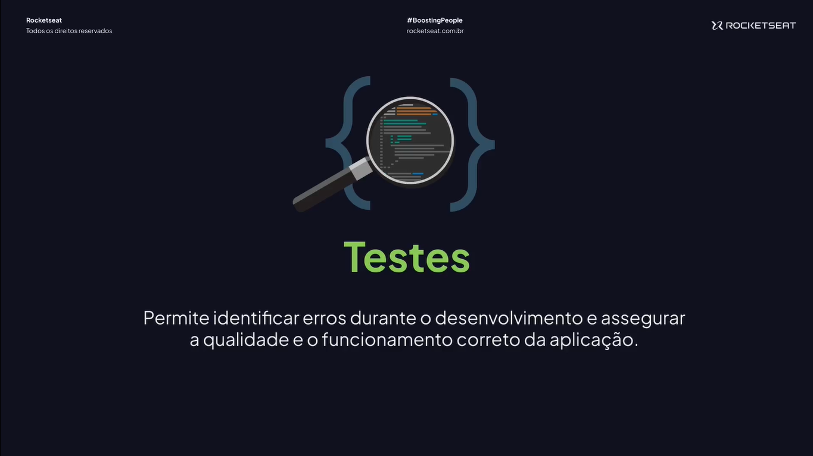

# Testes Automatizados

---

## Tipos de testes




## Criar um novo projeto Node.js

```json
{
  "name": "tests",
  "version": "1.0.0",
  "main": "index.js",
  "scripts": {
    "dev": "tsx watch src/server.ts"
  },
  "license": "ISC",
  "dependencies": {
    "tsx": "^4.19.1"
  }
}
```

## Configurando o TypeScript

```json
{
  "compilerOptions": {
    "target": "ES2022",
    // "lib": ["ES2023"],

    "module": "node16",
    "esModuleInterop": true,
    "forceConsistentCasingInFileNames": true,

    "strict": true,
    "skipLibCheck": true
  }
}
```

## Conhecendo o Jest

[Jest](https://jestjs.io/)

## Instalando e configurando o Jest

```bash
npm i jest@29.7.0 @types/jest@29.5.13 ts-jest@29.2.5 -D
```

```bash
npx jest --init
```

```json
import type { Config } from "jest";

const config: Config = {
  bail: true,
  preset: "ts-jest",
  testEnvironment: "node",
};

export default config;
```

## Executando teste específico

```bash
npm i ts-node@10.9.2 -D
```

```tsx
test("example", () => {
  console.log("test OK!");
});
```

```bash
npx jest src/sum.test.ts
```

## Script de teste

```tsx
test("sum", () => {
  console.log("test sum OK!");
});
```

```tsx
test("subtraction", () => {
  console.log("test subtraction OK!");
});
```

```bash
npx jest
```

```json
{
  "name": "tests",
  "version": "1.0.0",
  "main": "index.js",
  "scripts": {
    "dev": "tsx watch src/server.ts",
    "test": "jest"
  },
  "license": "ISC",
  "dependencies": {
    "tsx": "^4.19.1"
  },
  "devDependencies": {
    "@types/jest": "^29.5.13",
    "jest": "^29.7.0",
    "ts-jest": "^29.2.5",
    "ts-node": "^10.9.2"
  }
}
```

## Escrevendo o primeiro teste

```tsx
export function sum(a: number, b: number) {
  return a + b;
}
```

```tsx
import { sum } from "./server";

test("sum of 3 + 7 must be 10", () => {
  const result = sum(3, 7);

  expect(result).toBe(10);
});
```

## Utilizando Watch

```json
{
  "name": "tests",
  "version": "1.0.0",
  "main": "index.js",
  "scripts": {
    "dev": "tsx watch src/server.ts",
    "test:dev": "jest --watchAll",
    "test": "jest"
  },
  "license": "ISC",
  "dependencies": {
    "tsx": "^4.19.1"
  },
  "devDependencies": {
    "@types/jest": "^29.5.13",
    "jest": "^29.7.0",
    "ts-jest": "^29.2.5",
    "ts-node": "^10.9.2"
  }
}
```

## Agrupando testes

```tsx
import { sum } from "./server";

describe("sum", () => {
  test("sum of 3 + 7 must be 10", () => {
    const result = sum(3, 7);

    expect(result).toBe(10);
  });

  test("sum of 2 + 2 must be 4", () => {
    const result = sum(2, 2);

    expect(result).toBe(4);
  });
});
```

## It

```tsx
import { sum } from "./server";

describe("sum", () => {
  it("should do sum of 3 + 7 must be 10", () => {
    const result = sum(3, 7);

    expect(result).toBe(10);
  });

  test("sum of 2 + 2 must be 4", () => {
    const result = sum(2, 2);

    expect(result).toBe(4);
  });
});
```

## beforeAll

```tsx
import { sum } from "./server";

describe("sum", () => {
  let sumResult: number;

  beforeAll(() => {
    sumResult = 10;
  });

  it("should do sum of 3 + 7 must be 10", () => {
    const result = sum(3, 7);

    expect(result).toBe(10);
  });

  test("sum of 2 + 2 must be 4", () => {
    const result = sum(2, 2);

    expect(result).toBe(4);
  });
});
```

## afterAll

```tsx
import { sum } from "./server";

describe("sum", () => {
  let sumResult: number;

  beforeAll(() => {
    sumResult = 10;
    console.log("EXECUTADO ANTES DOS TESTES", sumResult);
  });

  afterAll(() => {
    sumResult = 0;
    console.log("EXECUTADO DEPOIS DOS TESTES", sumResult);
  });

  it("should do sum of 3 + 7 must be 10", () => {
    const result = sum(3, 7);

    expect(result).toBe(10);
  });

  test("sum of 2 + 2 must be 4", () => {
    const result = sum(2, 2);

    expect(result).toBe(4);
  });
});
```

## Criando rota

```tsx
export function sum(a: number, b: number) {
  return a + b;
}
```

```tsx
import http from "node:http";

const products = [
  { id: 1, name: "Camiseta", price: 29.99 },
  { id: 2, name: "Jaqueta", price: 129.99 },
  { id: 3, name: "Sapato", price: 59.99 },
];

const app = http.createServer((request, response) => {
  if (request.method === "GET" && request.url === "/products") {
    response.setHeader("Content-Type", "application/json");
    return response.end(JSON.stringify(products));
  }
});

export { app };
```

```tsx
import { app } from "./app";

app.listen(3333, () => console.log(`Server is running!`));
```

## Executando teste E2E

```bash
npm i supertest@7.0.0 @types/supertest@6.0.2 -D
```

```tsx
import request from "supertest";
import { app } from "./app";

describe("products", () => {
  it("should list products", async () => {
    const response = await request(app).get("/products");
    console.log(response);
  });
});
```

## Validando teste E2E

```tsx
import request from "supertest";
import { app } from "./app";

describe("products", () => {
  it("should list products", async () => {
    const response = await request(app).get("/products");

    expect(response.statusCode).toBe(200);
    expect(response.body.lenth).toBeGreaterThan(0);
  });
});
```
