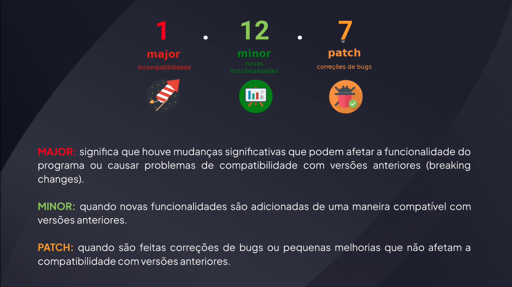

# Gerenciando Dependências

---

## Versionamento Semântico




## Calculando Versão

[semver](https://semver.npmjs.com/)

```bash
  npm out
```

```bash
  npx npm-check-updates
```

```bash
  npx npm-check-updates --interactive --format group
```