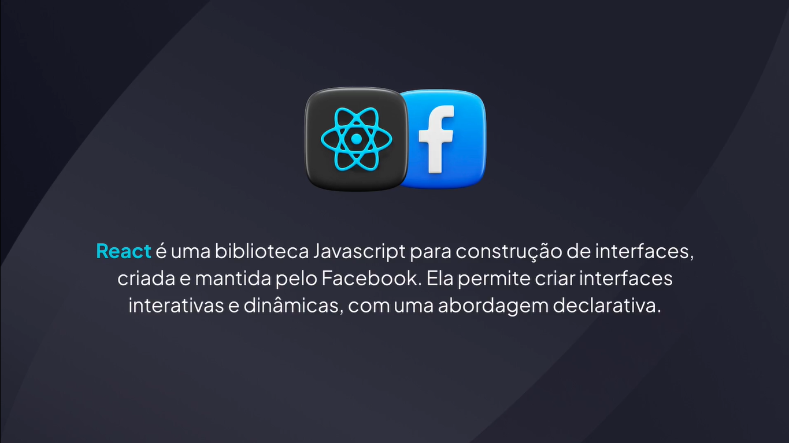
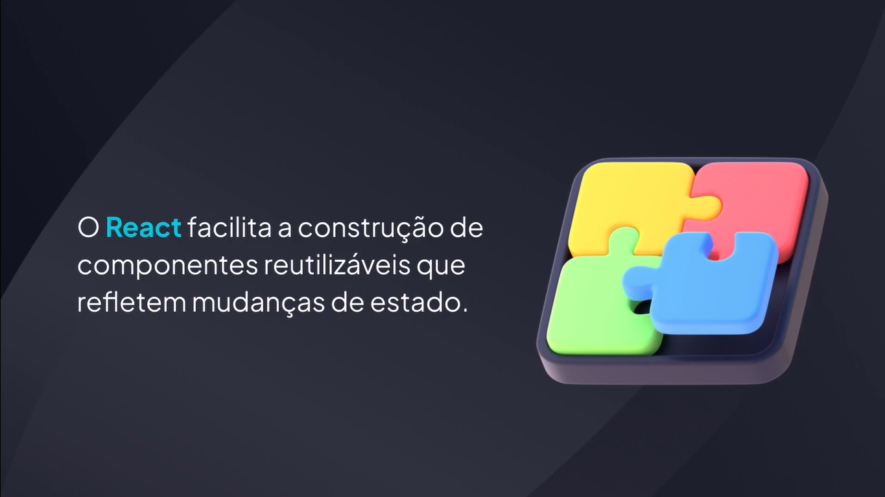
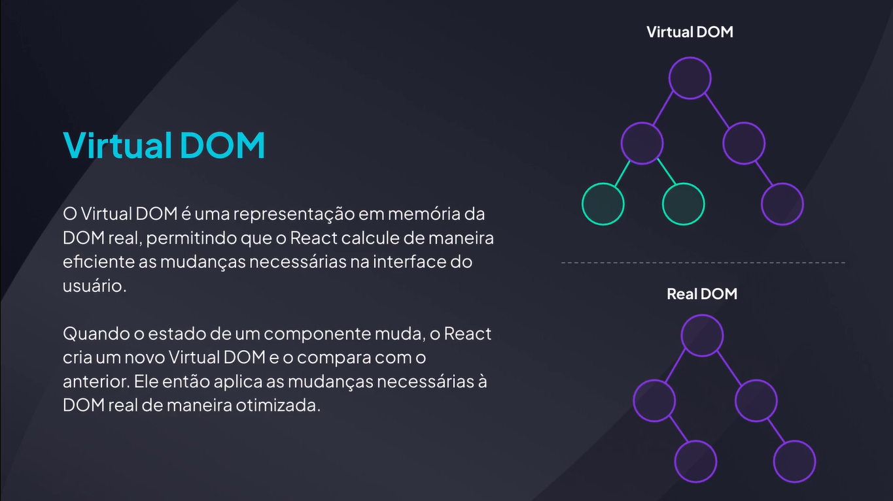

# Primeiros passos

---

## Conhecendo o React








## Ambiente de desenvolvimento

[React](https://react.dev/)

[Vite](https://vite.dev/)

## Criando o projeto

```bash
npm create vite@latest
```

## JSX

```tsx
export function App() {
  return <h1>Hello World!</h1>;
}
```

```tsx
import { StrictMode } from "react";
import { createRoot } from "react-dom/client";

import { App } from "./App";

createRoot(document.getElementById("root")!).render(
  <StrictMode>
    <App />
  </StrictMode>
);
```
