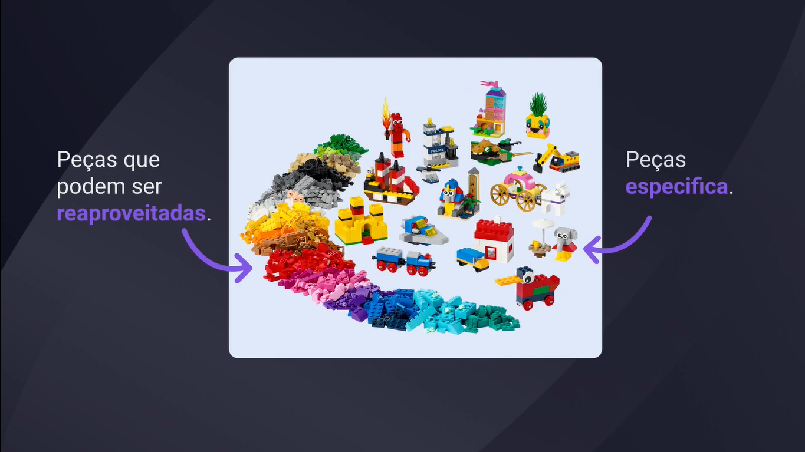
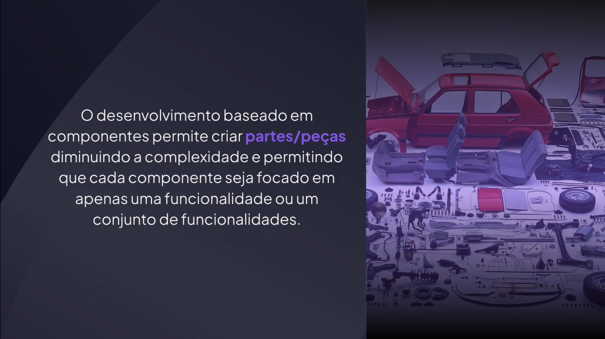
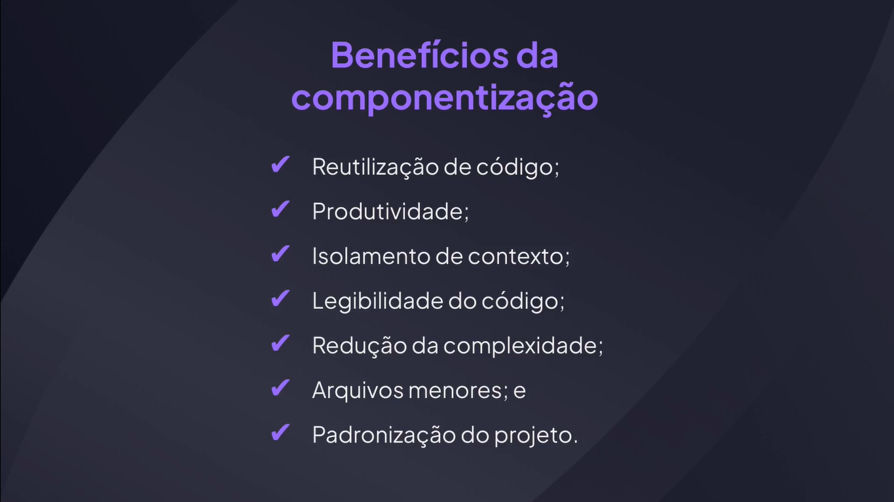

# Componentes

---

## Compreendendo componentes









## Criando um componente

```tsx
export function Button() {
  return <button>Clique Aqui</button>;
}
```

```tsx
import { Button } from "./components/button";

export function App() {
  return <Button />;
}
```

## Retornando um elemento Parent

```tsx
import { Button } from "./components/button";

export function App() {
  return (
    <div>
      <Button />
      <Button />
      <Button />
    </div>
  );
}
```

## Passando propriedades para o componente

```tsx
type Props = {
  name: string;
};

export function Button({ name }: Props) {
  return <button>{name}</button>;
}
```

```tsx
import { Button } from "./components/button";

export function App() {
  return (
    <div>
      <Button name="Criar" />
      <Button name="Editar" />
      <Button name="Remover" />
    </div>
  );
}
```

## Passando métodos no componente

```tsx
type Props = {
  name: string;
  onClick?: () => void;
};

export function Button({ name, onClick }: Props) {
  return <button onClick={onClick}>{name}</button>;
}
```

```tsx
import { Button } from "./components/button";

export function App() {
  return (
    <div>
      <Button name="Criar" onClick={() => alert("Criar")} />
      <Button name="Editar" />
      <Button name="Remover" />
    </div>
  );
}
```

## Estendendo propriedades do botão

```tsx
type Props = React.ComponentProps<"button"> & {
  name: string;
};

export function Button({ name, onClick }: Props) {
  return <button onClick={onClick}>{name}</button>;
}
```

## Rest Operator

```tsx
type Props = React.ComponentProps<"button"> & {
  name: string;
};

export function Button({ name, ...rest }: Props) {
  return <button {...rest}>{name}</button>;
}
```
